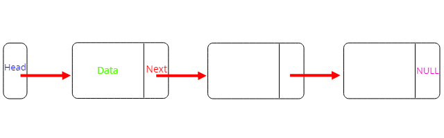
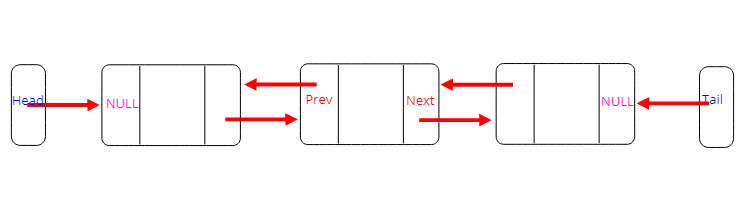
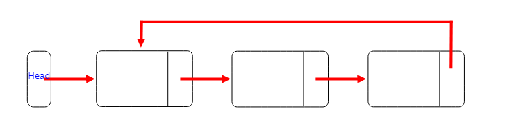
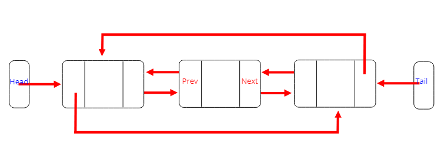

---

title: "연결리스트 (Linked List)"
excerpt: "연결리스트를 알아보자"
tags: [data_structure]

path: "/2019-08-26-linked-list"
featuredImage: "./single_linked_list_node.png"
created: 2019-08-26
updated: 2019-08-26

---


# 연결리스트 (Linked List)  

## \[ 개념 및 구조 \]  
  연결리스트는 노드들이 포인터를 이용해 연결된 구조를 가지고 있습니다.
  
  이중 하나의 노드를 가져와 어떻게 연결하는지 알아봅시다.
  ```cpp
  template <typename type>
  struct Data
  {
    type data;
    struct Data *Next;
  };
  ```
  
  위와 같이 노드는 데이터와 다음 노드를 가리킬 포인터로 구성되어 있습니다.
  각 노드의 Next 포인터는 다음 노드를 가리키고 마지막 노드의 Next 포인터는 NULL을 가리킵니다.
  이렇게 노드들이 (포인터를 이용해) 연결되어 있다고 해서 연결리스트(Linked List)라고 합니다.
  
## \[ 장단점 \]  
### 장점  
1. **크기를 지정하지 않아도 된다.**  
  연결리스트는 가변적인 크기를 가지고 있기 때문에 사용하기 전에 미리 크기를 지정할 필요가 없습니다.
    
2. **삽입과 삭제가 간단하다.**  
  연결리스트는 데이터를 담은 메모리가 연속된 것이 아니라 각 노드의 포인터를 이용해 연결되어 있기 때문에 삽입과 삭제를 위해 다른 모든 데이터를 옮기지 않아도 됩니다.  
  그냥 해당 노드를 제거하고 인접 노드의 포인터만 변경해주면 됩니다.
    
### 단점  
1. **노드마다 연결을 위한 포인터가 필요하다.**  
  구조에서 봤듯이 각 노드마다 연결을 위한 포인터가 필요합니다.  
  (노드 수)*(포인터 크기) 만큼의 메모리를 더 사용하게 됩니다. (이중 연결 리스트라면 2 배)
    
2. **노드 접근이 오래 걸린다.**  
  배열의 경우 n 번째 데이터라고 하면 배열 시작 위치에서 n 번째 메모리를 주소를 바로 찾아갈 수 있지만 연결리스트는 첫 번째 노드를 거쳐, 두 번째 노드를 거쳐, 세 번째 노드를 거쳐 ... n 번째 노드를 찾아가야 합니다.

3. **캐싱(Caching)의 효과를 보기 어렵다.**  
  CPU는 최근에 접근된 데이터와 인접한 데이터들을 캐시 메모리에 저장해둡니다.  
  배열의 경우 데이터들이 인접해있기 때문에 순회할 때 캐시를 이용할 수 있지만 연결리스트는 메모리상에서 인접해있지 않고 넓은 지역에 흩어져 있기 때문에 캐시의 효과를 보기 어렵습니다.
  
  
## \[ 종류 \]  
* 단일 연결리스트 (Singly-Linked List)
  
* 이중 연결리스트 (Doubly-Linked List)  
    
  이중 연결리스트는 양방향으로 순회가 가능하기 때문에 노드의 예상 위치에 따라 **탐색 방향을 변경**할 수 있습니다.  
  >예를 들어, x 번째 데이터를 접근할 경우에 x가 2/n보다 작다면 앞에서 뒤로, 2/n보다 크다면 뒤에서 앞으로 순회하여 접근 속도를 높일 수 있습니다.

  또한 **운행 중에 있는 노드의 삭제에도 높은 효율**을 보여줍니다.  
  연결리스트에서 노드를 삭제하려면 이전 노드의 Next 포인터를 수정해야 합니다. 단일 연결리스트라면 삭제하려는 노드의 iterator를 가지고 있더라도 Head부터 이전 노드까지 연결리스트를 따라와야 하지만 이중 연결리스트라면 삭제할 노드의 Next, prev 노드를 이용해 인접 노드의 포인터를 수정할 수 있습니다.  
    
* 원형 연결리스트 (Circular-Linked List)
  
* 원형 이중연결 리스트 (Circular-Doubly Linked List)
  

## \[ 활용 \]  
  C++ STL에서는 **std::list** 컨테이너를 제공하고 있습니다. 이는 **이중 연결리스트**로 구현되어 있습니다.
  굳이 이중 연결리스트를 사용할 필요가 없어 **단일 연결리스트**를 사용하고 싶다면 **std::forward_list** 컨테이너를 사용하면 됩니다.
  
  라이브러리를 충분히 공부해두고 사용하는 것이 효율이나 문제를 해결하는 데 큰 도움이 될 거라 생각합니다.
  여기서도 장단점을 몇 가지 써두었지만 이것만 보고 판단하기는 어렵습니다.
  여러 자료구조의 구조와 동작원리를 알아두면 단점과 장점이 어느 정도의 파급력이 있는지, 이보다 더 좋은 자료구조가 있을지, 사용하는데 문제가 없을지 생각할 수 있을 겁니다.
