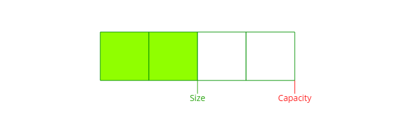
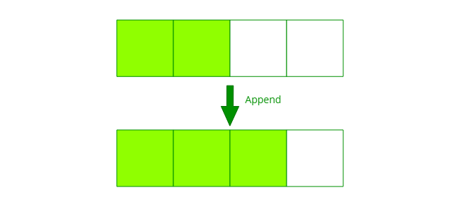
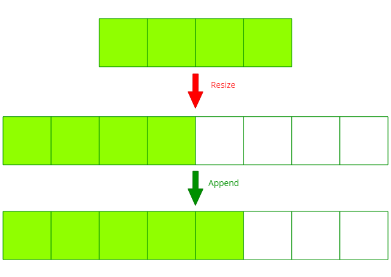

---

title: "동적배열 (Dynamic Array)"
excerpt: "동적배열을 알아보자"
tags: [data_structure]

path: "/2019-08-27-dynamic-array"
featuredImage: "./dynamic_array.png"
created: 2019-08-27
updated: 2019-08-27

---

# 동적배열 (Dynamic Array)  

## \[ 개념 및 구조 \]  
동적배열은 할당 크기가 고정되어 있지 않고 적절하게 늘렸다가 줄일 수 있는 배열입니다.  
기존의 배열은 크기를 고정된 크기로 할당하기 때문에 담을 자료들의 수를 예측할 수 있어야 합니다.   
하지만 그렇지 못한 경우가 많기에 동적배열이 필요합니다.  

  
동적배열은 size와 capacity를 가지고 있습니다.  
capacity는 할당된 크기, size는 실제로 사용하고 있는 크기입니다.  

  
동적배열에서 할당된 배열이 가득 차있지 않을 때에는 일반적인 배열과 동일합니다.
  
할당된 배열이 꽉 찼을 때 데이터를 입력하면 동적배열은 할당 크기를 늘려줍니다.  
이때 늘려준다는 말이 데이터를 그대로 두고 할당 크기를 늘려준다고 생각할 수 있겠지만,  
실제로는 기존 배열보다 **더 큰 배열을 할당하고 기존 배열을 복사하는 방식**입니다.  

*※동적배열은 힙에 할당하여 사용하는데 힙의 메모리 관리 방식상 경우에 따라 주소를 그대로 사용하고 할당 크기만 늘릴 수가 없기 때문에 새로 할당하여 기존 배열을 복사합니다.*  

그럼 할당 크기를 얼마나 늘릴 것인가, 그건 구현하는 사람 마음이겠지만 동적배열은 일반적으로 기존 크기의 2배로 할당합니다.  

동적배열에 여유 공간이 있을 때는 데이터 입력 시 (끝에 입력 시) 해당 데이터를 입력해주기만 하면 됩니다. **O(1)**  
동적배열이 꽉 차있을 경우에는 데이터 입력 시 기존의 데이터를 새 공간으로 복사하는 작업이 필요합니다. **O(N)**  
이를 보았을 때 재할당이 자주 일어나는 것은 피하는 게 좋아 보입니다.  
재할당 할 때마다 기존 크기의 2배로 할당할 경우 데이터 입력 N 번마다 O(N)의 작업을 추가로 하기 때문에 평균적으로 **O(1)**의 시간이 듭니다.  
*※단, 재할당이 필요할 때만 전체 배열 복사하기 때문에 시간 복잡도의 편차가 심합니다.*  
