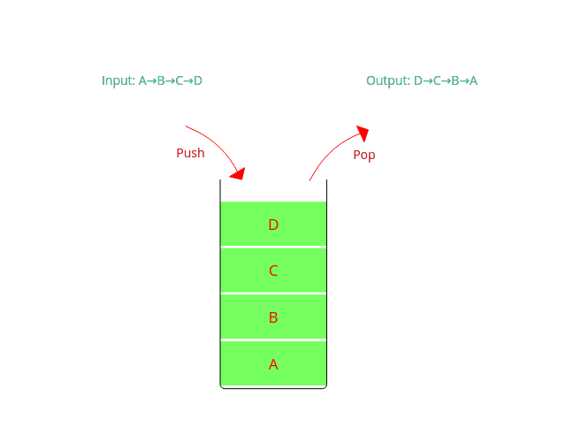
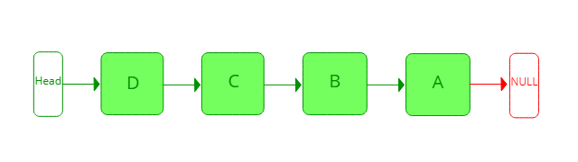

---

title: "스택 (Stack)"
excerpt: "스택을 알아보자"
tags: [algorithm, data_structure]

path: "/2019-09-03-stack"
featuredImage: "./stack.png"
created: 2019-09-03
updated: 2019-09-03

---

# 스택 (Stack)  

## \[ 개념 및 구조 \]  
스택은 한 쪽에서만 데이터 입력과 출력이 이루어지는 자료구조입니다.  
입출구가 하나로 이루어져 나중에 들어간 것이 먼저 나오는 **LIFO(Last-In First-Out)** 형식으로 작업이 이루어집니다.
  
그림에서 가장 먼저 넣은 A는 마지막에 나오고, 마지막에 넣은 D가 제일 먼저 나옵니다.  
Stack이라는 단어가 '(잘 정리해서 쌓아둔) 무더기'라는 뜻을 가지고 있는데 이 무더기에서 하나씩 물체를 꺼낼 때 가장 위에 있는 (마지막에 쌓은) 것부터 꺼내야 하기 때문에 붙은 이름인 것 같습니다.

## \[ 기능 \]  
* **PUSH**  
  스택에 데이터를 넣는 작업입니다.
* **POP**  
  스택에서 가장 위에 있는 데이터(마지막에 넣은 데이터)를 꺼내는 작업입니다.
* **TOP**  
  스택에서 가장 위에 있는 값을 반환하는 작업입니다.
* **SIZE**  
  현재 스택에 들어가 있는 데이터의 수를 반환하는 작업입니다.
* **IS_EMPTY**  
  스택이 비어있는지 확인하는 작업입니다.  
  (데이터를 꺼내기 전에 비어있는지 확인할 필요가 있습니다.)

## \[ 구현 \]  
  스택은 일관된 방식으로 작업을 하는 리스트(연결리스트 or 배열) 컨테이너라고 볼 수 있습니다.
  따라서 **연결리스트**나 **(동적)배열**의 기능을 제한하여서 스택을 구현할 수 있습니다.
* **연결리스트를 이용한 구현**  
  스택은 한 쪽 끝에서만 작업이 일어나기 때문에 굳이 이중 연결리스트를 사용할 필요가 없이 **단일 연결리스트**로 구현이 가능합니다.  
    
  이 경우 데이터 입출력은 **Head**를 통해서 이루어집니다.  
  연결리스트를 이용해 구현할 경우에 노드 수를 신경쓰지 않아도 됩니다.  
  대신 데이터 입출력 시 노드를 연결하는 작업, 메모리 공간을 할당/해제하는 작업으로 인해 배열을 이용할 경우보다는 더 오래 걸립니다.

* **배열을 이용한 구현**  
    
  배열로 스택을 구현할 경우에 다음에 들어올 위치(혹은 마지막 노드)를 가리키는 **top** 인덱스를 이용해서 데이터 입출력이 이루어집니다.  
  스택은 순회하거나 중간에 있는 데이터를 접근할 일은 없기 때문에 동적배열을 이용하는 것은 연결리스트를 이용하는 것보다 별로 이점이 없어 보입니다.  
  배열을 이용하면 최대 크기를 한정해야 하지만 입출력 시 데이터를 입력하고 top인덱스만 수정하면 되기 때문에 속도 면에서 좀 더 나은 효율을 낼 수 있습니다.  
  

사실 연결리스트로 구현하나 배열로 구현하나 Big-O 표기법의 시간복잡도는 같기 때문에 크게 신경쓰지 않아도 될듯합니다.  
**C++ STL의 stack**은 **연결리스트**로 구현이 되어 있다고 합니다.(?)  
최대 크기를 한정할 수 있으며 조금이라도 속도를 높이고자 한다면 배열을 이용해 구현할 수 있습니다.  

## \[ 활용 \]  
* **뒤로 가기**  
  웹페이지 같은 경우 URL 등으로 다른 페이지로 이동하기 때문에 이전 페이지로 돌아가는 길이 보장되어 있지는 않습니다. 하지만 다른 페이지로 넘어갈 때 이전 URL을 스택에 PUSH 해두면 뒤로 가기를 원할 때 쌓아둔 URL을 POP하면서 이전 페이지로 이동할 수 있습니다.  
* **깊이 우선 탐색 (DFS)**  
  그래프에서 뒤로가는 경로가 없을 수 있기 때문에 현재까지 따라온 노드들을 스택에 PUSH 하고 막다른 길이 나왔을 때 쌓아둔 노드를 POP 하여 돌아갈 수 있습니다.  
* **괄호 검사**  
  스택을 이용해서 괄호가 올바르게 짝이 맞게 되어 있는지 판단할 수 있습니다. 여는 괄호가 나올 경우 PUSH, 닫는 괄호가 나올 경우 POP 하여 괄호가 최종적으로 스택이 비어있는지 확인하여 괄호 검사를 할 수 있습니다. 괄호는 짝의 수뿐만 아니라 순서도 중요합니다. 여는 괄호 '('가 닫는 괄호 ')'보다 먼저 나와야 합니다. 만약 스택이 비어있는데 POP을 한다면 '('가 나오기 전에 ')'가 나왔다고 판단할 수 있습니다.  
* **후위 표기법**  
* . . .  

스택은 전에 했던 일을 역으로 추적한다던가, 올바른 짝을 맞추는 작업에서 유용하게 쓸 수 있습니다. 그 외에도 스택은 많은 곳에 유용하게 쓸 수 있으니 관심 있는 사람은 스택 관련 문제를 풀어보면 좋을 것 같습니다.  
스택을 잘 활용하려면 PUSH와 POP의 조건을 명확하게 설정해야 합니다. 물론 최종적으로 원하는 결과가 나오도록 PUSH와 POP을 할 때 데이터를 적절하게 처리해야 합니다.  