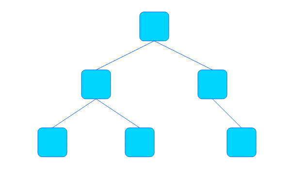
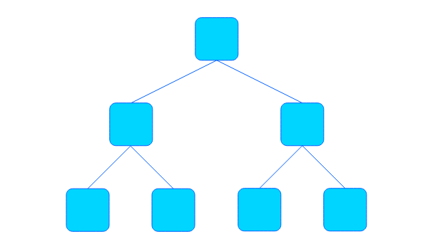
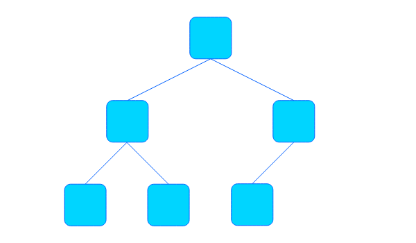
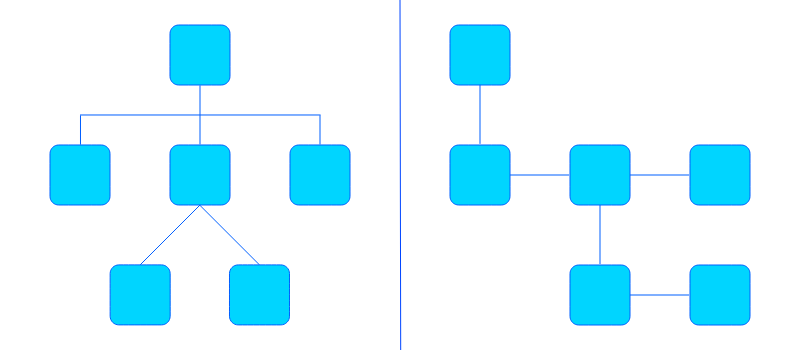
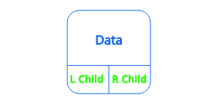
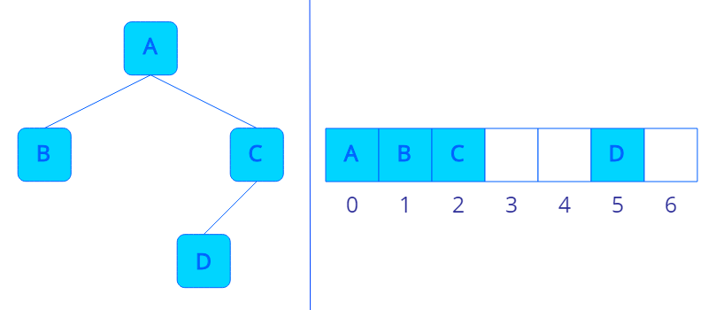
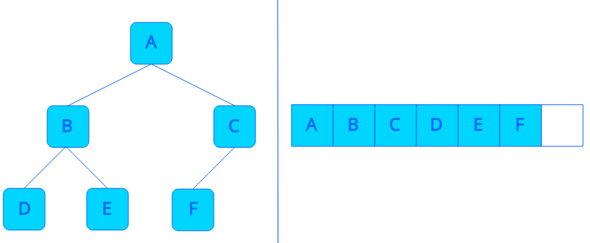

---

title: "트리 (Tree)"
excerpt: "트리를 알아보자"
tags: [algorithm, data_structure]

path: "/2019-09-13-tree"
featuredImage: "./tree_model.png"
created: 2019-09-13
updated: 2019-09-13

---

# 트리 (Tree)  

## \[ 개념 및 구조 \]  
  트리는 계층적인 형태를 가지고 있는 자료구조입니다.  
    
  트리에서 가장 꼭대기에 위치해 부모 노드가 없는 노드를 **루트 노드(Root Node)**라고 합니다.  
  트리에서 가장 끝에 위치해 자식이 없는 노드를 **리프 노드(Leaf Node)** 혹은 **단말 노드(Terminal Node)**라고 합니다.  
  트리는 **레벨(Level)**이라는 개념이 있는데 이는 루트 노드에서 1로 시작하고 자식 노드를 따라 아래로 내려갈 때마다 1씩 증가합니다.  
  
  * **노드(Node)**  
  * **자식 노드(Child Node)**  
  * **부모 노드(Parent Node)**  
  * **형제 노드(Sibling Node)**  
  * **루트 노드(Root Node)**  
  * **리프 노드(Leaf Node)[= 단말 노드(Terminal Node)]**  
  * **내부 노드(Internal Node)**  
  * **레벨(Level)**  
  
## \[ 이진 트리 (Binary Tree) \]  
    
  각 노드마다 최대 2개의 자식을 가질 수 있는 트리를 **이진 트리**라고 합니다.
  
  
  * **포화 이진 트리(Full Binary Tree)**
      
    이진 트리에서 모든 Level에 노드가 가득 차 있는 트리를 **포화 이진 트리(Full Binary Tree)**라고 합니다.  
    
  * **완전 이진 트리(Complete Binary Tree)**
      
    노드를 추가할 때 왼쪽부터 오른쪽으로 차곡차곡 추가하는 트리를 **완전 이진 트리(Complete Binary Tree)**라고 합니다. 완전 이진 트리의 마지막 Level을 제외한 부분은 항상 포화 이진 트리 상태입니다.  
  
  **포화 이진 트리**가 **완전 이진 트리**에 속한다고 볼 수 있지만, **완전 이진 트리**는 트리를 생성할 때부터 끝까지 **완전 이진 트리**의 성격을 유지하는 일종의 노드 관리 방식인 반면, **포화 이진 트리**는 언제든지 그 특성을 잃을 수 있는 하나의 상태로 볼 수 있습니다.  
  
  * **이진 트리로 일반 트리 구현하기**  
    일반 트리는 이진 트리를 이용하여 구현할 수 있습니다.  
      
    그림처럼 이진 트리의 **Left Child가 자식 노드**를, **Right Child가 형제 노드**를 가리키게 하여 일반 트리를 구현할 수 있습니다. 여기서 부모가 직접적으로 가리키는 자식 노드는 가장 왼쪽에 있는 노드입니다. 다른 형제 노드들은 Right Child 포인터를 이용해 접근할 수 있습니다.  
    
## \[ 구현 \]  
  * **포인터를 이용한 이진트리 구현**  
    포인터를 이용해 이진 트리를 구현하면 하나의 노드는 다음과 같이 생겼습니다.
    ```cpp
    template <typename type>
    struct Node
    {
        type data;
        struct Node *left_child;
        struct Node *right_child;
    };
    ```  
      
  
    **Left Child, Right Child 포인터**를 이용해 부모에서 자식으로의 접근이 가능합니다.  
  
  * **배열을 이용한 이진트리 구현**  
    배열을 이용해 이진 트리를 구현하면 **별도의 포인터 없이 INDEX의 계산**을 통해서 자식 노드에 접근할 수 있습니다.  
      
    현재 노드의 **INDEX**를 **K**라고 하면 왼쪽 자식 노드의 **INDEX**는 **2\*K + 1**이며 오른쪽 자식 노드의 **INDEX**는 **2\*K + 2**가 됩니다. 부모 노드의 **INDEX**는 **(K - 1)/2**로 계산할 수 있습니다.  
    ※ 하지만, 이렇게 할 경우 트리의 모양에 따라서 배열에 빈 공간이 생겨 메모리가 낭비될 수 있다는 단점이 있습니다. (데이터의 크기가 큰 경우에는 포인터로 인한 메모리 소모보다 훨씬 많은 메모리가 낭비될 수 있습니다.)  
      
    **완전 이진 트리**를 구현할 때는 배열로도 빈 공간 없이 효율적으로 구현할 수 있습니다. 따라서 **완전 이진 트리**를 구현할 때는 보통 **배열**을 이용해 구현합니다.  
  