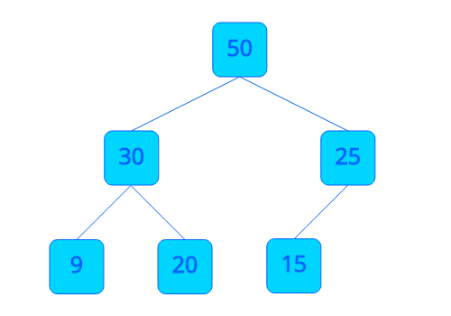
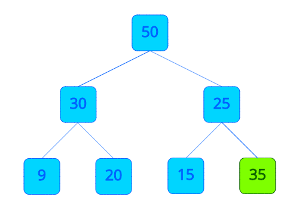
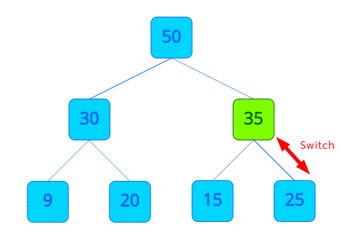
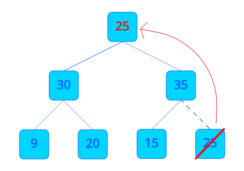
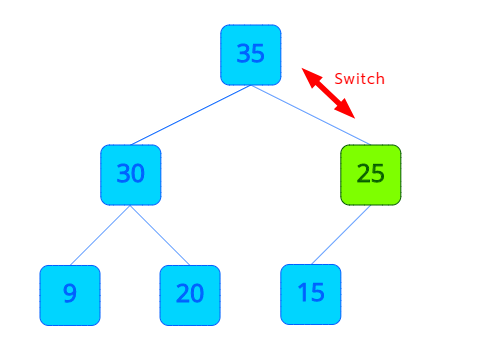

---

title: "우선순위 큐 (Priority Queue)"
excerpt: "우선순위 큐? 힙(Heap)?"
tags: [data_structure]

path: "/2019-09-14-priority_queue"
featuredImage: "./priority_queue_max_heap.png"
created: 2019-09-14
updated: 2019-09-16

---

# 우선순위 큐 (Priority Queue)

## \[ 개념 \]  
  **우선순위 큐(Priority Queue)**는 시간적 순서가 아닌 데이터 별로 **우선순위**를 두어 우선순위가 높은 순서대로 처리하는 큐입니다. 우선순위 큐는 **힙(Heap)**으로 구현할 수 있습니다. 힙이 뭐나구요? 그럼 먼저 **힙(Heap)**에 대해서 알아보도록 하겠습니다.    
  
## \[ 힙 (Heap)? \]  
  **힙(Heap)**은  **최댓값** 혹은 **최솟값**을 찾기 위해 만들어진 자료구조로 **우선순위 큐 (Priority Queue)**로 사용하기 용이한 자료구조입니다. 힙은 목적에 따라 두 가지로 나누어집니다.  
  * **최대 힙 (Max-Heap)**  
    **최댓값**을 찾기 위한 힙으로 부모 노드의 데이터가 자식 노드의 데이터보다 크다.  
  * **최소 힙 (Min-Heap)**  
    **최솟값**을 찾기 위한 힙으로 부모 노드의 데이터가 자식 노드의 데이터보다 작다.  

  우선순위 큐에서 값이 큰 데이터가 우선순위가 높다면 **최대 힙**을, 값이 작은 데이터가 우선순위가 높다면 **최소 힙**을 사용합니다. 여기서는 최대 힙을 예시로 들겠습니다.  
  ****  
  
  **최대 힙(Max-Heap)**은 큰 노드가 작은 노드들을 자식으로 가지는 **완전 이진 트리(Binary Tree)** 구조입니다. 두 자식 노드 중 누가 더 큰 지는 상관없이 양쪽 모두 부모 노드보다 작기만 하면 됩니다. 그러면 최댓값이 항상 루트 노드에 위치하여 항상 루트 노드에 있는 데이터가 먼저 빠져나갑니다. 힙은 **완전 이진 트리(Complete Binary Tree)**로 구현한다고 했는데 루트에서 데이터가 빠지면 데이터가 어떻게 재구성되는지 힙의 삽입과 삭제 과정을 통해 알아보겠습니다.  
  
  ※ 완전 이진 트리가 무엇인지 모르신다면 이전 포스터 [\[ 트리(Tree)를 알아보자. \]](https://goo-gy.github.io/2019-09-13-tree/)를 읽어보시는 걸 추천합니다.  
  
  * **삽입**  
    ****  
    힙에서 데이터 삽입은 해당 위치를 바로 찾아서 가는 것이 아니라. 일단 가장 뒤에 넣어두고 부모 노드와의 비교를 통해 제자리를 찾아갑니다.  
    ****  
    부모 노드의 데이터가 자신의 데이터보다 크다면 자리를 바꿉니다. 이 과정을 자신 보다 큰 부모 노드를 만나거나 자신이 루트 노드가 될 때까지 반복합니다.
    
  * **삭제**  
    **힙(Heap)**은 **우선순위 큐(Priority Queue**를 위해서 만들어진 자료구조입니다. 그럼 가장 우선순위가 높은 데이터부터 처리되겠죠? 그건 분명히 **루트 노드**일 겁니다. 하지만 힙에서 **루트 노드**를 바로 삭제하지는 않습니다.  
    ****   
    루트 노드를 제거하는 대신에 **마지막에 위치한 노드의 데이터를 루트 노드에 덮어쓴 후 마지막 노드를 제거**합니다. 
    ****  
    그런 다음 루트로 올라간 노드를 하위 노드와 비교하여 제자리를 찾도록 내려보냅니다. 여기서 내려보낼 때 **왼쪽 자식 노드와 오른쪽 자식 노드 모두 비교하여 더 큰 노드와 자리를 바꿉니다.** (물론, 양쪽 노드 모두 자신보다 작다면 바꾸지 않습니다.) 이 과정을 자신 보다 큰 자식 노드가 없을 때까지 반복합니다.  
    그러면 결과적으로 루트 노드를 제거하고 나머지 데이터를 힙에 맞게 재구성하는 효과를 볼 수 있습니다.  
  
## \[ 기능 \]  
  * **INSERT**  
    우선순위 큐에 데이터를 추가합니다. (우선순위에 따라서 데이터가 들어갈 위치가 달라져 중간에 들어갈 수 있기 때문에 INSERT라고 합니다.)  
  * **POP**  
    우선순위 큐에서 가장 앞에 있는 데이터를 꺼냅니다. (일반 큐의 POP과 달리 우선순위가 높은 데이터부터 꺼냅니다.)  
  * **TOP**  
    우선순위 큐에서 가장 위에 있는 데이터 (우선순위가 가장 높은 데이터)를 반환합니다.  
  * **SIZE**  
    우선순위 큐에 들어있는 데이터의 수를 반환합니다.  
  * **IS_EMPTY**  
    우선순위 큐가 비어 있는지 확인합니다.  
