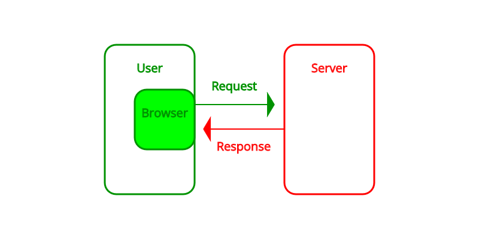
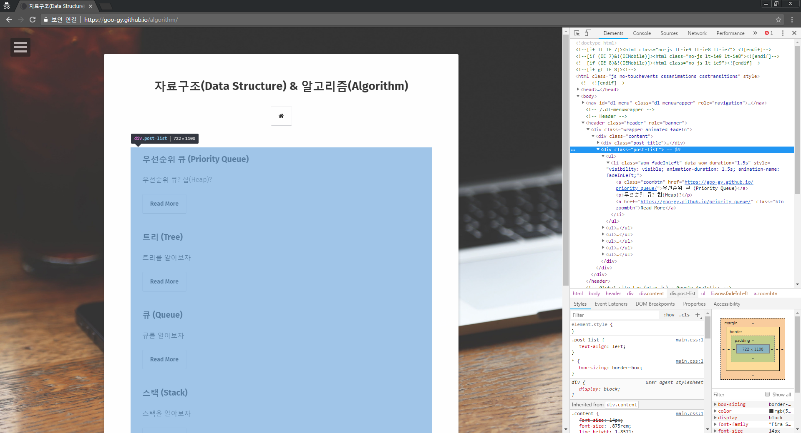

---

title: "크롤링(Crawling)을 해보자 [Python]"
excerpt: "urllib2와 beautiful-soup를 이용한 크롤링"
tags: [project, crawling]

path: "/2019-09-24-crawling"
featuredImage: "./crawling_web.png"
created: 2019-09-24
updated: 2019-09-24

---

# \[ 크롤링 (Crawling) \]  
**크롤링(Crawling)**은 **로봇(프로그램)**이 스스로 웹사이트를 돌아다니면서 필요한 정보를 추출하고 행위를 의미합니다. 사람이 직접 브라우저를 통해 웹사이트들에서 정보를 얻어 수작업으로 기록하는 것 대신 크롤링을 이용하면 대량의 정보를 빠르게 추출할 수 있습니다. 프로그램이 정보 수집을 위해 페이지들을 긁고 기어다는 것이 거미가 기어 다니는 것 같다고 하여 **크롤링(Crawling)**이라는 이름이 붙었나 봅니다.  

## \[ 원리 \]  
  크롤링을 하기에 앞서 웹 통신의 원리를 알아봅시다. (크롤링에 있어서도 큰 도움이 될 것입니다.)   
    
  먼저 사용자가 대상 서버에 정보를 요청합니다 (**Request**). 그러면 서버는 사용자에게 요청한 페이지 소스를 보내줍니다 (**Response**). 브라우저는 서버로부터 받은 **페이지 소스(Page Source)**를 분석하여 사용자에게 화면으로 보여줍니다.  
  
  크롤링을 하려면 다음의 과정을 이해하고 구현해야 합니다.    
  1. **웹 서버와 통신**
  2. **페이지 소스 분석 (Parsing)**
  
  사용자가 직접 웹서핑을 할 때는 브라우저가 알아서 정보를 요청하고 받은 페이지 소스를 분석하여 사용자에게 보내줍니다. 크롤링을 하기 위해서는 프로그램에서 **정보를 요청하는 통신**과 **페이지 소스를 분석**하는 과정이 필요합니다.  
  
## 웹 서버와 통신 \[urllib2\]  
  **urllib2** 라이브러리를 이용하면 편리하게 웹서버와 통신할 수 있습니다. 
  ``` python
import urllib2

url = "https://goo-gy.github.io/posts/"
request = urllib2.Request(url)
response = urllib2.urlopen(request)
print(response.read())
  ```  

  urllib2.Request()는 url을 인자로 받아 정보를 요청할 Request 객체를 생성합니다. Request 객체를 통해서 url에 접속만 하는 것이 아니라 추가적인 작업을 할 수 있습니다.  
  * **Request**  
    * **.add_header("header", "value")**  
      Request의 **헤더(Header)**를 추가할 수 있습니다. 이를 이용해 **Cookie, User-Agent, Referer** 등을 추가할 수 있습니다.  
    * **.add_data("param=data")**  
      **POST 메서드**로 데이터를 보낼 수 있습니다.  
    
  urllib2.urlopen()은 url 혹은 Request 객체를 가지고 서버에 정보를 요청하고 받아와 Response 객체를 생성합니다.  

  * **Response**  
    * **.read()**  
      Response에서 페이지 소스를 반환합니다.  
    
    * **.code**  
      Response의 응답 코드입니다.
    * **.headers**  
      Response의 헤더들이 담긴 사전(Dictionary)처럼 저장되어 있습니다.  

## 웹 페이지 파싱 \[beautiful-soup\]  
  웹페이지 소스는 **HTML**이라는 형식으로 구성되어 있는데, Beautiful Soup가 문자열로 얻어진 웹 페이지 소스를 분석하여 **HTML** 구조에서 필요한 정보를 추출할 수 있도록 도와줍니다.  
  ``` html
  --------------------Element--------------------
  <h1 id="크롤링-crawling">크롤링 (Crawling)</h1>
  Tag     Attribute                          Tag
  ```  
  HTML에는 기본적으로 구조를 나누는 **태그(Tag)**와 구체화시키는 **속성(Attribute)**이 있습니다. 이 태그와 속성을 이용하여 우리가 원하는 정보를 찾을 수 있습니다. 그리고 태그들로 감싸진 부분을 **엘리먼트(Element)**라고 합니다.  
  Beautiful Soup를 이용하여 우리는 HTML에서 원하는 정보를 쉽게 추출할 수 있습니다.  
  
  Beautiful Soup는 내장 라이브러리가 아니기 때문에 설치가 필요합니다.  
  ``` 
  # pip install bs4  
  ```  
  예제로 Beautiful Soup를 이용하여 제 블로그의 포스트 목록에서 제목들을 가져오겠습니다.  
  ``` python
import urllib2
from bs4 import BeautifulSoup

url = "https://goo-gy.github.io/posts/"
request = urllib2.Request(url)
response = urllib2.urlopen(request)
page_source = response.read()

page_html = BeautifulSoup(page_source, "html.parser")
post_table = page_html.find("div", {"class":"post-list"})
post_list = post_table.find_all("li")

for post in post_list:
    print(post.a.text)
  ```  
  
  * **find(name, attrs, recursive, string, **kwargs)**  
    find는 조건에 맞는 태그 중 소스에서 가장 앞에 위치한 요소 하나를 가져옵니다.  
    * **name**: 태그명으로 검색합니다.  
    * **attrs**: 특정 속성의 값으로 검색합니다.  
    * **recursive**: 해당 요소 내부에서 재귀적으로 검색할지 선택합니다. (True 이면 하위에 있는 모든 요소에서 검색하며 False 이면 내부의 최상위 요소들에서만 검색합니다.)  
    * **string**: 내부 문자열을 검색합니다. 문자열 자체 혹은 정규 표현식으로 입력할 수 있습니다.
      *※ HTML은 트리 구조입니다. recursive를 준다면 손자 요소들에서도 검색합니다.*  
    
  * **find_all(name, attrs, recursive, string, limit, **kwargs)**  
    find_all은 조건에 맞는 요소(Element)를 모두 가져와 리스트처럼 사용할 수 있습니다.  
    * **name**: 태그명으로 검색합니다.  
    * **attrs**: 특정 속성의 값으로 검색합니다.  
    * **recursive**: 해당 요소 내부에서 재귀적으로 검색할지 선택합니다. (True 이면 하위에 있는 모든 요소에서 검색하며 False 이면 내부의 최상위 요소들에서만 검색합니다.)  
    * **string**: 내부 문자열을 검색합니다. 문자열 자체 혹은 정규 표현식으로 입력할 수 있습니다.
    * **limit**: 매칭되는 결과의 수를 제한합니다.  

  * **Example**
    * 태그로 검색하기  
      ``` python
      page_html.find("div")
      ```  
    
    * 태그와 속성값으로 검색하기
      ``` python
      page_html.find("div", name="post-list")
      ```  
      class와 같이 파이썬의 예약어로 등록되어 있는 단어는 오류가 나기 때문에 뒤에 _를 붙여주는 것을 허용합니다.  
      ``` python
      page_html.find("div", class_="post-list")
      ```  
      딕셔너리 형태로 여러 개의 속성을 지정할 수 있습니다. (저는 한 개만 하더라도 예약어 문제가 없기 때문에 이 방법을 선호합니다.) 
      ``` python
      page_html.find("div", {"class":"post-list"})
      ```
     
    * 태그와 문자열로 검색하기
      ``` python
      page_html.find("a", string="트리 (Tree)")
      ```  
      
## \[ robots.txt \]  
  **robots.txt**는 웹페이지가 로봇(크롤러)에게 지켜달라고 지정해놓은 규약입니다. 기능적으로 강제성이 있지는 않지만 대상 **웹 서버에 대한 예의**라고 할 수 있습니다. 크롤링이 사람이 직접 하는 것보다 빠르게 접속하는 만큼 웹 서버에도 부하가 커질 수 있기 때문입니다. robots.txt에는 크롤링 금지 경로, 허용 경로, 최소 딜레이 등이 포함되어 있습니다.  
  * **User-agent**  
    대상 Agent
  * **Disallow**  
    금지 경로
  * **Allow**  
    허용 경로
  * **Crawl-delay**  
    최소 딜레이 간격  
    
  더 자세한 내용은 \[[Google robots.txt](https://support.google.com/webmasters/answer/6062596?hl=ko&ref_topic=6061961)\]를 참고하시기 바랍니다.  
  **robotparser**를 이용하면 내 크롤러가 **robots.txt**의 내용을 지키도록 적용할 수 있습니다.  
  ``` python
import robotparser
import urllib2

robot_url = "https://goo-gy.github.io/robots.txt"
robot = robotparser.RobotFileParser()
robot.set_url(robot_url)
robot.read()

url = "https://goo-gy.github.io/posts/"
request = urllib2.Request(url)
request.add_header('User-agent', 'python-urllib2')
if( robot.can_fetch(request.headers['User-agent'], url) ):
    response = urllib2.urlopen(request)
    print(response.read())
  ```  
  * **RobotFileParser()**  
    * **.set_url(url)**  
      읽어들일 robots.txt의 url 경로를 지정합니다.  
    * **.read()**  
      지정해둔 url에서 robots.txt를 읽어들입니다.  
    * **.can_fetch(agent, url)**  
      입력한 url에 입력한 robot agent의 접속 허용 여부를 반환합니다.  
  
## \[ Tips \]  
### \<정보 위치 찾기\>  
    
  * Chrome의 **개발자 도구(F12)**를 이용하면 내가 원하는 원하는 정보에 어떻게 접근해야 할지 쉽게 알 수 있습니다. ctrl + shift + c를 누르고 추출하려는 부분에 마우스를 올리면 개발자 도구에서 해당 html 태그를 보여줍니다.  
  
  * 크롤링 하면서 생각처럼 작동이 안 될 때는 [Burp-suite](https://portswigger.net/burp/communitydownload) 등의 **Proxy 툴**을 이용하여 오가는 HTTP 메세지를 잡아서 확인해 보는 것이 도움이 될 수 있습니다. 앞에서 설명한 것처럼 웹페이지는 사용자와 서버의 통신으로 이루어지는데 일반 브라우저로 접속했을 때와 내가 만든 크롤러로 접속했을 때의 패킷을 비교해보면 무엇이 잘못되었는지 파악할 수 있습니다.  

### \<메서드 변경하기\>  
  ``` python
import urllib2

url = "https://goo-gy.github.io"

request = urllib2.Request(url)
request.get_method = lambda: 'GET';
response = urllib2.urlopen(request)
page_source = response.read()
print(page_source)
  ```  
  제 블로그는 GET 메서드 이외의 메서드는 막혀 있기 때문에 에러가 발생합니다.  
  
### \<HTTP 응답[상태] 코드 \(HTTP Status Code\)\>  
  **HTTP 응답 코드**는 response.code로 확인할 수 있습니다. 하지만 **\[ 200 OK \]** 등의 요청 성공 이외의 코드들은 response 객체를 생성하기 전에 오류가 나기 때문에 별도의 에러 처리를 해야 응답 코드를 얻을 수 있습니다.  
  ```  python
import urllib2

url = "https://goo-gy.github.io"
request = urllib2.Request(url)
method_list = ['GET', 'POST', 'HEAD', 'OPTIONS', 'PUT', 'DELETE', 'TRACE', 'CONNECT']

for method in method_list:
    request.get_method = lambda: method;
    try:
        response = urllib2.urlopen(request)
        print(method, response.code)
    except urllib2.HTTPError as error:
        print(method, error.code)
  ```
  ```
# python2 method_test.py
('GET', 200)
('POST', 405)
('HEAD', 200)
('OPTIONS', 405)
('PUT', 405)
('DELETE', 405)
('TRACE', 405)
('CONNECT', 405)
  ```
  HTTP 상태 코드 : [https://developer.mozilla.org/ko/docs/Web/HTTP/Status](https://developer.mozilla.org/ko/docs/Web/HTTP/Status)  
  