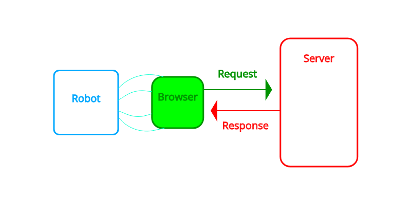
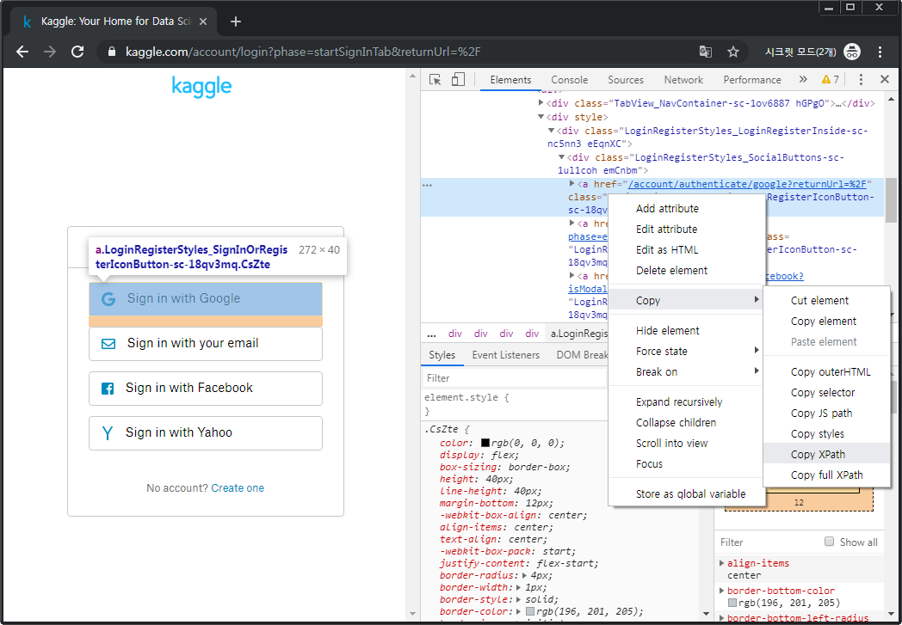

---

title: "셀레니움(Selenium)을 이용한 크롤링 [Python]"
excerpt: "크롤러에서 자바스크립트(JavaScipt)를 실행하고 싶은데.."
tags: [python, crawling]

path: "/2019-10-02-selenium"
featuredImage: "./selenium_selenium_communication.png"
created: 2019-10-02
updated: 2019-10-08

---

## [ JavaScript 처리 ]  
  웹 페이지 중에는 **JavaScript**를 실행해야 가져올 수 있는 데이터가 있으며 그중에서도 **비동기적으로 처리**되어 나중에 불러지는 데이터도 있습니다. 크롤러에서 JavaScript를 해석하고 로딩에 시간차가 생기는 데이터를 처리하는 것은 까다롭습니다. 하지만 크롬 등의 **브라우저**에는 이들을 처리하는 기능들이 내장되어 있어 사용자가 쉽게 이용할 수 있습니다. **Selenium**은 브라우저를 이용한 웹 진단 프레임워크입니다. 우리는 Selenium으로 브라우저의 기능을 활용하여 복잡한 처리를 거치는 데이터를 쉽게 가져올 수 있습니다.  
  
## [ Selenium의 동작원리 ]  
    
  이전 포스터에서의 로봇이 브라우저의 역할을 대신했다면 여기 Selenium은 브라우저를 조종하는 로봇이라고 할 수 있습니다. 사용자 대신 브라우저에게 명령을 하여 처리한 데이터를 가져올 수 있습니다.  

## [ Selenium 시작하기 ]  
  selenium에서는 크롬(Chrome), 파이어폭스(FireFox), PhantomJS 등 여러 가지 브라우저를 이용할 수 있지만 여기서는 **크롬(Chrome)**을 이용하도록 하겠습니다.    
  * **Selenium 설치하기**  
    ```
> pip install selenium
    ```  
  *※ PATH에 pip 경로가 등록되어있지 않다면 python 경로 아래 scripts에서 실행해야합니다.*  
  * **크롬 설치**  
  **Chrome 다운: [https://www.google.com/chrome/](https://www.google.com/chrome/){:target="_blank"}**  
  * **Chrome Driver**  
    Selnium에서 Chrome을 이용하기 위해서는 현재 크롬 버전에 맞는 Chrome Diver를 설치해야 합니다.  
    **Chrome-driver 다운: [https://sites.google.com/a/chromium.org/chromedriver/downloads](https://sites.google.com/a/chromium.org/chromedriver/downloads){:target="_blank"}**  

## [ Selenium 사용법 ]  
### \<Driver 생성\>  
  ``` python
driver = webdriver.Chrome()
  ```
  * **옵션 넣기**  
    ``` python
options = webdriver.ChromeOptions()
options.add_argument('lang=ko_KR')
options.add_argument('user-agent=googy bot')
driver = webdriver.Chrome(chrome_options=options)
    ```  
    
### \<Element 찾기\>  
  * **find_element_by_tag_name( ‘tag 명’ )**  
  * **find_element_by_id( ‘id 명’ )**  
  * **find_element_by_class_name( ‘class 명’ )**  
  * **find_element_by_xpath( ‘옵션’ )**  
    **XPath(XML Path Language)**는 마크업 언어 구조의 문서에서 지정한 구문을 사용하여 경로를 나타내고 처리하는 언어입니다. 이를 이용하면 HTML에서 원하는 요소(Element)를 쉽게 얻을 수 있습니다.  
    * **기본적인 단어는 tag를 지정합니다.**  
      Tag가 p인 요소
      ``` python
driver.find_element_by_xpath('//p')
      ```
    * **[] : 술부(Predicates)로 추가적인 조건을 명시하여 특정 요소를 찾을 수 있습니다.**  
      * **@ : 속성을 지정할 때 표시합니다.**  
        Tag가 div이면서 id 속성을 가진 요소  
        ``` python
        driver.find_element_by_xpath('//div[@id]')
        ```  
        Tag가 div이면서 id 속성 값이 "header"인 요소  
        ``` python
        driver.find_element_by_xpath('//div[@id="header"]')
        ```  
    
    * **/ : 경로 구분을 위해 나타냅니다.** (맨 앞에 오면 최상위 노드에서 시작합니다.)   
      id가 header인 div 요소 > ul 요소 > li 요소
      ``` python
driver.find_element_by_xpath('//div[@id="header"]/ul/li')
      ```
    * **// : 해당 경로 하위 노드 전체에서 검색합니다.** (마찬가지로, 맨 앞에 오면 최상위 노드에서 시작합니다.)  
      id가 header인 div 요소 내부에서 li 요소 검색
      ``` python
driver.find_element_by_xpath('//div[@id="header"]//li')
      ```
    * **\* : 모든(불특정)**  
      id 값이 "header"인 모든 엘리먼트
      ``` python
driver.find_element_by_xpath('//*[@id="header"]//li')
      ```  
      div 태그 중 어떤 속성값이라도 가지는 엘리먼트
      ``` python
driver.find_element_by_xpath('//div[@*]')
      ```  
      div 태그 중 어떤 속성값이라도 "header" 값을 가지는 엘리먼트
      ``` python
driver.find_element_by_xpath('//div[@*="header"]//li')
      ```  
      
  element에 s를 붙이면 조건을 만족하는 모든 요소를 가져와 리스트처럼 사용할 수 있습니다.  
  * **find_elements_by_tag_name( ‘tag 명’ )**  
  * **find_elements_by_id( ‘id 명’ )**  
  * **find_elements_by_class_name( ‘class 명’ )**  
  * **find_elements_by_xpath( ‘옵션’ )**  
  
### \<Data 입력하기\>  
  * **send_keys( str )**  
    Element에 문자열을 입력합니다. 물론 input, textarea 등 입력이 가능한 Element 이어야 합니다.  
  * **click()**  
    Element에 클릭합니다. button, submit, link 등 클릭이 가능한 Element 이어야 합니다.  
    
### \<로딩 기다리기\>  
  브라우저에 특정 페이지에 접속하라고 명령을 해두어도 비동기 처리 혹은 네트워크 상황에 따라 문서(DOCUMENT)에서 내가 찾는 Element가 로딩되지 않았을 수도 있습니다. 
  로딩이 끝나지 않은 문서에서 Element를 찾거나 입력을 준다면 오류가 발생할 수 있습니다. 
  이를 방지하기 위해서 Selenium에서는 브라우저에게 특정 Element가 존재할 때까지 기다리라고 명령할 수 있습니다.  
  ``` python
from selenium import webdriver

from selenium.webdriver.common.by import By
from selenium.webdriver.support.ui import WebDriverWait
from selenium.webdriver.support import expected_conditions

DELAY = 10
url = "https://www.kaggle.com/"
driver = webdriver.Chrome()
driver.get(url)

WebDriverWait(driver, DELAY).until(expected_conditions.presence_of_all_elements_located((By.XPATH, '//a[@id="sign-in-button"]')))
driver.find_element_by_xpath('//a[@id="sign-in-button"]').click()
  ```
  \[[selenium expected_conditions](https://seleniumhq.github.io/selenium/docs/api/py/webdriver_support/selenium.webdriver.support.expected_conditions.html){:target="_blank"}\] 내 여러 함수를 이용해 특정 조건을 지정하고 WebDriverWait()에서 Delay를 줄 수 있습니다.  
  

### \<Other Tips\>  
  * **Alert() 처리하기**  
    ``` python
WebDriverWait(driver, DELAY).until(expected_conditions.alert_is_present())
check_alert = webdriver.common.alert.Alert(driver)
check_alert.accept()
  ```
  
  * **새 윈도우로 전환하기**  
    ``` python
window_before = driver.window_handles
# 여기에 새 윈도우 창을 띄우는 작업
WebDriverWait(driver, DELAY).until(expected_conditions.new_window_is_opened(window_before))
driver.switch_to.window(driver.window_handles[-1])
  ```
  
## \[ 예제: Kaggle 로그인하기 \]  
  Kaggle에서는 Google, Facebook 등의 SSO 인증을 지원합니다. Selenium을 이용하면 구글의 복잡한 로그인 처리, SSO 인증을 간편하게 수행할 수 있습니다.  
  
  \<**Settings**\>  
  * **Python**  
    2.7.16  
  * **Selenium**  
    3.141.0
  * **Chrome**  
    77.0.3865.75 (공식 빌드)  
  * **Chrome-Drvier**  
    77.0.3865.40  

  먼저 Kaggle에 접속해 우리가 자동으로 수행할 부분을 찾아줍니다.  
    
  Chrome 개발자 도구에서 원하는 Element 우클릭 > Copy > Copy XPath를 사용하면 XPath를 얻을 수 있습니다. ( 다만, 저는 한 번 만든 프로그램은 오래 사용하길 원하기 때문에 페이지의 변경 가능성을 고려하여 XPath를 직접 작성하는 것을 선호합니다. )
  ``` python
# -*- coding: utf-8 -*-

from selenium import webdriver
from selenium.webdriver.common.by import By
from selenium.webdriver.support.ui import WebDriverWait
from selenium.webdriver.support import expected_conditions
import getpass
 
DELAY = 30
url = "https://www.kaggle.com/"
GOOGLE_ID = raw_input("Google ID:")
GOOGLE_PW = getpass.getpass()

driver = webdriver.Chrome()
driver.get(url)

# 로그인 > 구글 로그인
driver.maximize_window() # Kaggle에서 로그인 클릭을 위해 창 크기를 늘립니다.
WebDriverWait(driver, DELAY).until(expected_conditions.element_to_be_clickable((By.XPATH, '//a[@id="sign-in-button"]')))
driver.find_element_by_xpath('//a[@id="sign-in-button"]').click()
WebDriverWait(driver, DELAY).until(expected_conditions.element_to_be_clickable((By.XPATH, '/html/body/main/div/div/div/div/div/div/form/div[2]/div/div[1]/a')))
driver.find_element_by_xpath('/html/body/main/div/div/div/div/div/div/form/div[2]/div/div[1]/a').click()

# Google ID 입력
WebDriverWait(driver, DELAY).until(expected_conditions.visibility_of_all_elements_located((By.XPATH, '//input[@id="identifierId"]')))
driver.find_element_by_xpath('//input[@id="identifierId"]').send_keys(GOOGLE_ID)
WebDriverWait(driver, DELAY).until(expected_conditions.element_to_be_clickable((By.XPATH, '//div[@id="identifierNext"]')))
driver.find_element_by_xpath('//div[@id="identifierNext"]').click()

# Google Password 입력
WebDriverWait(driver, DELAY).until(expected_conditions.visibility_of_all_elements_located((By.XPATH, '//div[@id="password"]//input[@name="password"]')))
driver.find_element_by_xpath('//div[@id="password"]//input[@name="password"]').send_keys(GOOGLE_PW)
WebDriverWait(driver, DELAY).until(expected_conditions.element_to_be_clickable((By.XPATH, '//div[@id="passwordNext"]')))
driver.find_element_by_xpath('//div[@id="passwordNext"]').click()
  ```