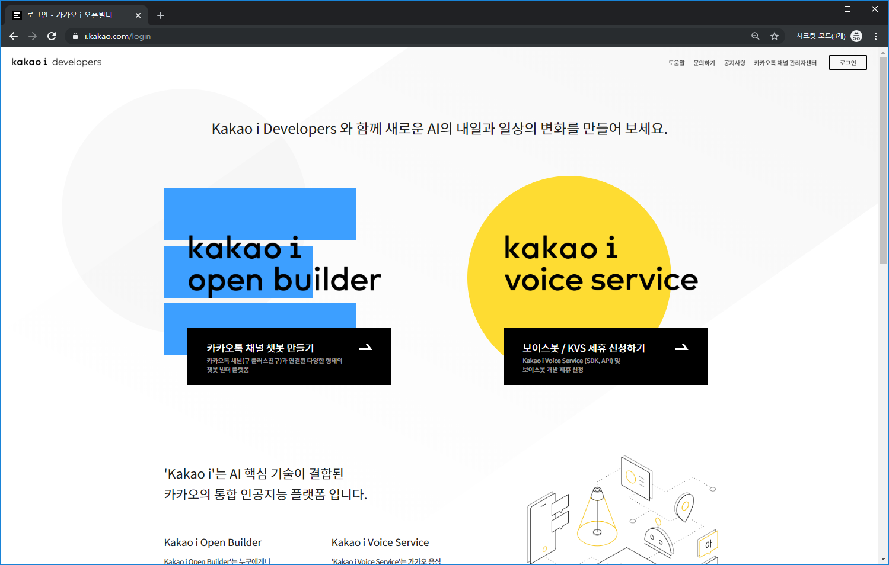
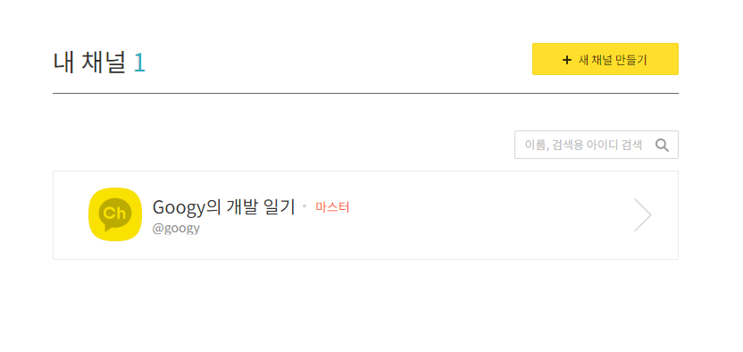
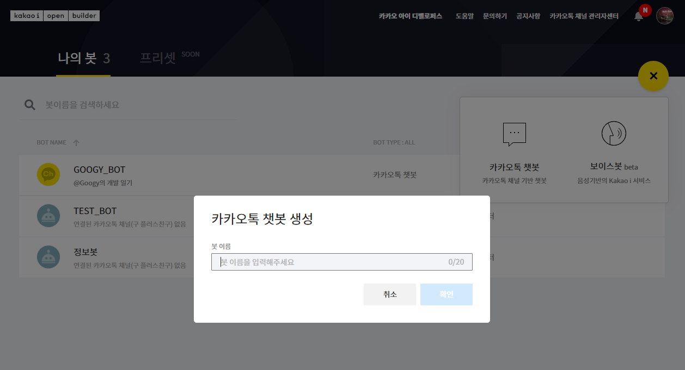
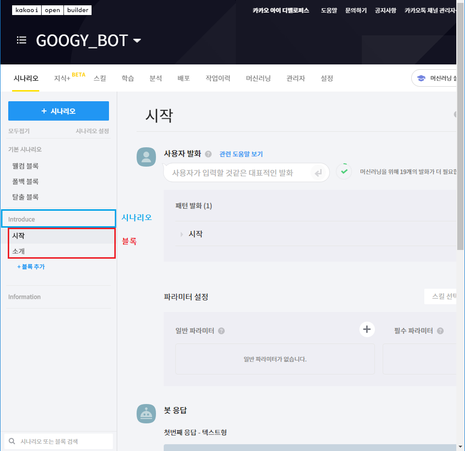
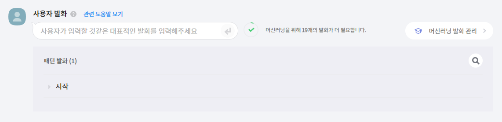
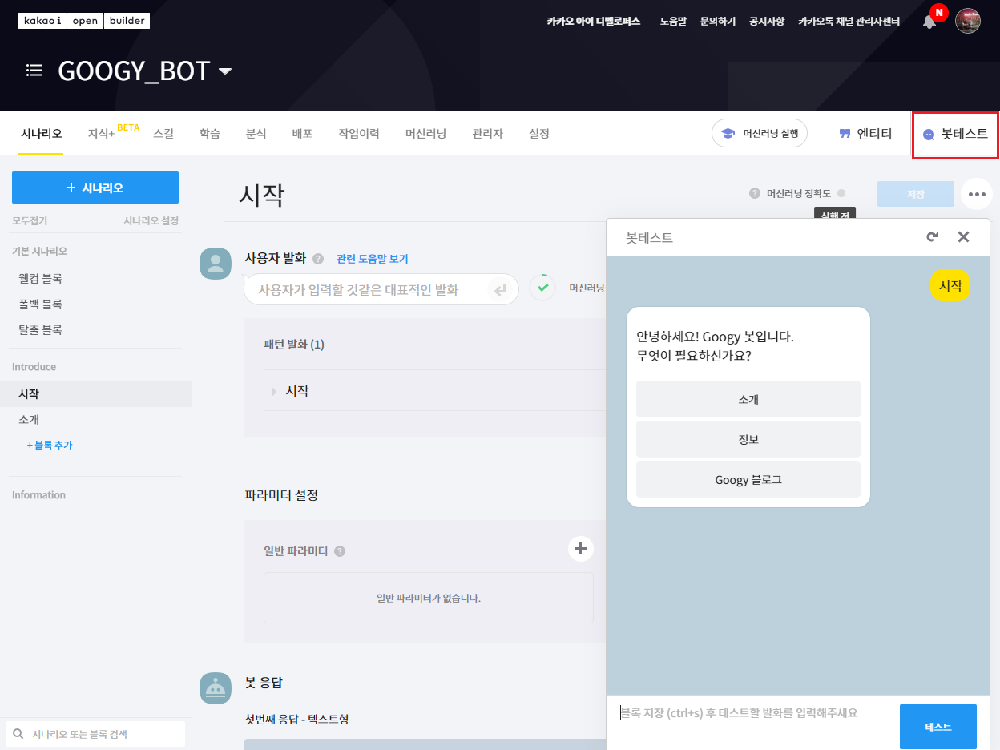
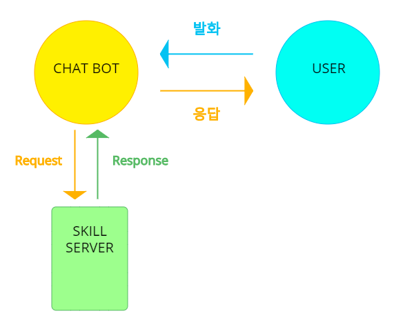
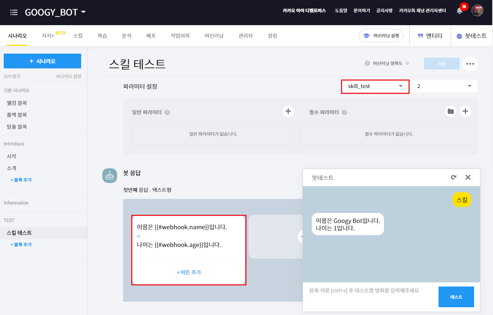
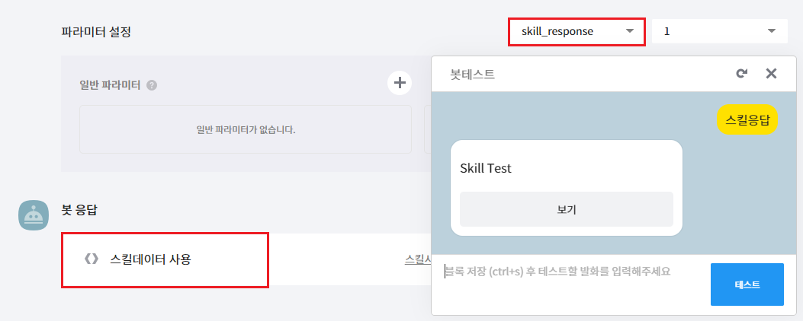

---

title: "카카오 챗봇 제작하기"
excerpt: "카카오 챗봇을 만들어보자"
tags: [project, kakao, chatbot]

path: "/2019-10-30-kakao-chatbot"
featuredImage: "./kakao_chatbot_openbuilder_login.png"
created: 2019-10-30
updated: 2019-10-30

---

## \[ 카카오톡 오픈빌더 신청하기 \]  
  **키카오톡 오픈빌더**를 통해서 카카오 챗봇을 제작할 수 있습니다.  
    

  [카카오톡 오픈빌더](https://i.kakao.com/login)에 접속해 왼쪽의 **카카오톡 채널 챗봇 만들기**를 선택하여 로그인하고 신청합니다. (신청 후 일정 기간이 지나면 승인됩니다.)

## \[ 채널 \]  
  챗봇을 사용하려면 챗봇을 연결할 **채널**이 필요합니다.  
    

  [카카오톡 관리자 센터](https://center-pf.kakao.com/)에 접속해 채널을 생성해 줍니다.
  
## \[ 챗봇 만들기 \]  
    

  승인이 되었다면 [카카오톡 오픈빌더](https://i.kakao.com/openbuilder)에 접속하여 **+**를 눌러 카카오 챗봇을 만들어 줍니다.  
  
  
## \[ 시나리오 \]  
  **시나리오**는 카카오 챗봇에서 제공하는 여러 **블록**들로 구성된 서비스 단위입니다.  
    

  * **블록**  
    **블록**은 대화의 최소단위로 **사용자 발화 - 봇 응답**으로 구성되어 있습니다.  
    
  * **블록 제작하기**  
      

    블록에서 사용자가 입력할 것 같은 **발화를 등록**해줍니다.  
      

    그리고 **텍스트, 카드, 스킬** 등을 이용하여 해당 발화에 대한 **응답을 설정**할 수 있습니다.  
    **버튼**을 이용하면 다른 블록을 직접 연결하거나 메세지를 전송하도록 하여 다른 블록으로 넘어갈 수 있습니다.  
    
  * **봇 테스트**  
      

    저장하여 등록했다면 오른쪽 상단의 **봇테스트**를 통해서 확인해 볼 수 있습니다.  
  
### \< 기본 시나리오 \>  
  * **웰컴 블록**  
    웰컴 블록에서는 봇이 사용자와 처음 채팅을 시작할 때 보여줄 응답을 지정할 수 있습니다.  
  * **폴백 블록**  
    폴백 블록에서는 봇이 이해할 수 없는 발화에 대한 응답을 지정할 수 있습니다.  
    
  * **탈출 블록**  
    탈출 블록에서는 대화를 초기화하거나 끝내기 위해 사용할 발화를 지정할 수 있습니다.  

## \[ 스킬 \]
  **스킬**은 사용자가 필요로 하는 정보를 **웹 서버**에서 처리하여 제공할 수 있습니다.  
  인터넷상에 있어 자주 변하는 정보, 복잡한 연산을 필요로 하는 정보들은 관리자가 직접 등록하기에는 한계가 있습니다. 이런 정보를 스킬을 통해 잘 처리하여 제공할 수 있습니다.  
    
   
  * **스킬 제작**  
    스킬 탭에서 스킬을 생성하겠습니다.  
      

    URL에 스킬을 제공할 서버의 접속 주소를 입력해줍니다.  
      
    ``` json
    {
        "version": "2.0",
        "data": 
        {
            "name":"Googy Bot",
            "age":"1"
        }
    }
    ```
    위는 스킬 응답 예시입니다. 챗봇과 서버는 **JSON 형식**으로 통신합니다.  
    * **version**: 챗봇이 응답을 이해하는데 필요한 버전입니다. (작성하지 않으면 1.0으로 인식합니다.)  
    * **data**: 실질적으로 우리가 사용할 응답 데이터입니다.  
    
  * **블록 - 스킬 연결**  
    스킬 응답을 돌려주는 서버를 만들었다면 이를 블록에서 사용할 수 있습니다.  
      
    
    그림과 같이 스킬을 지정하면 **\{\{\#webhook.KEY\}\}**로 스킬 서버에서 받은 데이터를 활용할 수 있습니다.  
    
  * **스킬 자체 응답 작성하기**  
    봇 응답을 서버에서 모두 처리하는 방법도 있습니다.  
    스킬 서버에서 **template**을 구성해 보내주고 봇 응답으로 **스킬 데이터**를 사용하면 됩니다.
    ``` json
    {
        "version": "2.0",
        "template": {
            "outputs": [
                {
                    "basicCard":{
                        "title":"Skill Test",
                        "buttons": [
                            {
                              "action": "message",
                              "label": "보기",
                              "messageText": "보기"
                            }
                        ]
                    }
                }
            ]
        }
    }
    ```
      
    
  * **스킬 파라미터**  
    스킬에서 **파라미터**를 입력으로 받아 처리한다면 하나의 스킬을 가지고 여러 블록에서 사용할 수 있습니다.  
  
  스킬을 위한 **Request, Reponse**에 대한 자세한 내용은 카카오의 \[[응답 타입별 JSON 포맷](https://i.kakao.com/docs/skill-response-format)\] 문서를 참고하시면 좋을 것 같습니다.  

## \[ MORE \]  
  지금까지 기본적인 기능을 제공할 수 있는 카카오톡 챗봇을 제작해보았습니다.  
  카카오 오픈빌더에는 더 많은 기능들이 있으니 더 공부하실 분은 \[[오픈 빌더 가이드](https://i.kakao.com/docs/getting-started-overview)\]를 참조하시길 바랍니다.  