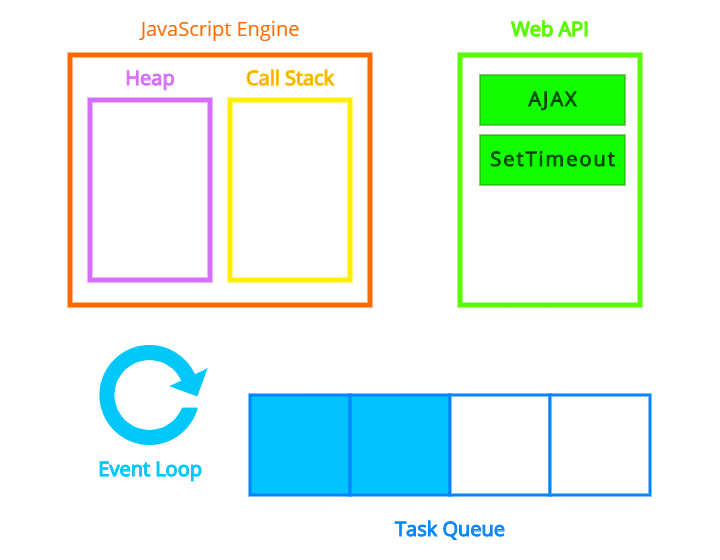
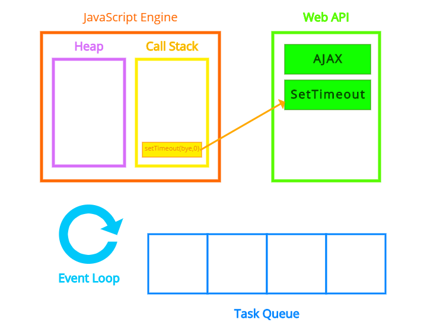
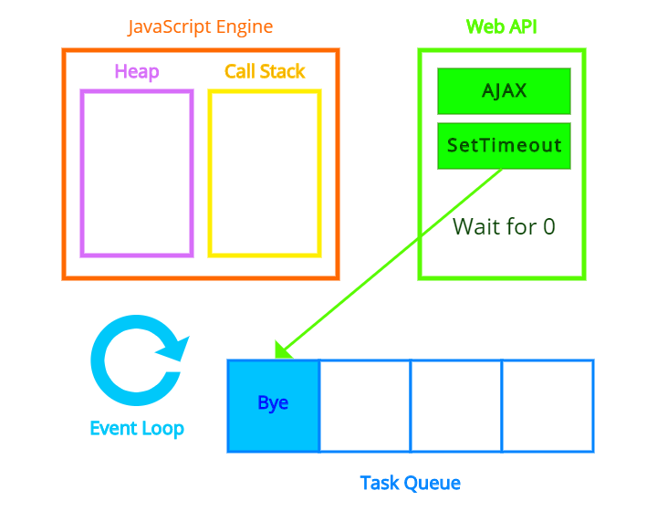
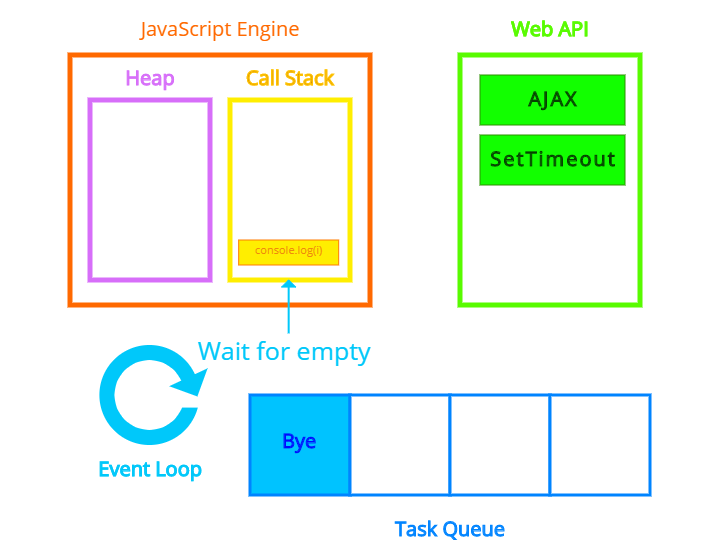
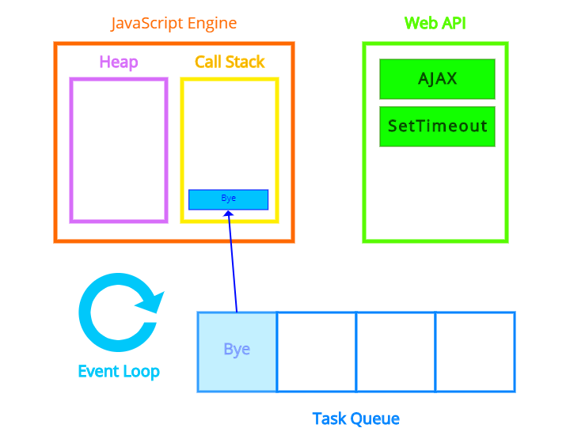

---

title: "콜백 함수(Callback Function) [JavaScript]"
excerpt: "비동기 처리와 콜백 함수에 대해서 알아보자"
tags: [programming, callback, synchronous, asynchronous, javascript]

path: "/2019-11-13-callback"
featuredImage: "./callback_to_callstack.png"
created: 2019-11-13
updated: 2019-12-03

---

## 콜백 함수(Callback Function)란 무엇인가  
  일반적으로 callback은 **답신 전화, 회신** 등을 의미합니다. **콜백 함수**도 이와 비슷합니다. 회의 중에 전화가 왔다면 기다렸다가 회의가 끝나고 답신 전화를 걸어주는 것처럼, **콜백 함수**는 코드 상에 명시적으로 특정 시점에 호출하라는 것이 아니라, **특정 조건**이 만족될 때 호출하려고 사용합니다.  
  
  ※ 콜백 함수는 특정 함수를 콜백 함수라고 정의하는 것이 아니라, 일반 함수를 콜백으로 사용한다고 볼 수 있습니다.  

## \[ Callback 사용법 \]  
  콜백 함수를 올바르게 사용하기 위해서는 인자로 사용될 콜백 함수가 어떻게 사용되는지 파악해야 합니다.  
    
  ``` javascript
let print_result(param1, param2, callback_function){
    result = callback_function(param1, param2);
    console.log(result);
};
```  
  위의 경우 콜백 함수에 두 개의 인자를 넘겨주고 콜백 함수로부터 받은 결과 값을 출력해줍니다. 
  따라서 **두 개의 인자**를 받고 어떤 작업을 하여 출력할 **값을 내보내주는** 콜백 함수를 사용할 수 있겠네요.  
  ``` javascript
let sum = function(number1, number2){
    let sum = number1 + number2;
    return sum;
}
  
let print_result = function(param1, param2, callback_function){
    result = callback_function(param1, param2);
    console.log(result);
};

sum(5, 7, sum);
```
  숫자 두 개를 받아 덧셈한 결과를 내보내는 함수를 넣어주면 반환 값을 출력합니다.  

## \[ 비동기 처리 \]  
  이제 콜백 함수가 필요한 예를 보기 위해 **동기(synchronous)**와 **비동기(asynchronous)**에 대해서 알아보겠습니다.  
  * **동기 처리**  
    **동기 처리**는 특정 작업이 끝나기 전까지는 다음 작업이 실행되지 않도록 막습니다.  
    그러면 **명시된 순서대로** 처리가 되겠죠?  
    
  * **비동기 처리**  
    반대로 **비동기 처리**는 특정 작업을 처리하는 동안에도 다른 작업이 실행할 수 있도록 합니다.  
  
  예를 들어 서버에서 사용자의 요청을 기다리는데 한 사용자가 응답을 보내주지 않는다고 해서 다른 사용자를 기다리게 할 순 없겠죠? 이때 특정 조건이 만족될 때 처리하도록 콜백 함수를 등록해주고 다른 작업을 수행하도록 비동기식으로 처리할 수 있습니다.  
  
## \[ 비동기 처리 함수 \]
  JavaScript에는 비동기식으로 처리하는 함수\(혹은 메서드\)들이 있습니다.  
  대표적으로 **setTimeout**이 있습니다. setTimeout의 경우에는 인자 값을 받지 않는 콜백 함수를 사용합니다.  
  ``` javascript  
let bye = function(){
    console.log("Bye");
}

setTimeout(bye, 3000);
console.log("Hello?");
  ```
  3초 동안 기다렸다가 bye 함수를 실행하라고 하였습니다. 하지만 **setTimeout**은 비동기식 함수이기 때문에 3초를 기다리는 동안 아래의 다른 코드를 수행하도록 합니다. 따라서 결과는 **Hello?**가 먼저 출력되고 **Bye**가 출력됩니다.  
  ```
  Hello?
  Bye
  ```
  
### * **Delay가 0일 때**  
  그러면 setTimeout의 Delay가 0일 때는 어떤 결과가 나타날까요?  
    
  ``` javascript  
let bye = function(){
    console.log("Bye");
}

setTimeout(bye, 0);
for(i = 0; i < 10000; i++){
    console.log(i);
}
```  
  필자는 처음에 0, 1 정도가 출력되고 Bye를 출력한 후 2, 3 .... 9999가 출력될 것이라 생각했습니다.  
  ```
1
2
3
...
9999
Bye
```
  하지만 결과는 위와 같이 아래 코드가 모두 실행된 뒤 콜백 함수가 실행됩니다.
  
## \[ JavaScript 동작 방식 \] 
  이를 이해하기 위해 자바스크립트의 동작 방식을 살펴봅시다. 자바스크립트는 **Javascript Engine, Web API, Task Queue** 들과 함께 실행됩니다. 
    
  * 실행하면 코드를 읽어 하나씩 **Call Stack**에 올리고 실행합니다. **Call Stack**에서 SetTimeout과 같은 Web API 함수를 만나면 **Web API**에 요청을 합니다.  
    
  * **Web API**에서 SetTimeout의 지정된 시간이 완료되면 Callback 함수를 **Task Queue**로 넘겨줍니다.  
      
  * **Event Loop**가 계속 돌면서 **CallStack**이 비어 있는지 확인하고 비어 있다면 **Task Queue**에 있는 Task를 **CallStack**에 넘겨 실행합니다. 
      
      
  
  이전에 봤던 코드에서 Web API로 bye 함수가 넘어와서 0초 만에 Task Queue로 넘어가지만 Call Stack에서 아래 코드를 모두 수행한 이후에 bye 함수가 Call Stack으로 넘어가서 처리됩니다.  