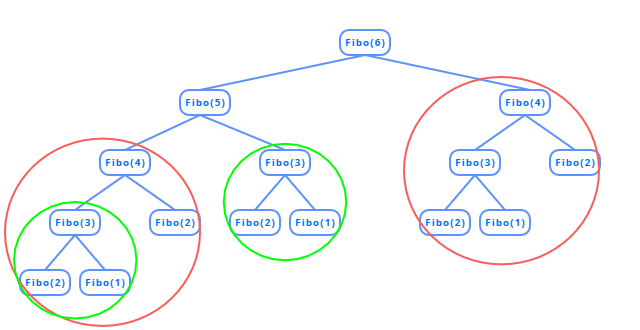

---

title: "메모이제이션 (Memoization)"
excerpt: "동적계획법?"
tags: [algorithm, memoization, DP]

path: "/2019-12-09-memoization"
featuredImage: "./memoization_fibonacci_overlap.png"
created: 2019-12-09
updated: 2020-01-09

---

## \[ 메모이제이션? 동적계획법? \]  
  **메모이제이션(Memoization)**은 **동적계획법(Dynamic Programming)**의 핵심으로 특정 입력에 대한 함수의 결과 값을 저장하고 같은 입력이 주어질 때 저장된 값을 불러오면서, 같은 계산이 여러 번 수행되는 것을 막아 효율을 높이는 기법입니다.  
  
  *동적계획법을 주제로 글을 쓸까 생각했었지만, 필자가 소개하려는 내용보다 좀 더 큰 범위를 가지고 있겠다 생각하여 더 직관적인 메모이제이션만 다루려고 합니다.*

## \[ 필요성 \]  
  메모이제이션은 어떤 문제를 계산하기 위해 **부분 문제가 여러 번 중복으로 수행**되는 경우에 유용하게 사용할 수 있습니다. 우리는 이 부분 문제를 매번 계산하여 결과를 얻는 대신 한 번 계산한 값을 **메모리에 저장**하고 같은 입력이 주어질 때 저장된 값을 불러와 효율을 높일 수 있습니다.  
  
  예시로 **피보나치 수**의 계산 과정을 한 번 살펴보겠습니다.  
  피보나치 수는 다음과 같은 점화식이 성립합니다.  
  ```
  f(n) = f(n - 1) + f(n - 2)
  ```
    
  위에서 fibo(4)와 fibo(3)은 여러 번 호출되어 중복으로 계산하는데, 메모제이션을 이용한다면 이 값들을 한 번씩만 계산하여 해결할 수 있습니다.  
  
  
## \[ 조건 \]
  그럼 언제 메모이제이션을 사용할 수 있는지 살펴봅시다.  
  * **인풋이 같을 때 아웃풋이 같다.**  
  
  저장된 값을 신뢰하려면 **같은 입력에 대한 출력이 항상 같아야** 합니다. 만약 다른 변수가 작용하여 f(5)가 50이었다가 f(5)가 100이기도 한다면 메모이제이션을 사용할 수 없습니다.   
  
## \[ 방법 \]
  재귀 함수 내부에서 다음과 같이 처리할 수 있습니다.  
  1. 기저 사례 처리  
  2. memoization 확인  
  3. 부분 문제 수행 후 memozation 기록  
  
  ``` cpp
int fibo(int number)
{
	if (number == 1 || number == 2)    // 기저 사례 처리
		return 1;
	if (memo[number] != -1)            // memoization 확인
		return memo[number];

	int fibo_number = fibo(number - 1) + fibo(number - 2);	// 부분 문제 수행 후 memozation 기록
	return fibo_number;
}
  ```  
  물론 처음에 memo의 초기화 과정이 필요합니다. 초기화 값은 계산 결과 값으로 나올 수 없는 값이어야 합니다. 피보나치 수의 경우 자연수만 다루기 때문에 음수인 -1을 초기화 값으로 사용할 수 있습니다.  
  
  