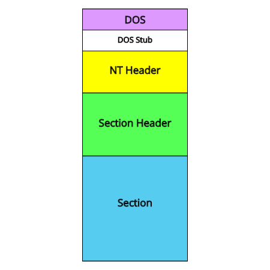
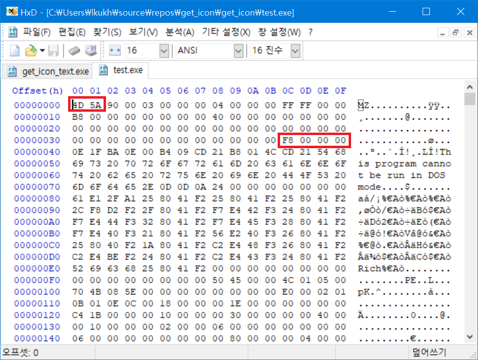
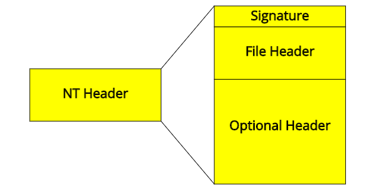
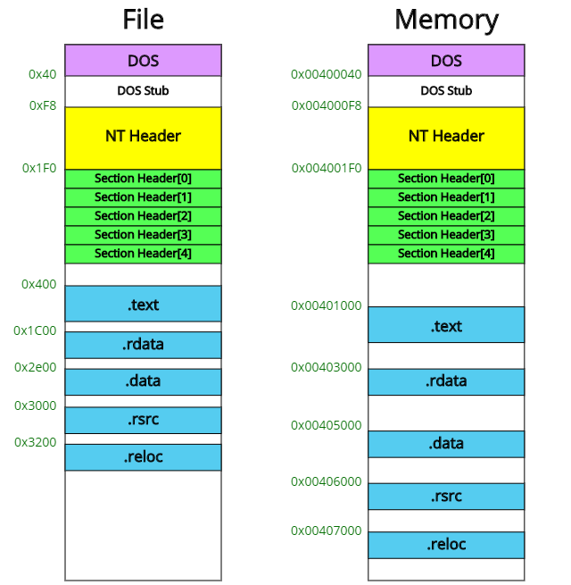
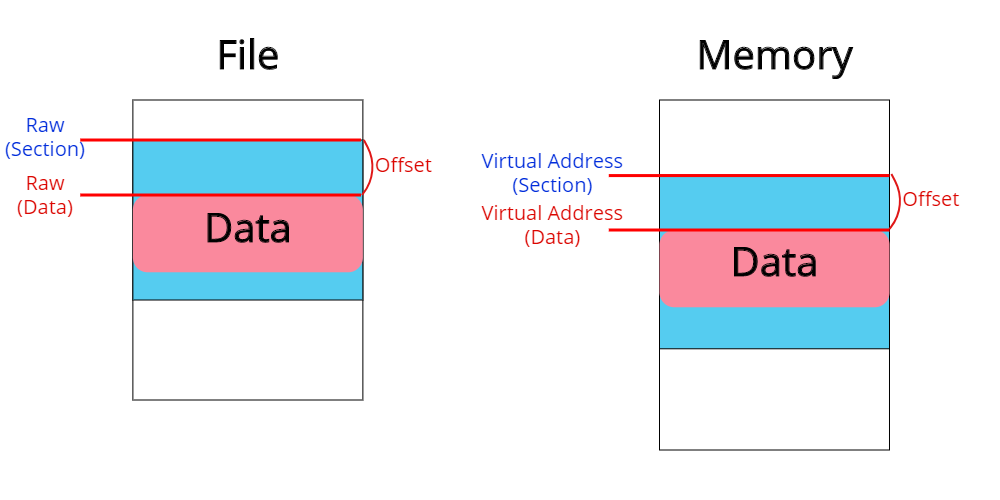

---

title: "PE (Portable Executable) 구조 [Windows]"
excerpt: "윈도우 실행 파일의 구조를 분석해보자"
tags: [project]

path: "/2019-12-19-PE"
featuredImage: "./PE_PE.png"
created: 2019-12-19
updated: 2020-01-02

---
## \[ 들어가기 전에 \]  
  이 블로그에서는 32bit 실행파일을 예시로 설명하고 있습니다. 구조체의 크기나 Offset, ImageBase 등에서 64bit 실행파일과 차이가 있겠지만 전반전인 내용에 있어서는 크게 차이가 없으니 양해 바랍니다.  
  
## \[ PE (Portable Executable) 란? \]  
  PE는 EXE, DLL 등의 윈도우에서 실행 가능한 파일들의 파일 형식입니다. PE 구조에서 실행 파일을 분석하기 위해 어떤 내용이 있는지, 그리고 어떻게 활용할 수 있는지 살펴보겠습니다. 이번에는 PE에 대한 모든 것을 파헤치는 것이 아니라 전체적인 구조와 알아두면 유용한 내용을 중심으로 다루겠습니다.  
  
## \[ 구조 \]  
    
  PE는 크게 DOS Header, NT Header, Section Header, Section으로 구성되어 있습니다.  
  
## \[ DOS Header\]  
  ``` cpp
  typedef struct _IMAGE_DOS_HEADER {      // DOS .EXE header
    WORD   e_magic;                     // Magic number
    WORD   e_cblp;                      // Bytes on last page of file
    WORD   e_cp;                        // Pages in file
    WORD   e_crlc;                      // Relocations
    WORD   e_cparhdr;                   // Size of header in paragraphs
    WORD   e_minalloc;                  // Minimum extra paragraphs needed
    WORD   e_maxalloc;                  // Maximum extra paragraphs needed
    WORD   e_ss;                        // Initial (relative) SS value
    WORD   e_sp;                        // Initial SP value
    WORD   e_csum;                      // Checksum
    WORD   e_ip;                        // Initial IP value
    WORD   e_cs;                        // Initial (relative) CS value
    WORD   e_lfarlc;                    // File address of relocation table
    WORD   e_ovno;                      // Overlay number
    WORD   e_res[4];                    // Reserved words
    WORD   e_oemid;                     // OEM identifier (for e_oeminfo)
    WORD   e_oeminfo;                   // OEM information; e_oemid specific
    WORD   e_res2[10];                  // Reserved words
    LONG   e_lfanew;                    // File address of new exe header
  } IMAGE_DOS_HEADER, *PIMAGE_DOS_HEADER;
  ```  
  DOS 헤더는 PE 파일의 시작 부분입니다. DOS 헤더에서 의미 있게 살펴볼 부분은 **e_magic** 과 **e_lfanew** 정도입니다.  
    
  * **e_magic (2 byte)**  
    DOS의 Signature로 4D 5A ('MZ') 값을 가집니다.  
  * **e_lfanew (4 byte)**  
    NT 헤더의 파일 주소 값입니다.  

  ```
  <Little-Endian>
  컴퓨터에서 데이터를 저장할 때 byte 단위로 저장하는데 하위 byte부터 기록하는 것이 Little-Endian입니다.  
  4 byte 크기의 값 0x1A2B3C4D는 Little-Endian으로 4D 3C 2B 1A으로 저장됩니다.  
  ```  
  
## \[ NT Header \]  
    
  NT 헤더는 **Signature, File Header, Optional Header**로 이루어져 있습니다.  

  **Signature** (4 byte)는 50 45 00 00 ( 'PE..') 값을 가지며 이는 PE 파일임을 나타냅니다.    
  * **File Header**  
    ``` cpp
    typedef struct _IMAGE_FILE_HEADER {
        WORD    Machine;
        WORD    NumberOfSections;
        DWORD   TimeDateStamp;
        DWORD   PointerToSymbolTable;
        DWORD   NumberOfSymbols;
        WORD    SizeOfOptionalHeader;
        WORD    Characteristics;
    } IMAGE_FILE_HEADER, *PIMAGE_FILE_HEADER;
    ```      
    * **NumberOfSection**  
      section의 수입니다.  
    * **TimeDateStamp**  
      컴파일된 시간을 의미합니다.  
    * **SizeOfOptionalHeader**  
      시스템에 따라 32bit 용은 0xE0, 64bit 용은 0xF0의 값을 가집니다. 이것에 따라 다음에 설명할 Optional Header 구조체가 달라지는데, 다음은 32bit Optional Header입니다.  
  
  * **Optional Header**  
    ``` cpp
    typedef struct _IMAGE_OPTIONAL_HEADER {
        //
        // Standard fields.
        //
        WORD    Magic;
        BYTE    MajorLinkerVersion;
        BYTE    MinorLinkerVersion;
        DWORD   SizeOfCode;
        DWORD   SizeOfInitializedData;
        DWORD   SizeOfUninitializedData;
        DWORD   AddressOfEntryPoint;
        DWORD   BaseOfCode;
        DWORD   BaseOfData;
        //
        // NT additional fields.
        //
        DWORD   ImageBase;
        DWORD   SectionAlignment;
        DWORD   FileAlignment;
        WORD    MajorOperatingSystemVersion;
        WORD    MinorOperatingSystemVersion;
        WORD    MajorImageVersion;
        WORD    MinorImageVersion;
        WORD    MajorSubsystemVersion;
        WORD    MinorSubsystemVersion;
        DWORD   Win32VersionValue;
        DWORD   SizeOfImage;
        DWORD   SizeOfHeaders;
        DWORD   CheckSum;
        WORD    Subsystem;
        WORD    DllCharacteristics;
        DWORD   SizeOfStackReserve;
        DWORD   SizeOfStackCommit;
        DWORD   SizeOfHeapReserve;
        DWORD   SizeOfHeapCommit;
        DWORD   LoaderFlags;
        DWORD   NumberOfRvaAndSizes;
        IMAGE_DATA_DIRECTORY DataDirectory[IMAGE_NUMBEROF_DIRECTORY_ENTRIES];
    } IMAGE_OPTIONAL_HEADER32, *PIMAGE_OPTIONAL_HEADER32;
    ```
    
    * **ImageBase**  
      실행되어 메모리에 올라올 때 실행 파일의 시작 주소입니다.  
    * **NumberOfRvaAndSizes**  
      DataDirectory 배열의 길이입니다. (일반적으로 16이지만 항상은 아니기 때문에 이 값을 따르는 것이 좋다고 합니다.)  
    * **DataDirectory**  
      Section과 관련되며 내용이 많기 때문에 뒤에서 설명하겠습니다.    

## \[ Section Header \]  
  Section Header는 File Header에 있는 NumberOfSections 길이의 배열로 이루어져 있습니다.  
    
  .text, .idata, .data, .rsrc 등의 섹션이 있으며 하나의 section_header는 다음과 같은 정보들을 가지고 있습니다.  
  ``` cpp
typedef struct _IMAGE_SECTION_HEADER {
    BYTE    Name[IMAGE_SIZEOF_SHORT_NAME];
    union {
            DWORD   PhysicalAddress;
            DWORD   VirtualSize;
    } Misc;
    DWORD   VirtualAddress;
    DWORD   SizeOfRawData;
    DWORD   PointerToRawData;
    DWORD   PointerToRelocations;
    DWORD   PointerToLinenumbers;
    WORD    NumberOfRelocations;
    WORD    NumberOfLinenumbers;
    DWORD   Characteristics;
} IMAGE_SECTION_HEADER, *PIMAGE_SECTION_HEADER;
  ```
  * **Name**
    섹션의 이름입니다. 모두 길이가 8을 넘지 않는 짧은 길이기 때문에 주소값이 아니라 문자열 자체가 header에 들어있습니다.  
  * **VirtualSize**  
    Section의 크기입니다.  
  * **VirtualAddress**  
    파일이 실행될 때 메모리에 올라오는 Section의 주소 (Image Base로부터의 Offset)입니다.  
  * **PointerToRawData**  
    파일 내부에서 Section의 주소입니다. (이를 줄여서 **Raw**라고 부르겠습니다.)  
  * **Characteristics**  
    Section의 쓰기/읽기/실행 가능 여부의 속성입니다.  

  *※ PE 구조 내에서의 VirtualAddress는 대부분 **RVA (Relative Virtual Address)**, 즉 Image Base로부터의 **상대 주소**입니다.*  

  메모리에서의 주소(VirtualAddress)와 파일에서의 주소(PointerToRawData)가 따로 존재하는데, 이는 PE 파일의 모습과 실행되어 메모리에 올라온 모습이 다르기 때문입니다.    
    
  
  Header까지는 크기와 상대 위치가 같지만 Section에서 차이가 있습니다.  

## \[ DataDirectory 따라가기 \]  
  DataDirectory는 앞에서 봤던 NT Header의 Optional Header의 끝부분에 있는 구조체 배열입니다. 여기에는 **Import Table, Resource Table, TLS Table** 등의 데이터의 주소 정보를 담고 있습니다. 실제 데이터는 Section 영역에 포함되어 있습니다.   
  ``` cpp
typedef struct _IMAGE_DATA_DIRECTORY {
    DWORD   VirtualAddress;
    DWORD   Size;
} IMAGE_DATA_DIRECTORY, *PIMAGE_DATA_DIRECTORY;
  ```  
  
  DataDirectory 구조체를 보면 파일에서의 주소는 명시되어 있지 않습니다. 하지만 이 데이터는 특정 Section에 속해 있기 때문에 Section Header의 정보들을 통해서 다음과 같이 **Raw (파일 주소)**를 구할 수 있습니다.  
  1. **Data가 어느 Section에 속해 있는지 확인한다.**  
    1) **Virtual Address (Data) > Virtual Address (Section A)**  
    2) **Virtual Address (Data) < Virtual Address (Section A) + Virtual Size (Section A)**  
    이 두 가지를 모두 만족한다면 Data는 Section A에 속해 있습니다.  
    
  2. **해당 Section Header의 정보를 통해서 Raw를 계산한다.**  
    **Raw (Data)**를 구하기 위해서는 이 데이터를 포함한 섹션의 시작점으로부터 얼마나 떨어져 있는지 **(Offset)** 계산해야 합니다.  
      
    **Offset = Virtual Address (Data) - Virtual Address (Section)**  
    이제 이 값을 Raw (Section)에 더한 것이 Raw (Data)입니다.  
    **Raw (Data) = Raw (Section) + Offset**  
    **= Virtual Address (Data) - Virtual Address (Section) + Raw (Section)**  
  
    Converter = Virtual Address (Section) - Raw (Section) 라고 해두고
    Raw (Data) = Virtual Address (Data) - Converter
    이렇게 사용하기도 합니다.  

## \[ Next \]  
  DataDirectory가 가리키는 Data의 파일 주소 찾는 법을 알았으니 다음 포스팅에서는 **Resource Table**의 구조를 다뤄보겠습니다.  
  