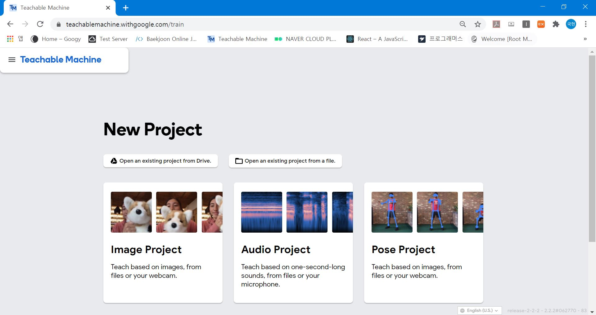
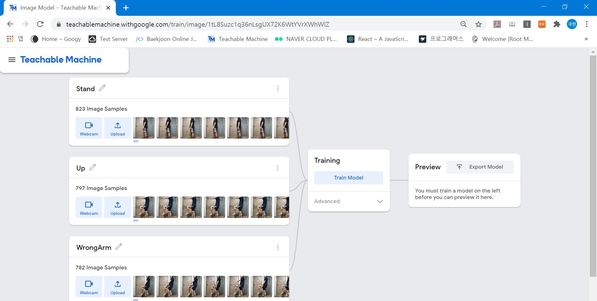
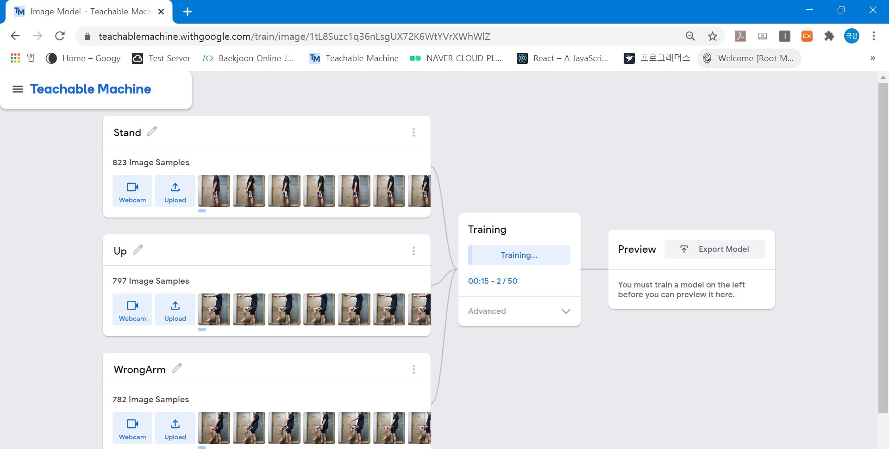
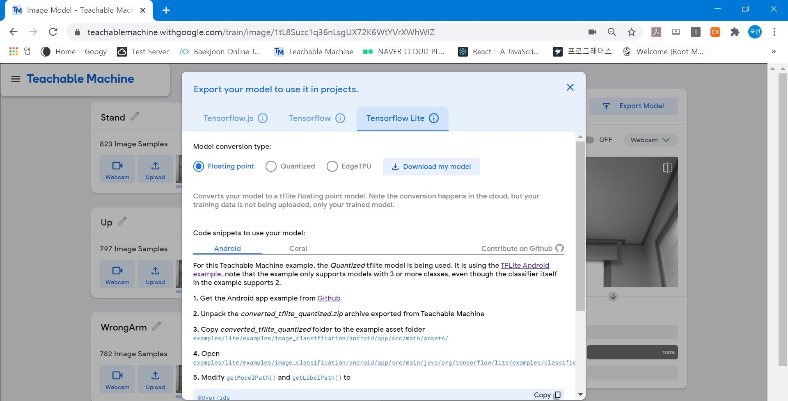
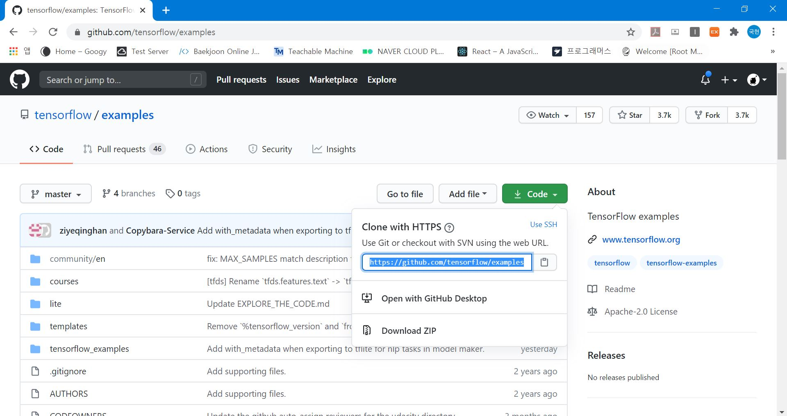
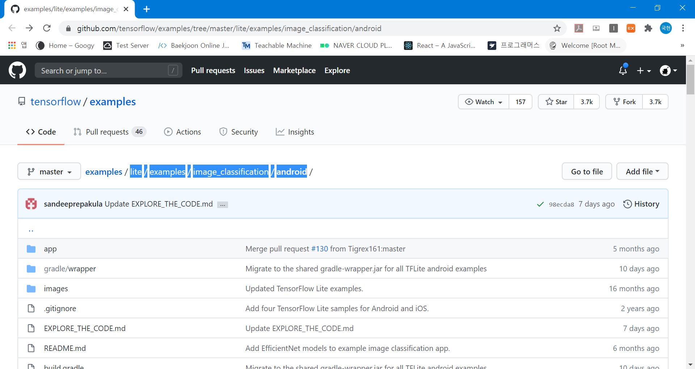
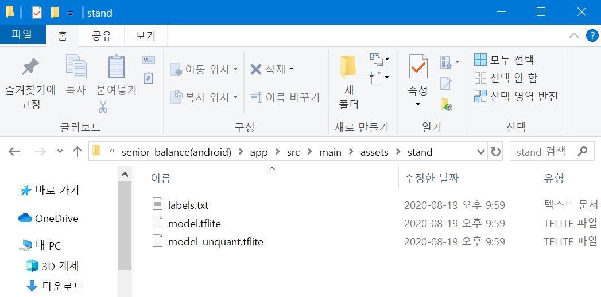

---

layout: post
title: "Teachable Machine 앱에서 사용하기"
excerpt: "Android App에서 Teachable Machine을 사용해 보자"
tags: [machine_learning, AI]

path: "/2020-08-28-teachable_machine"
featuredImage: "./teachable_machine.JPG"
created: 2020-08-28
updated: 2020-08-29

---
진행하는 Project에서 사람의 자세를 판단할 수 있는 기능이 필요했는데, Machine Learning을 직접 구현하는 대신 Teachable Machine을 사용하면 이를 쉽게 해결할 수 있었다. 

# \[ Teachable Machine \]  
Teachable Machine은 Google에서 제공하는 머신러닝 서비스이다.  

  
[https://teachablemachine.withgoogle.com/](https://teachablemachine.withgoogle.com/){:target="_blank"}

이미지 인식, 음성 인식, pose 인식 프로젝트를 사용할 수 있다.  

## < 데이터 입력 >  
  
이런 식으로 Web-cam으로 Teachable Machine 자체에서 학습할 이미지를 찍을 수도 있고, 이미지를 업로드할 수도 있다.  이미지를 올리고 해당하는 자세가 무엇인지 Labeling만 해주면 된다.  
여기서 끝낼 것이 아니라 나중에 학습시킬 데이터를 더 추가할 거라면 Google Drive에 저장해두는 것을 추천한다.  

## < 학습 & Export >  
  
데이터를 모두 가져왔다면 Train을 눌러서 학습시키자. Training이 완료되면 Export 하여 Javascript에서 사용할 수 있는 Json으로 다운로드할 수 있다. Android (Java)에서 사용하고 싶다면 Tensorflow Lite로 다운로드 해서 사용하면 된다.  
  
이번 프로젝트에서는 학습한 결과를 Android 앱에서 사용할 것이기 때문에 Tensorflow Lite 탭을 클릭해 Floating point, Quantized 모두 다운로드한다.  

# [ 문제 및 대안 ]
자세를 구분하는 기능을 필요로 했기 때문에 Teachable Machine의 Pose 인식을 활용하려고 했지만, Pose 인식은 Android에서 사용할 수 있는 Tensorflow Lite를 지원하지 않았다. 그래서 Pose 인식 대신 Image 인식을 사용하기로 했다.  
[https://github.com/tensorflow/examples/tree/master/lite/examples/posenet/android](https://github.com/tensorflow/examples/tree/master/lite/examples/posenet/android){:target="_blank"}  
Teachable machine pose를 사용하는 Android 예제도 Demo라고 나와 있다. ( 글 쓴 날짜 기준 2020-08-28 )  

# [ 안드로이드에서 사용하기 ]  

## < 예제 clone >  
Image 인식을 사용하므로 image_classification 예제를 변형하여 앱을 만들 것이다.  

[https://github.com/tensorflow/examples/tree/master/lite/examples/image_classification/android](https://github.com/tensorflow/examples/tree/master/lite/examples/image_classification/android){:target="_blank"}  

### 1. 부분적으로 clone 하기  

```bash
git init [project-name]
cd [project-name]
```

### 2. sparseCheckout 을 사용할 수 있도록 설정  

```bash
git config core.sparseCheckout true
```

### 3. clone 하려는 remote url 연결  
  

```bash
git remote add -f origin https://github.com/tensorflow/examples.git
```

### 4. sparseCheckout 작성  

내가 clone 하길 원하는 폴더를 입력해 준다. (최상위 폴더는 제외하고 입력한다.)  
  
  
```bash
echo lite/examples/image_classification/android > .git/info/sparse-checkout
```

어떤 문서를 보면 echo "~~~~"라고 되어 있는데 그렇게 하면 "까지 파일에 입력되어, 위 코드와 같이 실행하였다.  

### 5. pull  

이제 pull 하면 내가 지정한 폴더만 clone 한다.  

```bash
git pull origin master
```

## < 학습한 파일 적용 >  

* 앞에서 다운받은 floating point, Quantized 모두 압축 풀어서 한 폴더에 저장한다.  
* label.txt는 동일하기 때문에 하나만 있으면 된다. (필자는 일어서서 하는 운동이란 의미로 stand라는 폴더에 저장해두었다.)  
* 이제 해당 폴더를 ...\app\src\main\assets에 옮겨준다.  
  

여러 Classifier (ClassifierFloatEfficientNet, ClassifierFloatMobileNet, ClassifierQuantizedEfficientNet, ClassifierQuantizedMobileNet) 중 한 Class의 getModelPath와 getLabelPath 메서드에서 해당하는 경로를 return 하면 된다. (이때 assets를 기준으로 경로를 설정하면 된다.)  

### ex) ClassifierFloatEfficientNet  

**getModelPath()**  

```java
@Override
protected String getModelPath() {
  // you can download this file from
  // see build.gradle for where to obtain this file. It should be auto
  // downloaded into assets.
  return "stand/model_unquant.tflite";
}
```

**getLabelPath()**  

```java
@Override
  protected String getLabelPath() {
    return "stand/labels.txt";
  }
```

## <실행>  
설정한 Model은 실행했을 때 아래 bottomSheet 에서 선택할 수 있다.  
본인이 원하는 형태로 변형하여 사용하자.  