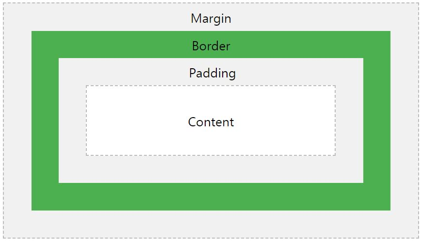

---

layout: post
title: "CSS Layout (위치 잡기 / 여백 / 정렬)"
excerpt: "css layout에서 헷갈리는 position, padding, margin, 정렬 방법 등을 알아보자"
tags: [web, css]

path: "/2021-02-10-css-position"
featuredImage: "./box-model.JPG"
created: 2021-02-10
updated: 2021-02-12

---

# \[ CSS Layout \]  
오늘은 CSS 속성 중 Layout을 잡을 때 꼭 필요하지만 어딘가 헷갈리는 부분을  정리하려고 한다. element를 원하는 위치에 배치하기 위해서 position을 어떻게 설정할지, padding, margin 등은 어떤 차이가 있고 어떻게 사용해야 할지, 그리고 item들을 중앙 정렬하는 법 등을 다룰 것이다.  

## < Position >  
position은 해당하는 element의 위치를 어떤 방식으로 지정할지 결정하는 속성으로 볼 수 있다. position을 지정하면 종류에 따라 top, bottom, left, right 속성으로 위치를 조정할 수 있다.  

- **static**   
- **relative**  
- **fixed**  
- **absolute**  
- **sticky**  

### > static  
static은 position 속성의 default 값으로 공간을 차지하고 쌓는 방식으로 배치된다. position이 static인 element는 top, bottom, left, right 속성이 작동하지 않는다.    
<iframe height="265" style="width: 100%;" scrolling="no" title="position-static" src="https://codepen.io/goo-gy/embed/eYBdLbM?height=265&theme-id=dark&default-tab=css,result" frameborder="no" loading="lazy" allowtransparency="true" allowfullscreen="true">
  See the Pen <a href='https://codepen.io/goo-gy/pen/eYBdLbM'>position-static</a> by Googy
  (<a href='https://codepen.io/goo-gy'>@goo-gy</a>) on <a href='https://codepen.io'>CodePen</a>.
</iframe>  

### > relative  
relative는 static일 때 배치될 위치에서 top, bottom, left, right를 이용해 위치를 조정할 수 있다. top, bottom, left, right를 통해 위치를 지정해 주지 않으면 default로는 static일 때와 동일하게 배치된다.
<iframe height="333" style="width: 100%;" scrolling="no" title="position-relative" src="https://codepen.io/goo-gy/embed/RwoGQbP?height=333&theme-id=dark&default-tab=css,result" frameborder="no" loading="lazy" allowtransparency="true" allowfullscreen="true">
  See the Pen <a href='https://codepen.io/goo-gy/pen/RwoGQbP'>position-relative</a> by Googy
  (<a href='https://codepen.io/goo-gy'>@goo-gy</a>) on <a href='https://codepen.io'>CodePen</a>.
</iframe>  

relative는 보이는 위치가 아니라 position되지 않았을 때 (static일 때) 위치에서 공간을 차지한다.  

### > fixed  
fixed는 relative와 달리 쌓이는 위치가 아닌 view port를 기준으로 위치를 설정할 수 있다. scroll을 움직여도 화면을 기준으로 위치하기 때문에 상단 바 등을 만들 때 유용하게 쓸 수 있을 것 같다. 그리고 fixed 요소는 공간을 차지하지 않아 다른 요소들의 위치에도 전혀 영향을 주지 않는다.  

<iframe height="265" style="width: 100%;" scrolling="no" title="position-fixed" src="https://codepen.io/goo-gy/embed/wvozEEG?height=265&theme-id=dark&default-tab=css,result" frameborder="no" loading="lazy" allowtransparency="true" allowfullscreen="true">
  See the Pen <a href='https://codepen.io/goo-gy/pen/wvozEEG'>position-fixed</a> by Googy
  (<a href='https://codepen.io/goo-gy'>@goo-gy</a>) on <a href='https://codepen.io'>CodePen</a>.
</iframe>

fixed인 요소와 relative인 요소 모두 top: 30px를 줬지만, fixed는 브라우저를 기준으로 배치되기 때문에 다른 위치에 배치되었다.

### > absolute  
absolute는 fixed와 동일하게 공간을 차지하지 않는다. 다만 position되는 기준이 다른데 absolute는  position된 (static이 아닌) 조상 요소들 중 가장 가까운 element를 기준으로 위치를 지정한다.  
<iframe height="265" style="width: 100%;" scrolling="no" title="position-absolute" src="https://codepen.io/goo-gy/embed/RwoGYwq?height=265&theme-id=dark&default-tab=css,result" frameborder="no" loading="lazy" allowtransparency="true" allowfullscreen="true">
  See the Pen <a href='https://codepen.io/goo-gy/pen/RwoGYwq'>position-absolute</a> by Googy
  (<a href='https://codepen.io/goo-gy'>@goo-gy</a>) on <a href='https://codepen.io'>CodePen</a>.
</iframe>  

## < Box Model >  
  
[https://www.w3schools.com/css/css_boxmodel.asp](https://www.w3schools.com/css/css_boxmodel.asp)  
box model을 보면 padding, margin 등의 layout을 개념을 이해하는 데 도움이 될 것 같아서 가져왔다. box model에서 다루는 속성은 다음과 같다.  

* **border**  
* **padding**  
* **margin**  

여기서 헷갈리는 padding과 margin에 대해서 살펴보자. 모두 여백을 주기 위한 속성이지만, padding은 내부 여백을 의미하고 margin은 외부 여백을 의미한다.  

<iframe height="265" style="width: 100%;" scrolling="no" title="box-model" src="https://codepen.io/goo-gy/embed/poNNejg?height=265&theme-id=dark&default-tab=css,result" frameborder="no" loading="lazy" allowtransparency="true" allowfullscreen="true">
  See the Pen <a href='https://codepen.io/goo-gy/pen/poNNejg'>box-model</a> by Googy
  (<a href='https://codepen.io/goo-gy'>@goo-gy</a>) on <a href='https://codepen.io'>CodePen</a>.
</iframe>  
위 예시는 padding과 margin을 모두 설정하지 않았을 때이다.  

### > padding  
container를 기준으로 먼저 padding을 설정해보자. 
<iframe height="265" style="width: 100%;" scrolling="no" title="ExNNWpE" src="https://codepen.io/goo-gy/embed/ExNNWpE?height=265&theme-id=dark&default-tab=css,result" frameborder="no" loading="lazy" allowtransparency="true" allowfullscreen="true">
  See the Pen <a href='https://codepen.io/goo-gy/pen/ExNNWpE'>ExNNWpE</a> by Googy
  (<a href='https://codepen.io/goo-gy'>@goo-gy</a>) on <a href='https://codepen.io'>CodePen</a>.
</iframe>  
padding을 설정하니 내부의 element는 여백을 두고 배치되는 것을 볼 수 있다. 그리고 한 가지 더 padding을 설정하면 그 크기만큼(상하좌우 25px) element도 커지는 것을 확인할 수 있다.  

### > margin
이제 container에 margin을 설정해보자.
<iframe height="265" style="width: 100%;" scrolling="no" title="abBBJRK" src="https://codepen.io/goo-gy/embed/abBBJRK?height=265&theme-id=dark&default-tab=css,result" frameborder="no" loading="lazy" allowtransparency="true" allowfullscreen="true">
  See the Pen <a href='https://codepen.io/goo-gy/pen/abBBJRK'>abBBJRK</a> by Googy
  (<a href='https://codepen.io/goo-gy'>@goo-gy</a>) on <a href='https://codepen.io'>CodePen</a>.
</iframe>  
margin은 외부에 여백을 주고 해당 요소의 크기에는 영향을 주지 않는 것을 알 수 있다.  

그렇다면 내부 item에 margin을 주면 어떨까? item을 포함하고 있는 container가 커지는 건 아닌지 한 번 살펴보자.

<iframe height="265" style="width: 100%;" scrolling="no" title="item-margin" src="https://codepen.io/goo-gy/embed/dyOOvEL?height=265&theme-id=dark&default-tab=css,result" frameborder="no" loading="lazy" allowtransparency="true" allowfullscreen="true">
  See the Pen <a href='https://codepen.io/goo-gy/pen/dyOOvEL'>item-margin</a> by Googy
  (<a href='https://codepen.io/goo-gy'>@goo-gy</a>) on <a href='https://codepen.io'>CodePen</a>.
</iframe>  
내부 item에 margin을 넣어 보았지만 margin은 element의 크기에는 영향을 주지 않는 것을 확인할 수 있다.    

## < 정렬 >  
프론트 개발을 하다 보면 가운데 정렬이 필요할 때가 있을 것이다. container 내에서 item을 가운데 정렬하는 방법을 알아보자.  

### > static    
static element를 가운데 정렬하기 위해서는 margin을 이용하는 것이 일반적이다.  
<iframe height="265" style="width: 100%;" scrolling="no" title="static-margin-auto" src="https://codepen.io/goo-gy/embed/KKNNxOm?height=265&theme-id=dark&default-tab=css,result" frameborder="no" loading="lazy" allowtransparency="true" allowfullscreen="true">
  See the Pen <a href='https://codepen.io/goo-gy/pen/KKNNxOm'>static-margin-auto</a> by Googy
  (<a href='https://codepen.io/goo-gy'>@goo-gy</a>) on <a href='https://codepen.io'>CodePen</a>.
</iframe>  
위와 같이 margin을 auto로 준다면 좌우로는 양쪽 여백이 동일하게 정렬되지만, 위아래에는 여백을 주지 않는다.  

<iframe height="265" style="width: 100%;" scrolling="no" title="LYbbgaE" src="https://codepen.io/goo-gy/embed/LYbbgaE?height=265&theme-id=dark&default-tab=css,result" frameborder="no" loading="lazy" allowtransparency="true" allowfullscreen="true">
  See the Pen <a href='https://codepen.io/goo-gy/pen/LYbbgaE'>LYbbgaE</a> by Googy
  (<a href='https://codepen.io/goo-gy'>@goo-gy</a>) on <a href='https://codepen.io'>CodePen</a>.
</iframe>  
대신 직접 margin-top에 (container height - item height) / 2 만큼 주어서 상하 정렬이 가능하다.  

### > absolute  
수직으로도 가운데 정렬을 하고 싶다면 차라리 positiion을 absolute로 설정하고 정렬하는 것이 더 편할 것이다.  
<iframe height="265" style="width: 100%;" scrolling="no" title="gOLLyjN" src="https://codepen.io/goo-gy/embed/gOLLyjN?height=265&theme-id=dark&default-tab=css,result" frameborder="no" loading="lazy" allowtransparency="true" allowfullscreen="true">
  See the Pen <a href='https://codepen.io/goo-gy/pen/gOLLyjN'>gOLLyjN</a> by Googy
  (<a href='https://codepen.io/goo-gy'>@goo-gy</a>) on <a href='https://codepen.io'>CodePen</a>.
</iframe>  
top에 50%(여기서 50%는 container 기준이다.)를 주고, translate로 -50%를 주면 (여기서 50%는 item 기준이다.) 가운데로 정렬할 수 있다.  

*※이때 주의할 점은 container의 position이 static이 아니어야 가운데 정렬하려는 기준이 된다.*
