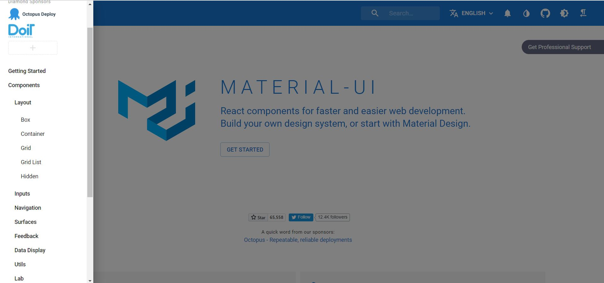
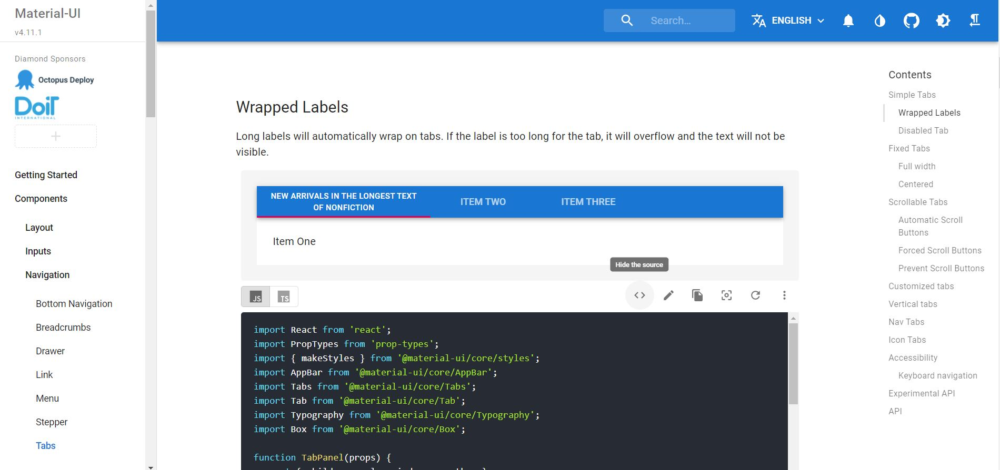

## [ Material-Ui ]  
[https://material-ui.com/](https://material-ui.com/)  
Material-Ui에서는 자주 사용되는 기능/디자인들을 Component/API로 제공해 줘서, React로 개발을 할 때 다양한 UI를 쉽게 만들 수 있다. 기능적인 Ui를 제공해 주면서도 내 프로젝트에 맞게 커스터마이징할 수 있다는 게 굉장히 매력적이다.

## [ Material-Ui 시작하기 ]  
### \<설치\>  
- @material-ui/core
    ```bash
    // with npm
    npm install @material-ui/core

    // with yarn
    yarn add @material-ui/core
    ```

- @material-ui/icons
    ```bash
    // with npm
    npm install @material-ui/icons

    // with yarn
    yarn add @material-ui/icons
    ```
    meterial에서 제공하는 icon도 사용하고 싶다면 같이 설치하자.  
    
---  

### \<원하는 Components 찾기\>  
  
사이드바를 보면 여러 가지 카테고리가 있다. 이 중에서 원하는 기능을 찾거나 검색해보자. material-ui 문서에 사용하는 방법, 여러 종류의 예제가 있어서 쉽게 사용해 볼 수 있다.  

## [ Material-Ui 사용하기 ]  
### \<Document\>  
필자는 상단에 띄워 다른 페이지로 이동할 수 있는 Top-Header를 만들기 위해 Tabs Component를 이용하기로 했다.  
  
[https://material-ui.com/components/tabs/](https://material-ui.com/components/tabs/)  
문서를 보면 여러 예제가 있는데 \< \> 버튼을 누르면 code를 확인할 수 있다.  

---  

### \<Import\>  
이전에 material-ui를 설치했으므로 편하게 사용할 수 있다.
```jsx
import AppBar from "@material-ui/core/AppBar";
import Tabs from "@material-ui/core/Tabs";
import Tab from "@material-ui/core/Tab";
```  

예제를 보니 AppBar, Tabs, Tab이 필요해 보여서 이들을 import 하였다.  
```jsx
import { AppBar, Tabs, Tab } from "@material-ui/core";
```  

필자는 더 필요한 게 생겼을 때 쉽게 추가하고, 코드도 깔끔하게 하기 위해서 이렇게 사용하는 것을 더 선호한다.  

---  

### \<Component\>  
<iframe src="https://codesandbox.io/embed/boring-cookies-ug881?fontsize=14&hidenavigation=1&theme=dark"
    style="width:100%; height:500px; border:0; border-radius: 4px; overflow:hidden;"
    title="boring-cookies-ug881"
    allow="accelerometer; ambient-light-sensor; camera; encrypted-media; geolocation; gyroscope; hid; microphone; midi; payment; usb; vr; xr-spatial-tracking"
    sandbox="allow-forms allow-modals allow-popups allow-presentation allow-same-origin allow-scripts"
></iframe>  

---  

### \<Icon\>  
tabs 문서를 보니 각 tab에 아이콘을 넣을 수도 있는 것 같다.  
[https://material-ui.com/components/material-icons/](https://material-ui.com/components/material-icons/) 여기서 넣고 싶은 아이콘을 찾아서 적용해보자  

<iframe src="https://codesandbox.io/embed/material-tabs-icon-tuvlv?fontsize=14&hidenavigation=1&theme=dark"
    style="width:100%; height:500px; border:0; border-radius: 4px; overflow:hidden;"
    title="material-tabs-icon"
    allow="accelerometer; ambient-light-sensor; camera; encrypted-media; geolocation; gyroscope; hid; microphone; midi; payment; usb; vr; xr-spatial-tracking"
    sandbox="allow-forms allow-modals allow-popups allow-presentation allow-same-origin allow-scripts"
></iframe>  

## [ 커스터마이징 ]  
### \<styled-components\>  
React에서는 여러 styling 방법이 있고, material에서도 makeStyles라는 솔루션을 지원하지만, 필자는 프로젝트 전반적으로 하나의 styling 방식을 사용하기 위해 **styled-components**를 사용하였다. styled-components는 scss 문법도 지원하고 있다.  

- 설치  
  ``` bash
  $ yarn add styled-components
  ```

<iframe src="https://codesandbox.io/embed/vigorous-architecture-4479r?fontsize=14&hidenavigation=1&theme=dark"
    style="width:100%; height:500px; border:0; border-radius: 4px; overflow:hidden;"
    title="vigorous-architecture-4479r"
    allow="accelerometer; ambient-light-sensor; camera; encrypted-media; geolocation; gyroscope; hid; microphone; midi; payment; usb; vr; xr-spatial-tracking"
    sandbox="allow-forms allow-modals allow-popups allow-presentation allow-same-origin allow-scripts"
></iframe>

material component에 그냥 style을 주면 적용이 되지 않는다. 이는 material에서 적용된 style의 우선순위가 더 높기 때문인데, 필자는 &&에 style을 주어서 우선순위를 높일 수 있었다.  

---  

위에서 &&을 통해서 우선순위를 높였는데, 이 scss 문법과 css의 우선순위, material의 styling 방식을 좀 더 이해하고 정리해서 다음 포스팅으로 돌아오겠다.  

---  
