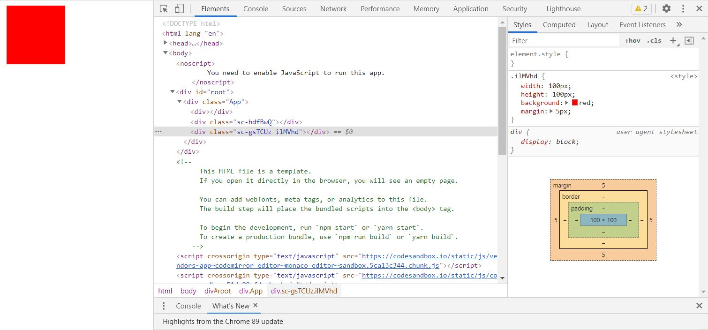
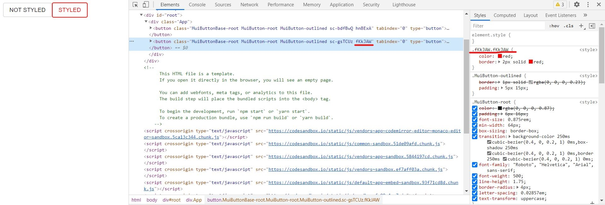

## [ 들어가기 전에 ]  
이전 포스트에서 styled-component를 이용해 material-ui에 style을 줄 때 &&를 활용했다. 그게 어떤 원리로 적용되는지 한 번 살펴보고자 한다.  
궁금한 분들은 [https://goo-gy.github.io/2021-02-28-material-ui](https://goo-gy.github.io/2021-02-28-material-ui)를 참고하길 바란다.  

## [ CSS 선택자 우선순위 ]  
먼저 CSS가 적용되는 우선순위를 먼저 알아보자.
1. !important를 붙인 속성
2. html에서 직접 style을 지정
3. id 선택자 (**#id**)
4. class 선택자 (**.class**)
5. 태그 선택자
6. 상위 속성 상속

### 같은 우선순위인 경우?

- 부모-자식 관계가 많은 경우가 우선
- 나중에 선언한 것이 우선

## [ styled-components의 원리 ]  
styled-component를 이용해 css를 입힌 예제를 살펴보자.
<iframe src="https://codesandbox.io/embed/styled-component-uk61d?fontsize=14&hidenavigation=1&theme=dark"
     style="width:100%; height:500px; border:0; border-radius: 4px; overflow:hidden;"
     title="styled-component"
     allow="accelerometer; ambient-light-sensor; camera; encrypted-media; geolocation; gyroscope; hid; microphone; midi; payment; usb; vr; xr-spatial-tracking"
     sandbox="allow-forms allow-modals allow-popups allow-presentation allow-same-origin allow-scripts"
></iframe>  
예제에는 다음과 같은 3가지 element가 있다.  

- 아무런 style도 주지 않은 div  
- styled-components로 생성했지만 아무런 속성도 주지 않은 DivNone  
- styled-components로 css 속성을 준 DivBox  

  

변환된 코드를 보면 styled-components는 class 선택자로 style을 생성하고 component에 해당하는 class를 전달하여 style을 적용하는 것을 알 수 있다.  

## [ material-ui + styled-components ]  
<iframe src="https://codesandbox.io/embed/styled-components-w1x03?fontsize=14&hidenavigation=1&theme=dark"
     style="width:100%; height:500px; border:0; border-radius: 4px; overflow:hidden;"
     title="styled-components"
     allow="accelerometer; ambient-light-sensor; camera; encrypted-media; geolocation; gyroscope; hid; microphone; midi; payment; usb; vr; xr-spatial-tracking"
     sandbox="allow-forms allow-modals allow-popups allow-presentation allow-same-origin allow-scripts"
></iframe>  
material component에 styled-component로 그냥 style을 주면 제대로 적용되지 않지만, &&를 통해 style을 주니 적용되는 것을 확인할 수 있다.    

  
해당 component의 css 부분을 보면 선택자로 .class가 두 번 중첩되어 있는 것을 확인할 수 있다.  
material-ui의 기본 디자인 역시 class 선택자로 style을 생성하고 class를 전달하는데,  

- **우선순위가 같을 경우 부모-자식 관계가 많은 경우가 우선**  

이라는 규칙 때문에 material의 기본 style보다 &&으로 지정한 style이 더 우선적으로 적용되는 것 같다.  
<iframe height="265" style="width: 100%;" scrolling="no" title="doubleClassName" src="https://codepen.io/goo-gy/embed/jOVdpYR?height=265&theme-id=dark&default-tab=css,result" frameborder="no" loading="lazy" allowtransparency="true" allowfullscreen="true">
  See the Pen <a href='https://codepen.io/goo-gy/pen/jOVdpYR'>doubleClassName</a> by Googy
  (<a href='https://codepen.io/goo-gy'>@goo-gy</a>) on <a href='https://codepen.io'>CodePen</a>.
</iframe>  
이해를 돕기 위해서 비슷한 예제를 가져왔다.  