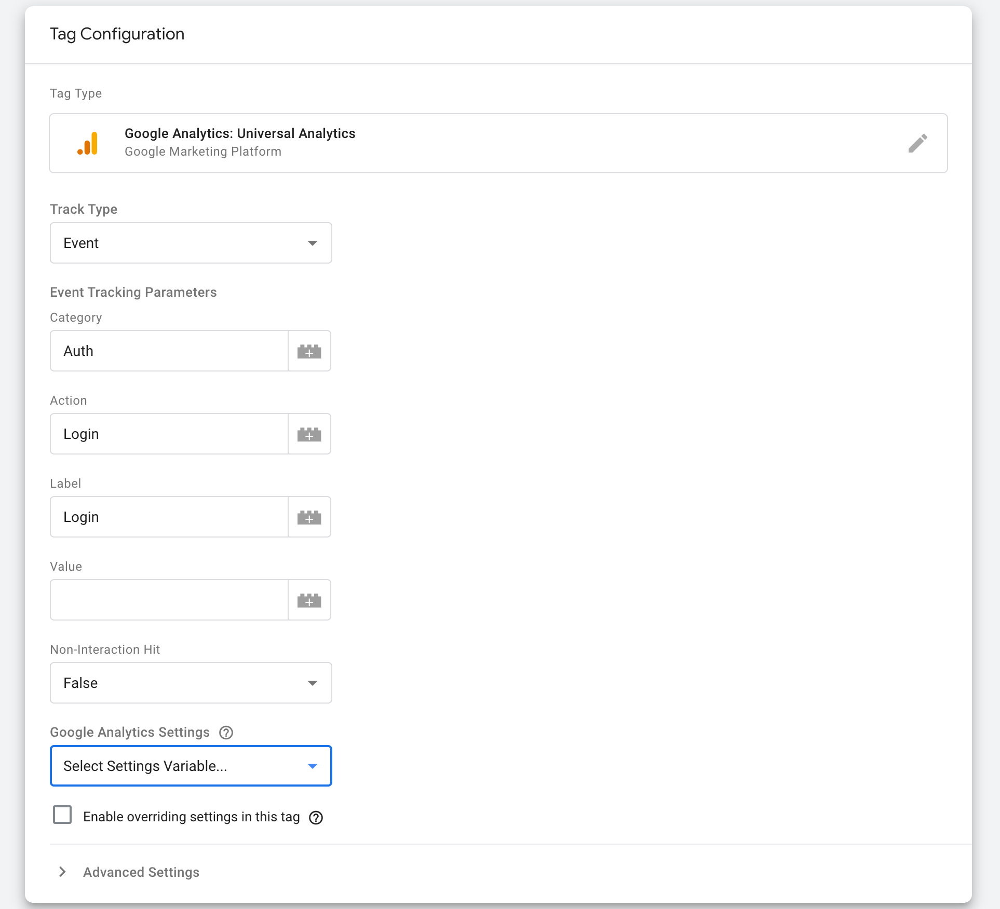
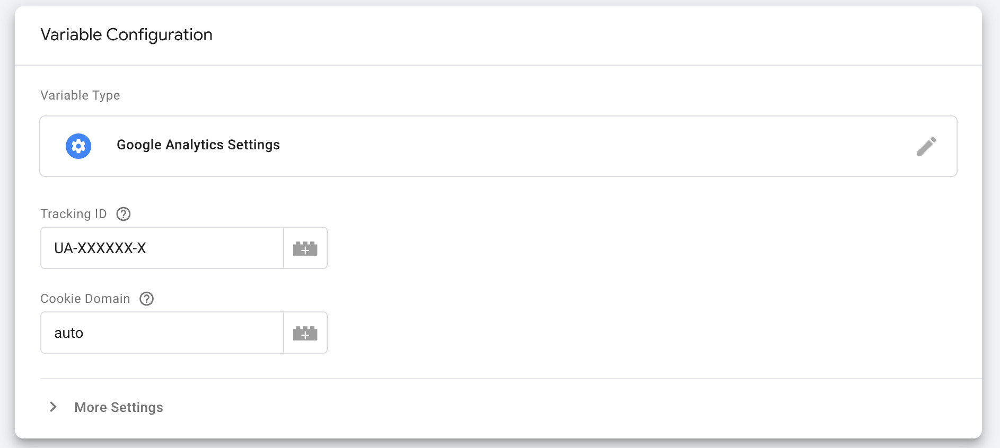
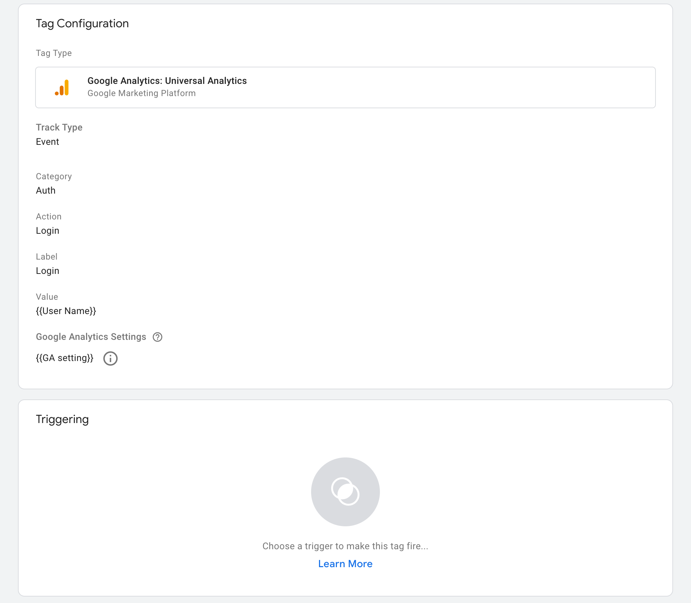
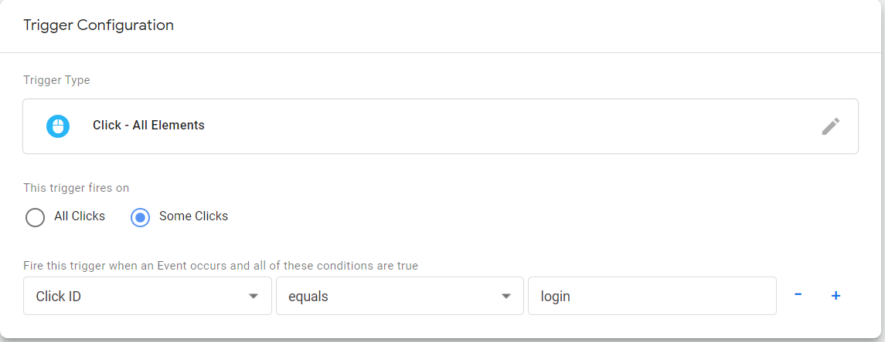
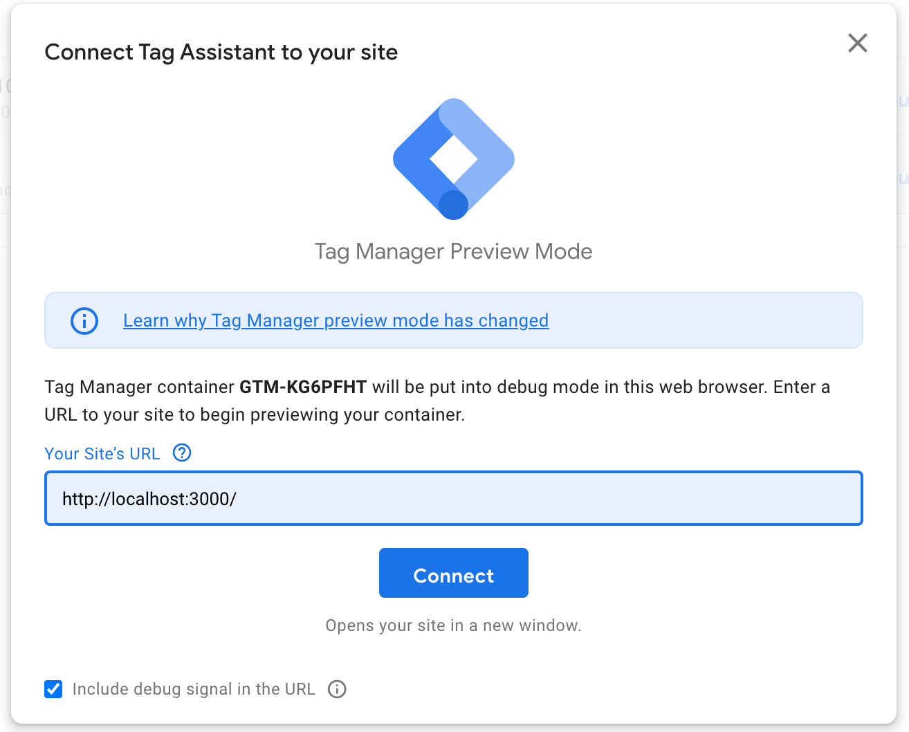
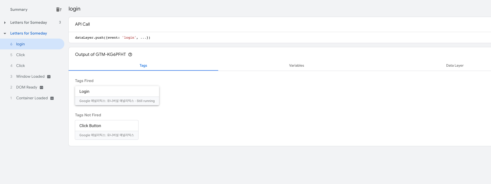
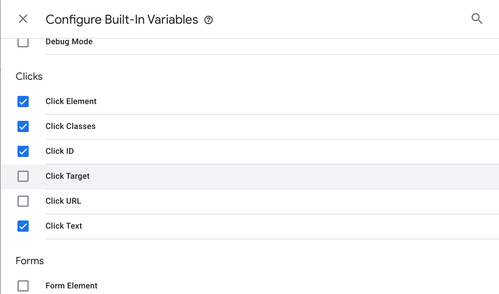
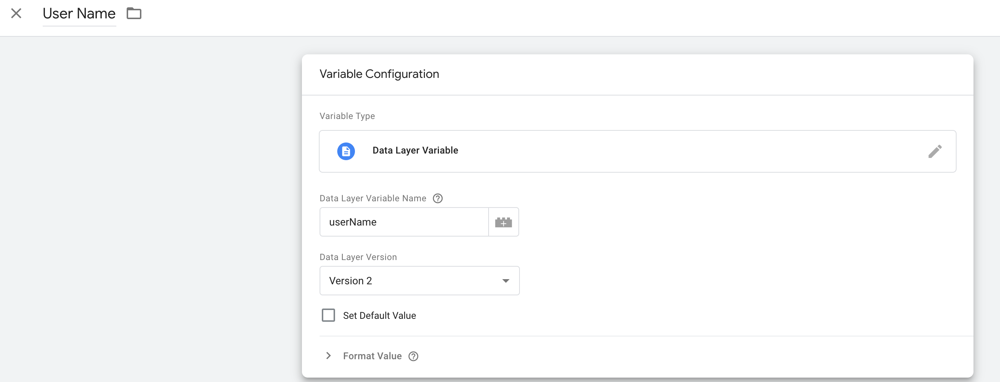
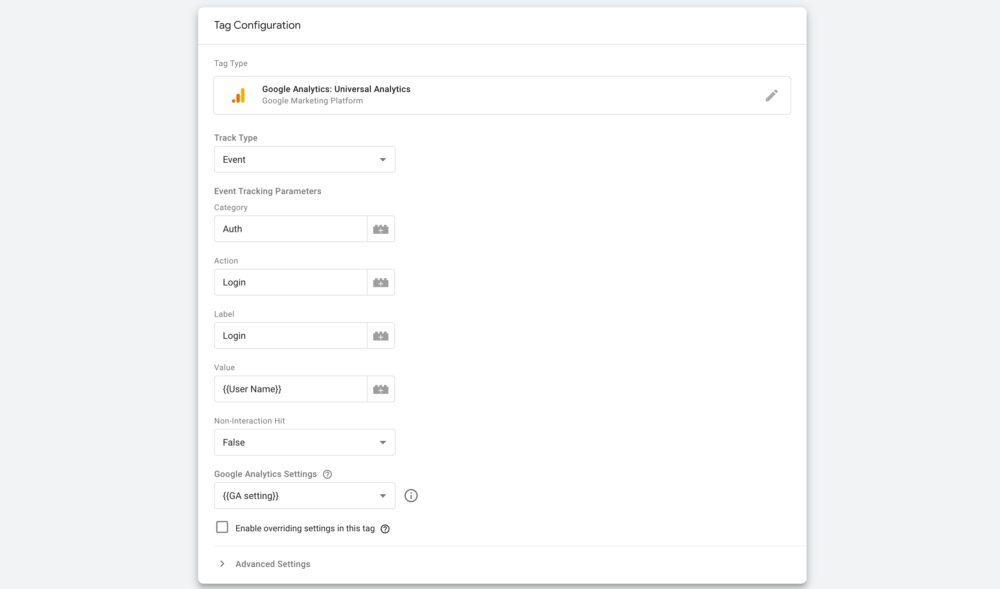
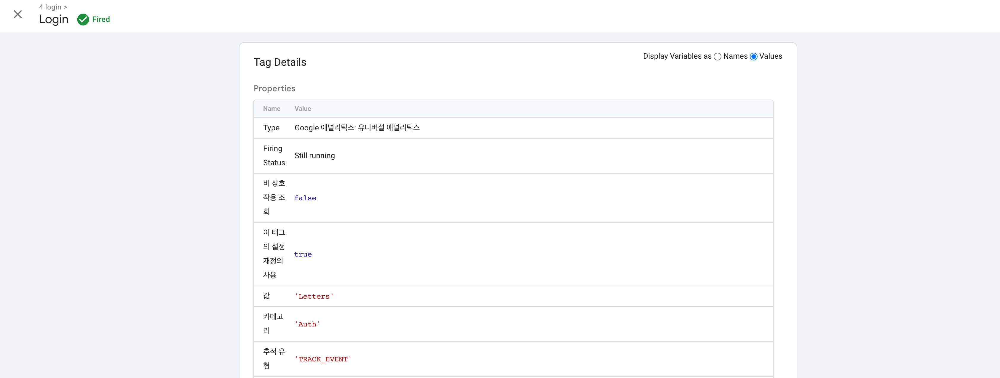

GTM을 이용하면 Application에서 일어나는 특정 이벤트를 감지하여 측정할 수 있다. GTM의 작동 원리를 한 번 알아보자.  

## [ GTM의 작동원리 ]
  

Application과 GTM을 연결하면 Application에서 일어나는 Event들을 GTM으로 보낼 수 있다. Application이 GTM으로 Event를 보내면 GTM은 해당 event가 등록되어 있는 Trigger가 있는지 확인하고 매칭되면 그 Trigger와 연결된 Tag 정보를 GA에 전달한다.  

- Tag  
- Trigger  
- Variables  

## [ React Project에 GTM 연결하기 ]

```bash
npm install react-gtm-module
```

```jsx
import TagManager from 'react-gtm-module';

const tagManagerArgs = {
  gtmId: 'GTM-KG6PFHT'
}

TagManager.initialize(tagManagerArgs);
```

최상위 App에 TagManager를 등록해주자.

## [ 태그 (Tag) ]

태그에서는 Application에서 어떤 행위가 일어날 때 기록할 정보들을 지정할 수 있다. 기본적으로 해당 Event의 Category, Action, Label을 지정하고 추가적인 데이터를 더 저장할 수도 있다. 간단하게 Login 태그를 만들어보자.  

인증과 관련된 내용이라 Category를 Auth로 설정하고, Action과 Label은 Login으로 설정하였다. 우리는 GA에서 태그 데이터를 이용하기 위해 Type을 Google Analytics: Universal Analytics로 설정했는데, GA와 연결하기 위한 **Google Analytics Settings**을 설정해주어야 한다.  
GA Setting 변수를 만들어 두지 않았다면 새로 만들어서 연결해주자.  

Tracking ID에는 만들어 둔 GA Application의 추적 ID (UA-XXXXXX-X)를 넣어주면 된다.  

위에서 Tag에서 보낼 여러 정보들을 설정했는데, 이 정보들을 언제 보낼지에 대한 Trigger가 필요하다. Trigger를 만들어서 Tag와 연결해주자.  

## [ 트리거 (Trigger) ]
Trigger는 event를 감지하고 조건에 맞는 event가 발생하면 연결된 Tag를 발동(Fire)시켜주는 역할을 한다.  
- 미리 정의된 Event
- Custom Event


### < 정의된 Event >

미리 정의되어 있는 Event를이용하면 한 번 연결된 Application은 더이상 코드에 관여하지 않고도 Event를 발생시킬 수 있다. Web Application의 경우 Page View, Click, ... 등이 있다.  Click Event를 이용한 Trigger를 한 번 만들어 보자.  



이렇게 ( id="login"이라는 element를 클릭할 때만 발동 ) 조건을 달아주면 모든 Click을 인식하지 않고 우리가 id="login"이라고 달아둔 로그인 버튼의 Click만 측정할 수 있다.  

*필자의 경우 미리 정의된 < Click - Just Links > Trigger는 a 태그에 id를 지정하고 조건을 달아주면 잘 동작했는데, < Click - All Elements >로 했을 때는 Trigger가 제대로 발동하지 않았다. 아마 Click 했을 때 겹치는 부분에 있던 다른 Element가 Click된 것 같다. 좀 더 공부하고 다시 해봐야겠다.)*  

### < Custom Trigger >

일반적으로 Application에서 일어나는 일반적인 행위가 아닌, Login 성공 등의 Event는 Custom Event를 이용할 수 있다.  


```jsx
import TagManager from "react-gtm-module";

const tagManagerArgs = {
  dataLayer: {
    event: "login",
  },
};
TagManager.dataLayer(tagManagerArgs);
```

위와 같이 Event name을 "login"으로 설정해두고, 로그인에 성공했을 때 Application에서 "login" event를 전송해 주면 Trigger가 발동된다.

*이 때 주의할 점은 Trigger에서 등록한 Event name과 코드에서 보내는 event의 값이 정확하게 같아야 한다.*  

## [ 디버깅 해보기 ]



태그와 트리거를 만들어서 연결했으니 실제로 Application에서 Event가 발생할 때 내가 설정한대로 Tag가 동작하는지 테스트해보자. GTM 오른쪽 상단에 보면 Preview라는 버튼을 누르면 위와 같은 화면이 나온다. develop 서버를 돌려놓고 주소를 연결해주면 된다.  



왼쪽 사이드바에는 발생한 Event 이름이 나온다. 우리가 Application에서 보내준 login 이벤트를 확인할 수 있다. 그리고 Tags 탭에서 어떤 Tag가 발동되었는지 나타난다. 우리가 login Event로 연결한 Login 태그가 발동된 것을 확인할 수 있다.

## [ 변수 (Variables) ]

GTM에서는 다양한 종류의 변수를 정의하고 사용할 수 있다. 앞에서 만들었던 GA-Setting도 변수를 만들어서 사용한 것이다. GTM에서 변수에는 크게 **Built-In Variable**과 **User-Defined Variable**로 나눌 수 있다.  

### < Built-In Variables >

Built-In 변수는 Event가 일어날 때 해당 Event에 대한 정보를 가져올 수 있다. 앞에서 Click Event를 이용한 트리거를 만들어봤는데, Login 버튼을 Click했을 때, 그 버튼의 텍스트를 가져오고 싶다고 하자. 그러면 Click Text라는 Built-In Variable을 사용할 수 있다.  

필요한 Builit-In 변수를 체크해두면 Event가 일어날 때마다, Application에서 설정한 변수값을 같이 보낸다.  


### < User-Defined Variables >

User-Defined Variable은 우리가 직접 값을 설정해줄 수 있다. Constant Variables의 경우 설정한 값을 그대로 가지고 있다. 너무 길거나 외우기 힘들 때 이런 변수를 사용할 수 있다.  
여기서 유용하게 살펴볼 변수는 Data Layer Variable이다. 이 변수를 사용하면 Custom Event를 보낼 때 같이 넣어준 데이터를 가져올 수 있다.  
```jsx
import TagManager from "react-gtm-module";

let randomName = Math.random() > 0.5 ? "Googy" : "Letters";
const tagManagerArgs = {
  dataLayer: {
    event: "login",
    userName: randomName
  },
};
TagManager.dataLayer(tagManagerArgs);
```
앞에서 만든 login event에 userName이라는 data를 추가하여 보냈다.  

그러면 GTM의 variable 설정에서 Data Layer Variable Name을 코드에서 정한대로 userName이라고 설정하여 변수를 만들고 활용할 수 있다.  

### < 태그에서 변수 사용하기 >


태그에서 필요한 곳에 {{변수명}} 이렇게 설정하면 변수의 값이 들어간다. (+ 버튼을 눌러서 사용할 변수를 추가할 수도 있다.)  

디버그모드에서 발동된 Login Tag의 값을 보니 Application에서 보내준 데이터가 값으로 들어간 것을 확인할 수 있다.  
모두 테스트했다면 잊지말고, Publish 해주고, 다음에 Google Analytics에서 기록된 Event를 확인해보자.  