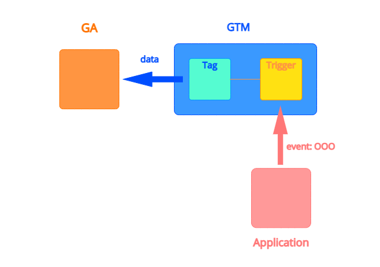
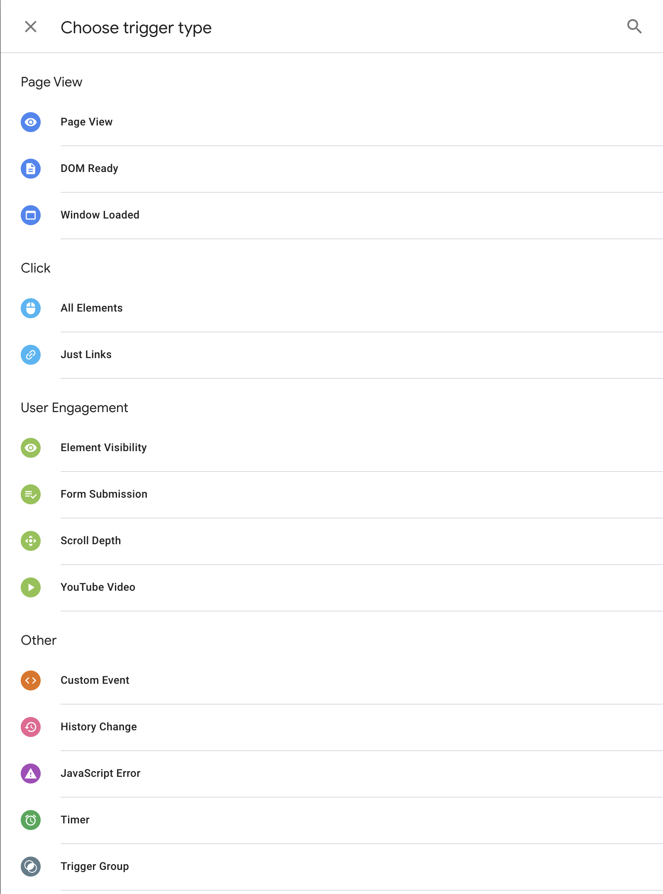
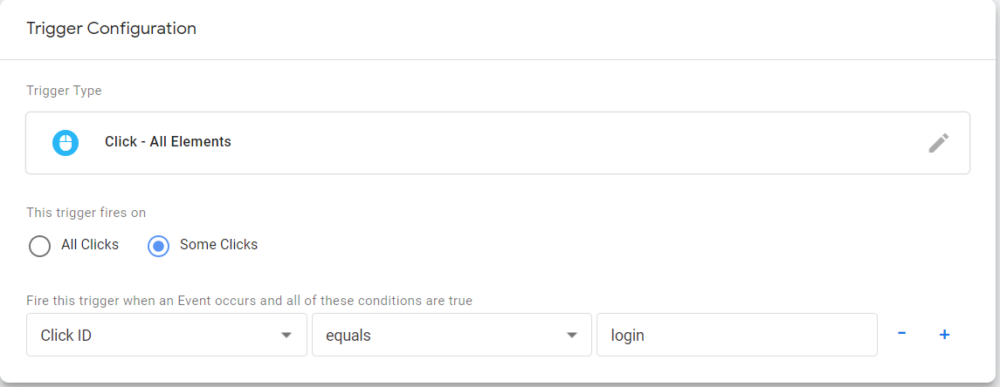
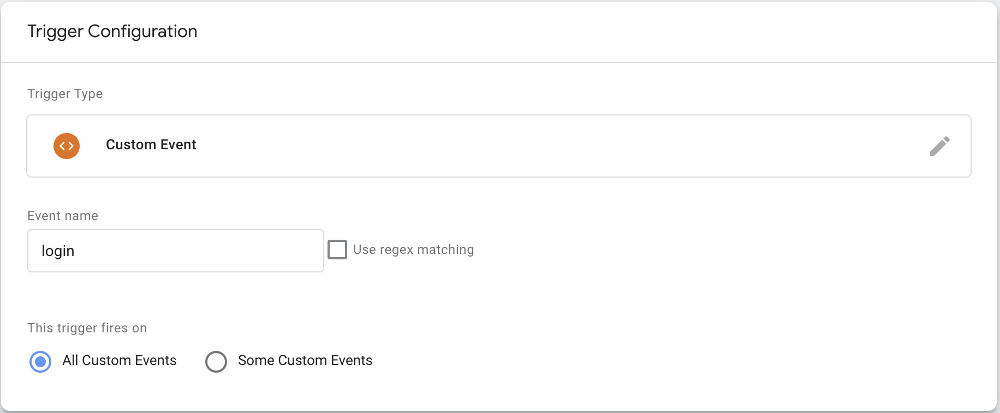
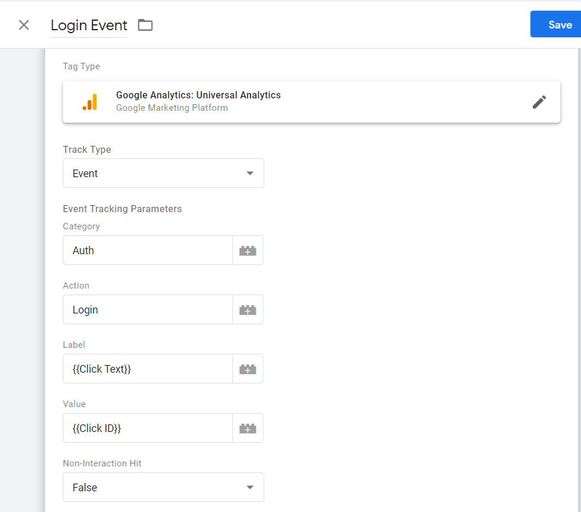
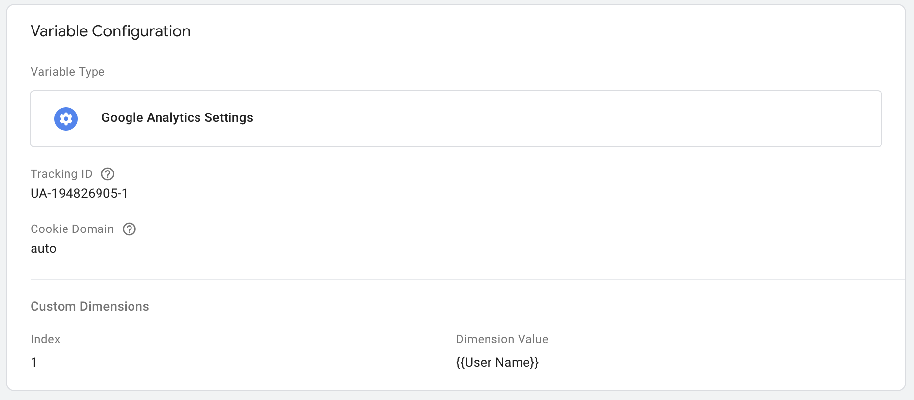
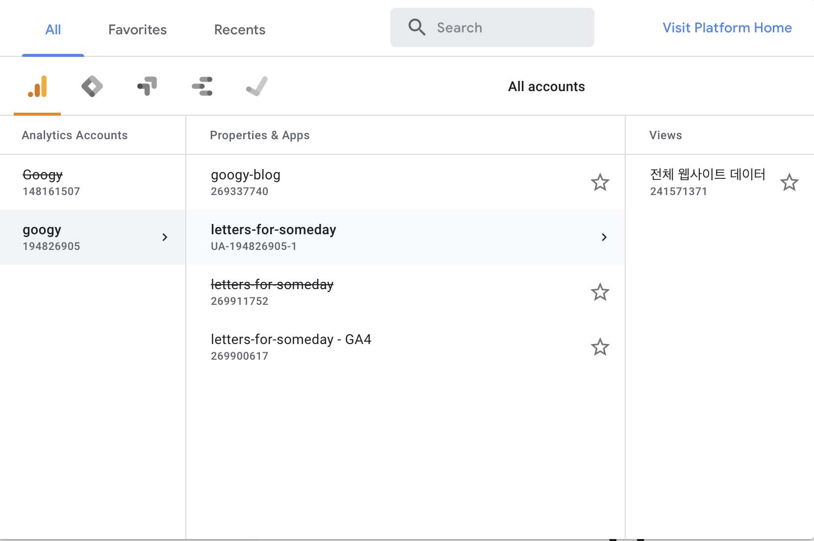
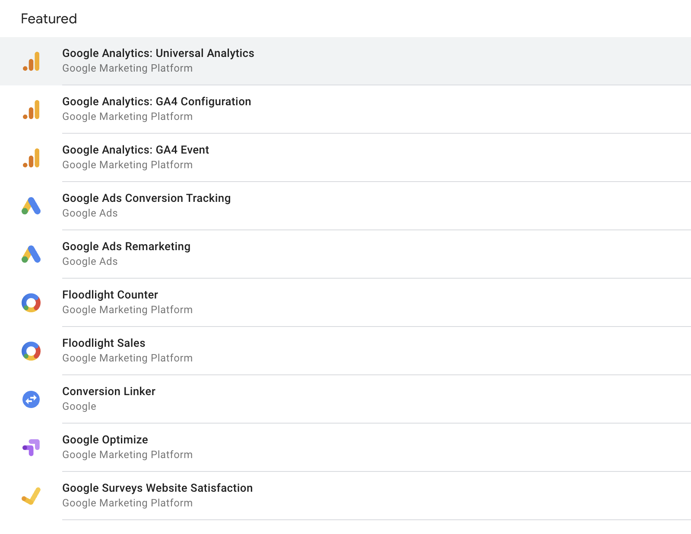
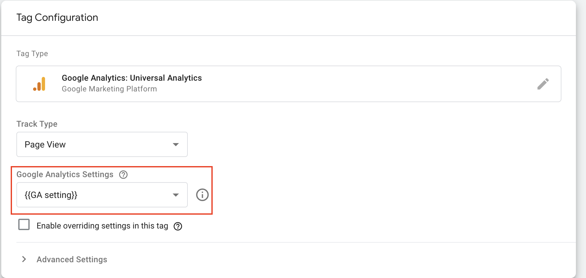

GTM을 이용하면 Application에서 일어나는 특정 이벤트를 감지하여 측정할 수 있다. GTM의 작동 원리를 한 번 알아보자.  

## [ GTM의 작동원리 ]
  

Application과 GTM을 연결하면 Application에서 일어나는 Event들을 GTM으로 보낼 수 있다. Application이 GTM으로 Event를 보내면 GTM은 해당 event가 등록되어 있는 Trigger가 있는지 확인하고 매칭되면 그 Trigger와 연결된 Tag 정보를 GA에 전달한다.  

- Tag  
- Trigger  
- Variables  

## [ React Project에 GTM 연결하기 ]

```bash
npm install react-gtm-module
```

```jsx
import TagManager from 'react-gtm-module';

const tagManagerArgs = {
  gtmId: 'GTM-KG6PFHT'
}

TagManager.initialize(tagManagerArgs);
```

최상위 App에 TagManager를 등록해주자.

## [ 트리거 (Trigger) ]



Trigger는 event를 감지하고 조건에 맞는 event가 발생하면 연결된 Tag를 발동(Fire)시켜주는 역할을 한다. 

- 미리 정의된 Event
- Custom Event

### < 정의된 Event >

미리 정의되어 있는 Event를이용하면 한 번 연결된 Application은 더이상 코드에 관여하지 않고도 Event를 발생시킬 수 있다. Web Application의 경우 Page View, Click, ... 등이 있다.  Click Event를 이용한 Trigger를 한 번 만들어 보자.



이렇게 (id="login"이라는 element를 클릭할 때만 발동) 조건을 달아주면 모든 Click을 인식하지 않고 우리가 id="login"이라고 달아둔 로그인 버튼의 Click만 측정할 수 있을 것이다. 

물론 조건이 복잡해지면  코드에 직접 삽입하고, Custom Event를 사용해야 할 경우가 생길 것이다.

(필자의 경우 미리 정의된 Event가 내 생각만큼 제대로 동작하지 않아서, 확실하기 Custom Event를 이용했다. 미리 정의된 Event를 어떻게 하면 제대로 사용할 수 있을지 좀 더 공부하고 다시 해봐야겠다.)

### < Custom Trigger >

Login 성공 등의 Event는 Custom Event를 이용해서 Trigger를 발생시킬 수 있다. 



```jsx
import TagManager from "react-gtm-module";

let randomName = Math.random() > 0.5 ? "Googy" : "Letters";
const tagManagerArgs = {
  dataLayer: {
    event: "login",
    userName: randomName
  },
};
TagManager.dataLayer(tagManagerArgs);
```

위와 같이 Custom Trigger로 Event name을 login으로 설정하고,  Login이 성공했을 때, Application에서 login event를 전송해 주면 Trigger가 발동된다.

이 때 주의할 점은 Trigger에서 등록한 Event name과 코드에서 보내는 event의 값이 정확하게 같아야 한다.

## [ 변수 (Variables) ]

GTM에서는 다양한 종류의 변수를 정의하고 사용할 수 있다. 가장 간단한 예로 Constant 타입의 Tracking ID라는 변수를 만들어 놓고, 우리가 그 안에 Google Anayltics의 Tracking ID (UA-XXXXXX-X)를 저장해두면, Tracking ID가 필요할 때마다 "UA-XXXXXX-X"를 복붙하지 않고, {{Tracking ID}}라는 걸 가져다 쓸 수 있다.

- 변수에는 **Built-In Variable**과 **User-Defined Variable**이 있다.

### < User-Defined Variables >

먼저 자주 사용하게 될 User-Defined Variables를 먼저 알아보자. 앞에서 봤던 것 처럼, 

### < Built-In Variables >

- Built-In Variables

그리고 동적으로 가져와주는 Built-In 변수도 있다. 앞에서 우리가 트리거를 만들어봤는데, Login 버튼을 Click했을 때, 그 버튼의 텍스트 내용을 가져오고 싶다고 하자. 그러면 Click Text라는 Built-In Variable을 사용할 수 있다.

- Click한 Element의 텍스트를 가지게 된다.

이런 Variables를 다음 Tag를 만들 때 사용해보자.

## [ 태그 (Tag) ]



위와 같이 태그를 만들어봤다.

- Tag Type은 어떤 블로그를 참조하는데, GA: Univerasal Analytics로 하라고 해서, 일단 그렇게 했다..
- 우리가 정리한대로 Category는 Auth, Action는 Login으로 줬다.
- Label도 우리가 직접 적어도 되지만, 아까 봤던 것처럼 앞에서 만들 Variable을 활용할 수도 있다.
- 마지막으로 Value라는 것도 설정할 수 있는 걸 보니, 내 생각엔 저걸 GA 가져오는 걸 찾아내기만 하면 될 것 같다.
    - 예를 들어 프로필링크의 Url Link ID를 Url Link 버튼의 id로 주고 {{Click ID}}로 가져와서 Value에 넣어주면 될 것 같다.

## [ GA와 연결하기 ]



Variables에서 Google Anayltics Settings라는 걸 생성한다.



Tracking ID는 Analytics App의 추적 ID(Tracking ID)를 넣어주면 된다. (UA-XXXXXXXXX-X)

Google Anayltics 4?에서부터는 Analytics App을 만들때 측정 ID (G-XXXXXXXX)가 생성되는데 추적 ID (UA-XXXXXXXXX-X)를 생성하도록 하는법도 써놓겠다.

본론으로 돌아가서 



Tag를 생성할 때, Google Anayltics: Universal Analytics를 선택하고, Google Analytics Settings에 아까 만들었던 GA Setting을 넣어주면 된다.



[GA Setting에서 Custom Dimension 연결하기](https://www.notion.so/GA-Setting-Custom-Dimension-20ac0c0c1e064ee9920ef2e442082330)

## [ 테스트 해보기 ]