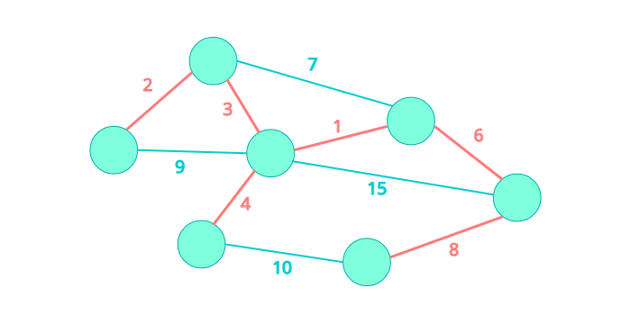
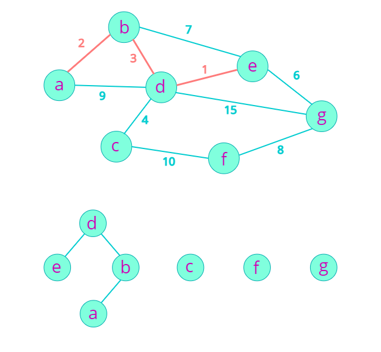
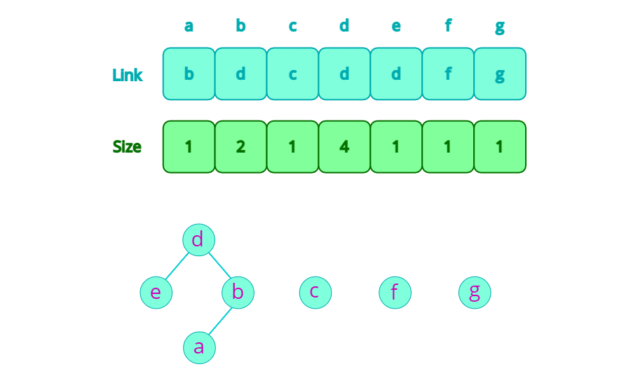
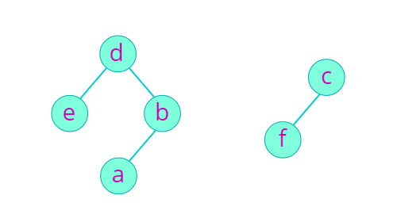
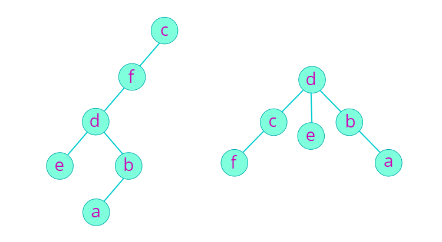
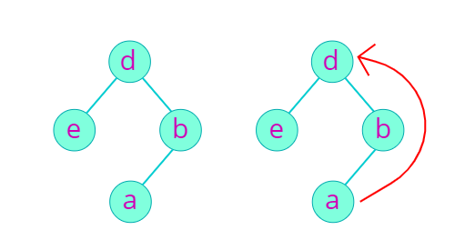

## [ 최소 스패닝 트리 (Minimum Spanning Tree) ]  

  

**스패닝 트리(Spanning Tree)**는 어떤 그래프의 부분 그래프 중에, 모든 노드를 포함하고, 모든 노드들이 서로 간에 경로가 존재하는 그래프를 말한다. 이 그래프는 (모든 간선의 Weight가 양수라는 가정 하에) 당연히 트리 형태를 가지기 때문에, 스패닝 **트리**라고 부른다. **최소 스패닝 트리 (Minimum Spanning Tree)**는 이름에서 알 수 있듯이 간선(Edge)의 Weight 합이 최소가 되는 스패닝 트리를 말한다.  

그래프에서 최소 스패닝 트리를 찾기 위한 알려진 방법에는 **크루스칼 알고리즘 (Kruskal's Algorithm)**과 **프림 알고리즘 (Prim's Algorithm)**이 있다. 크루스칼 알고리즘에 대해서 알아보자.  


## [ 크루스칼 알고리즘 (Kruskal's Algorithm) ]  
 크루스칼 알고리즘은 Greedy를 활용하여 그래프 내에서 Weight가 가장 작은 간선을 선택해 나가는 알고리즘이다.  
  
- 그래프의 간선을 Weight가 작은 것부터 순회한다.  
- 해당 간선을 추가할 때 **Cycle을 생성하지 않는다면** 트리에 추가한다.  
- 모든 간선을 순회하였을 때, 최소 스패닝 트리가 만들어진다.  

## [ 사이클 찾기 ]  
- DFS  
- Union-find  

크루스칼 알고리즘을 적용하여 트리를 만들어 나갈 때 Cycle이 생기는지 확인할 필요가 있었다. 어떤 그래프에서 Cycle이 있는지 확인하기 위해서는 쉽게 생각해서 DFS로 순회하면서 방문한 곳을 또 방문한다면 Cycle이 있다는 것을 알 수 있다. 하지만 이보다 더 효율적인 **Union-Find** 알고리즘을 알아보자.  


### < Union-Find >  
Union-Find는 **서로소 집합 (Disjoint Set)** 을 표현하기 위해 사용하는 알고리즘이라고 한다. 크루스칼 알고리즘에서 집합은 연결된 컴포넌트로 볼 수 있다. 간선을 확정하여 두 컴포넌트를 합칠 때 Union-Find 알고리즘을 사용할 것이다.  

  
Union-Find 알고리즘에서는 확정된 **컴포넌트**를 **트리구조**로 표현하여 트리의 루트가 대표 노드가 된다.  
Union-Find의 단계는 다음과 같다.  

- 연결시킬 두 노드가 속한 컴포넌트에서 루트 노드를 찾는다. (Find)  
  해당 노드가 속한 트리에서 부모를 계속 따라가면 루트를 찾을 수 있다.  
- 루트 노드가 같다면 두 노드가 같은 컴포넌트에 존재하는 것이기 때문에, 루트 노드가 다를 때만 두 컴포넌트를 합친다. (Union)

## [ 구현 ]  
  
* Parent Link  
* Size  

### < Parent Link >  
Union-Find에서 연결된 컴포넌트를 표현하기 위해 트리 구조로 표현했는데, 각 노드가 속한 트리의 루트 노드만 찾아낼 수 있으면 된다. 따라서 트리의 루트를 찾기 위해서 각 노드마다 부모를 가리키는 Parent Link를 저장한다.  

### < Size >  
  
  
두 트리를 합칠 때 (Union), 한 트리는 다른 트리의 하위로 들어간다. 임의로 합친다면 트리의 불균형이 생길 수 있지만 (왼쪽) Size가 작은 트리를 Size가 큰 트리의 하위로 들어가면 트리의 불균형이 줄어들어 루트 노드를 찾는 시간이 줄일 수 있다. (오른쪽)  

### < Kruskal with Union-Find >  
- 각 노드마다 Parent Link와 Size를 저장한다.  
  초깃값으로 Parent Link는 자신의 Index를, Size는 1을 가진다.  
- 그래프 내의 간선을 Weight가 작은 순으로 순회하면서 다음 작업을 수행한다.  
  - 간선마다 연결된 두 노드의 루트 노드를 찾는다. (Find)  
  - 루트 노드가 다르다면 두 집합을 합치고 (Union) 간선을 스패닝 트리에 추가한다.  

### < Code >  
``` cpp
int find_root(int node_number)
{
  while(node_number != parent_links[node_number])
    node_number = parent_links[node_number]
  return node_number;
}

void union_graph(int root1, int root2)
{
  if(sizes[root1] < sizes[root2])
  {
    parent_links[root1] = root2;
    sizes[root2] += sizes[root1];
  } else
  {
    parent_links[root2] = root1;
    sizes[root1] += sizes[root2];
  }
}

int solution()
{
  sort(edges.begin(), edges.end());
  for (int i = 0; i < E; i++)
  {
    int root1 = find_root(edges[i].src);
    int root2 = find_root(edges[i].dst);
    if (root1 != root2)
    {
      union_graph(root1, root2);
    }
  }
}
```

## [ 경로 압축 ]  
Parent Link는 컴포넌트에서 루트를 찾기 위한 용도이다. 그리고 노드 A가 노드 B보다 하위에 있다는 사실은 Union이 일어나더라도 변하지 않기 때문에, 루트를 한번 찾으면 중간에 거치는 노드를 생략하고 찾은 루트를 Parent Link로 바로 연결할 수 있다.  
  
*※물론 해당 컴포넌트가 다른 컴포넌트의 하위로 들어갈 수 있기 때문에, Find에서 해당 노드가 루트인지 확인할 필요가 있다.*  

``` cpp
int find_root(int node_number)
{
  if(node_number == parent_links[node_number])
    return node_number;
  parent_links[node_number] = find_root(parent_links[node_number]);
  return parent_links[node_number];
}
```

