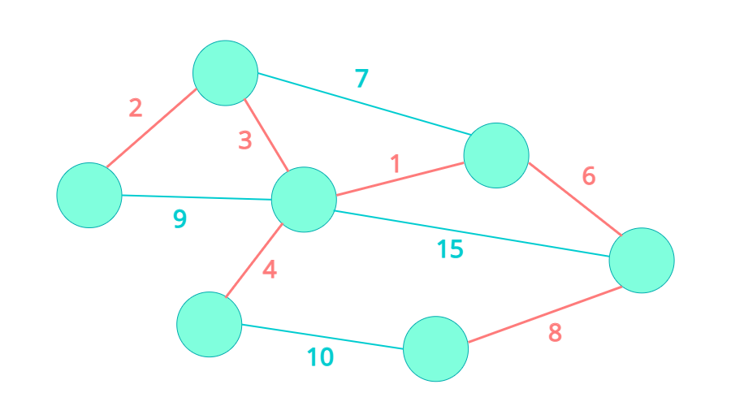
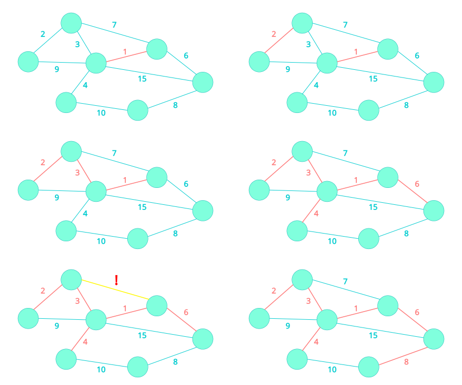

## [ 최소 스패닝 트리 (Minimum Spanning Tree) ]  

  

**스패닝 트리(Spanning Tree)**는 그래프 내에서 모든 노드를 포함하는 트리를 말한다. 이름에서 알 수 있듯이 **최소 스패닝 트리 (Minimum Spanning Tree)**는 간선(Edge)의 Weight 합이 최소가 되는 Spanning Tree를 말한다.  

그래프에서 최소 스패닝 트리를 찾는 방법에는 크게 **크루스칼 알고리즘 (Kruskal's Algorithm)**과 **프림 알고리즘 (Prim's Algorithm)**이 있다. 크루스칼 알고리즘에 대해서 알아보자.  

- 사례  

## [ 크루스칼 알고리즘 (Kruskal's Algorithm) ]  
크루스칼 알고리즘은 Greedy 알고리즘을 활용하여 그래프 내에서 Weight가 가장 작은 간선을 선택해 나가는 알고리즘이다.  
  
- 그래프의 Edge를 Weight가 작은 것부터 순회한다.  
- 해당 Edge를 추가할때 Cycle을 생성하지 않는다면 트리에 추가한다.  
- 모든 Edge를 순회하였을 때 (또는 모든 노드가 트리에 포함되었을 때)의 트리가 최소 스패닝 트리이다.  

## [ Cycle 찾기 ]  
어떤 그래프에서 Cycle이 있는지 확인하기 위해서는 
- DFS
- Disjoint Set / Union-find

## [ 증명 ]

## [ ~~ 알고리즘 ]  

## [ Kruskal's Algorithm을 이용한 문제 풀이 ]  