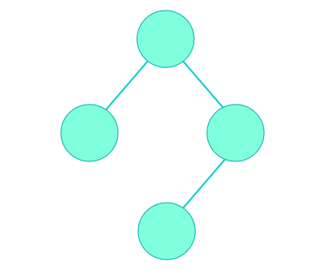

## [ 최소 스패닝 트리 (Minimum Spanning Tree) ]  

  

**스패닝 트리(Spanning Tree)**는 어떤 그래프의 부분 그래프 중에, 모든 노드를 포함하고, 모든 노드들이 서로 간에 경로가 존재하는 그래프를 말한다. 이 그래프는 (모든 Edge의 Weight가 양수라는 가정 하에) 당연히 트리 형태를 가지기 때문에, 스패닝 트리라고 부른다. **최소 스패닝 트리 (Minimum Spanning Tree)**는 이름에서 알 수 있듯이 간선(Edge)의 Weight 합이 최소가 되는 Spanning Tree를 말한다.  

그래프에서 최소 스패닝 트리를 찾는 방법에는 크게 **크루스칼 알고리즘 (Kruskal's Algorithm)**과 **프림 알고리즘 (Prim's Algorithm)**이 있다. 크루스칼 알고리즘에 대해서 알아보자.  

- 사례  

## [ 크루스칼 알고리즘 (Kruskal's Algorithm) ]  
 앞에서 크루스칼 알고리즘은 Greedy 알고리즘을 활용하여 그래프 내에서 Weight가 가장 작은 간선을 선택해 나가는 알고리즘이다.  
  
- 그래프의 Edge를 Weight가 작은 것부터 순회한다.  
- 해당 Edge를 추가할때 Cycle을 생성하지 않는다면 트리에 추가한다.  
- 모든 Edge를 순회하였을 때 (또는 모든 노드가 트리에 포함되었을 때)의 트리가 최소 스패닝 트리이다.  

## [ 사이클 찾기 ]  
- DFS  
- Union-find  

크루스칼 알고리즘을 적용하면서 트리를 만들어 나갈 때 Cycle이 생기는지 확인할 필요가 있었다. 어떤 그래프에서 Cycle이 있는지 확인하기 위해서는 쉽게 생각해서 DFS로 순회하면서 방문한 곳을 또 방문한다면 Cycle이 있다는 것을 알 수 있다. 하지만 이보다 더 효율적인 알고리즘인 Union-Find 알고리즘을 알아보자.  

### < Union-Find >  
Union-Find 알고리즘은 서로소 집합 (Disjoint Set)을 표현하기 위해 사용하는 알고리즘이라고 한다. 우리는 Spanning Tree를 만들어 나갈 때 연결된 컴포넌트라는 것을 집합으로 표현하고, Edge를 확정하여 집합들을 합칠 때 Union-Find 알고리즘을 사용할 것이다.  
  
Union-Find 알고리즘에서는 각 집합(컴포넌트)을 트리구조로 표현하여 집합 내의 모든 원소들이 대표 원소를 찾을 수 있도록 한다. Union-Find의 단계는 다음과 같다.  

- (초기화) 각 노드 만큼의 집합을 만든다.  
- Edge마다 연결된 두 노드의 대표값을 찾는다(Find).  
- 대표값이 다르다면 두 집합을 합치고(Union) Edge를 Spanning Tree에 추가한다.  
  대표값이 같다면 이미 같은 컴포넌트를 구성하고 있는 것이므로, Edge를 추가하면 Cycle이 생겨 Tree가 아니게 된다.  


## [ 구현 ]  
- 각 노드마다 parent와 size를 저장한다.
  parent는 대표 노드를 Find할 때 따라갈 노드이고, size는 해당 
- 그래프 내의 Edge를 Weight가 작은 순으로 순회한다.
  * Edge마다 연결된 두 노드의 대표값을 찾는다(Find).  
  * 대표값이 다르다면 두 집합을 합치고(Union) Edge를 Spanning Tree에 추가한다.  

### < 코드 >  
``` cpp
#include <iostream>
#include <vector>
#include <algorithm>
#include <stack>

using namespace std;

class Edge
{
public:
  int weight;
  int src;
  int dst;
  bool operator<(Edge &ref)
  {
    return (this->weight < ref.weight);
  }
};

int V, E;
vector<Edge> edges;
vector<int> parent_vector;
vector<int> size_vector;

int find_root(int node_number)
{
  if(node_number == parent_vector[node_number])
    return node_number;
  parent_vector[node_number] = find_root(parent_vector[node_number]);
  return parent_vector[node_number];
}

void union_graph(int root1, int root2)
{
  if(size_vector[root1] < size_vector[root2])
  {
    parent_vector[root1] = root2;
    size_vector[root2] += size_vector[root1];
  } else
  {
    parent_vector[root2] = root1;
    size_vector[root1] += size_vector[root2];
  }
}

int solution()
{
  // input
  cin >> V >> E;
  size_vector.resize(V + 1);
  parent_vector.resize(V + 1);
  for (int i = 0; i < E; i++)
  {
    Edge edge;
    cin >> edge.src >> edge.dst >> edge.weight;
    edges.push_back(edge);
  }

  // set up
  for (int i = 1; i <= V; i++)
  {
    parent_vector[i] = i;
    size_vector[i] = 1;
  }
  
  // kruskal's
  long long total_cost = 0;
  sort(edges.begin(), edges.end());
  for (int i = 0; i < E; i++)
  {
    int root1 = find_root(edges[i].src);
    int root2 = find_root(edges[i].dst);
    if (root1 != root2)
    {
      union_graph(root1, root2);
      total_cost += edges[i].weight;
    }
  }

  // output
  cout << total_cost << "\n";

  return 0;
}

int main()
{
  ios_base::sync_with_stdio(false);
  cin.tie(NULL);
  solution();
}
```


## [ 증명 ]

