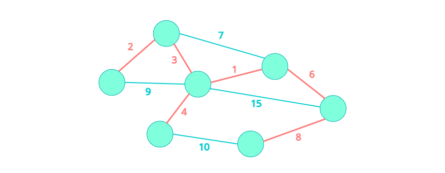

## [ 최소 스패닝 트리 (Minimum Spanning Tree) ]  

  

**스패닝 트리(Spanning Tree)**는 어떤 그래프의 부분 그래프 중에, 모든 노드를 포함하고, 모든 노드들이 서로 간에 경로가 존재하는 그래프를 말한다. 이 그래프는 (모든 Edge의 Weight가 양수라는 가정 하에) 당연히 트리 형태를 가지기 때문에, 스패닝 트리라고 부른다. **최소 스패닝 트리 (Minimum Spanning Tree)**는 이름에서 알 수 있듯이 간선(Edge)의 Weight 합이 최소가 되는 Spanning Tree를 말한다.  

그래프에서 최소 스패닝 트리를 찾는 방법에는 크게 **크루스칼 알고리즘 (Kruskal's Algorithm)**과 **프림 알고리즘 (Prim's Algorithm)**이 있다. 크루스칼 알고리즘에 대해서 알아보자.  

- 사례  

## [ 크루스칼 알고리즘 (Kruskal's Algorithm) ]  
 앞에서 크루스칼 알고리즘은 Greedy 알고리즘을 활용하여 그래프 내에서 Weight가 가장 작은 간선을 선택해 나가는 알고리즘이다.  
  
- 그래프의 Edge를 Weight가 작은 것부터 순회한다.  
- 해당 Edge를 추가할때 Cycle을 생성하지 않는다면 트리에 추가한다.  
- 모든 Edge를 순회하였을 때 (또는 모든 노드가 트리에 포함되었을 때)의 트리가 최소 스패닝 트리이다.  

## [ Cycle 찾기 ]  
크루스칼 알고리즘을 적용하면서 트리를 만들어 나갈 때 Cycle이 있는지 확인할 필요가 있었다. 어떤 그래프에서 Cycle이 있는지 확인하기 위해서는 쉽게 생각해서 DFS로 순회하면서 방문한 곳을 또 방문한다면 Cycle이 있다는 것을 알 수 있다. 하지만 이보다 더 효율적인 알고리즘인 Union-Find 알고리즘을 알아보자.  

## [ Union-Find 알고리즘 ]  
Union-Find 알고리즘은 같은 컴포넌트(Component)에 있는 노드를 (서로 연결된 노드) 같은 집합에 담고, 두 집합이 연결되면 하나의 집합으로 합치는 알고리즘이다. 여기서 각 집합들은 서로소 집합 (Disjoint Set)이 되고, 각 집합마다 하나의 대표 노드가 존재한다. 그리고 집합 내의 모든 원소는 경로를 따라가면?? 대표 노드를 찾을 수 있다. 따라서? 두 노드의 대표값이 같다면 두 노드가 같은 집합에 있다는 뜻이다.  

- DFS
- Disjoint Set / Union-find

## [ 증명 ]

## [ ~~ 알고리즘 ]  

## [ Kruskal's Algorithm을 이용한 문제 풀이 ]  