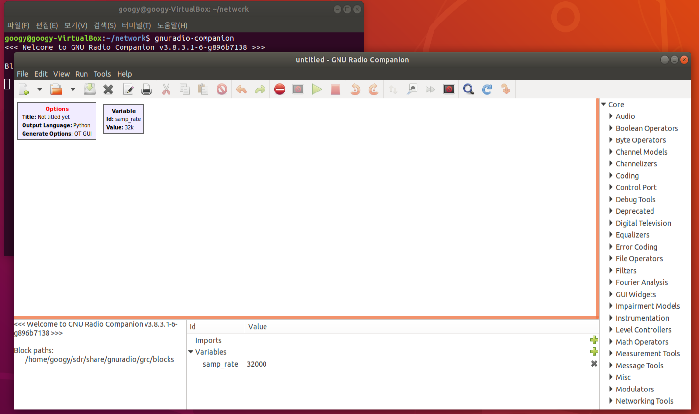
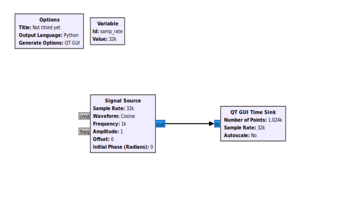
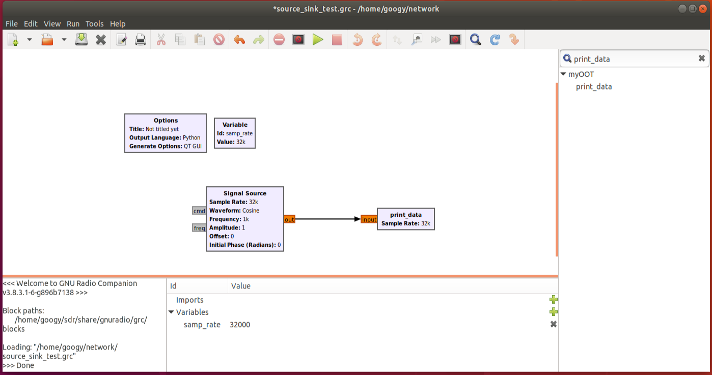

## [ GNU Radio ]  
[https://www.gnuradio.org](https://www.gnuradio.org/)  
GNU Radio는 Software Defined Radio에서 신호를 처리하는 프로그램을 만들 수 있는 개발도구이다.  

### < Software Defined Radio >  
Software Defined Radio (SDR)는 신호 처리 로직이 Hardware 내의 회로에서 고정된 것이 아니라 Software로 동작하도록 설계된 무선 통신 장비이다. 이를 이용하면 신호처리에 대한 업데이트도 쉽고 하나의 장비로 여러 종류의 통신을 지원할 수 있다.  

## [ GNU Radio 설치 ]  
### < 환경, 버전 >  
* Ubuntu LTS 18.04  
* GNU Radio 3.8  

### < 설치 >
``` shell
sudo add-apt-repository ppa:gnuradio/gnuradio-releases-3.8
sudo apt-get update
sudo apt-get install gnuradio
```  

ppa를 통해서 쉽게 설치할 수 있다.
``` shell
sudo add-apt-repository ppa:gnuradio/gnuradio-releases
```  

3.8 버전이 필요해 gnuradio-releases-3.8로 설치하였지만, 최신 버전으로 설치하고 싶다면  이렇게 바꾸면 된다.  

## [ GNU Radio 시작하기 ]  
``` shell
gnuradio-companion
```  



gnuradio 코드는 여러 block들로 구성된다. 

* **Options**  
    Options block은 프로그램에 대한 정보를 나타낸다. 더블 클릭하면 properties를 설정할 수 있는데, Id를 설정해 주어야 실행 가능하다.  
* **Variable**  
    자주 사용하는 값을 재사용하기 위해서 변수로 지정하는 block이다.  

### < source & sink >  
  
* **source**  
    source block은 어떤 출력을 내보내주는 block이다. 위 예제에서는 frequency가 1khz인 cosine wave를 내보내고 있다.  
* **sink**  
    sink block은 어떤 입력을 받아서 처리하는 block이다. QT GUI Sink는 입력받은 신호를 그래프로 그려준다.  

## [ Out Of Tree Modules 제작하기 ]  
Out Of Tree (OOT)는 Gnuradio에 내장되어 있지 않고, 사용자가 직접 함수를 작성하여 block으로 사용할 수 있는 module이다.  
`myOOT`라는 module과 `print_data`라는 block을 만들어보자.  

### < 모듈 생성 >  
```bash
gr_modtool newmod {module name}
```
실행하면 gr-{module name}이라는 폴더가 생긴다.

### < block 추가 >  
``` shell
cd gr-{module name}
gr_modtool add -t sync -l python
```

``` shell
Language: Python
Enter name of block/code (without module name prefix): {block name}
Block/code identifier: {block id}
Please specify the copyright holder:
Enter valid argument list, including default arguments: {arg1}, {arg2}, ... (필요한 properties)
Add Python QA code? [Y/n] n
```
완료되면 module 폴더 내에 `grc/{module name}_{block name}.block.yml` 과 `python/{block name}.py` 파일이 생긴다.  

### < Block 설정/코드 작성 >  

* `grc/{module name}_{block name}.block.yml`  
  paramters, inputs, outputs에서 ...으로 되어 있는 부분에 값을 채워준다.  
  ``` yml
  parameters:
  - id: sample_rate
    label: Sample Rate
    dtype: float

  inputs:
  - label: input
    dtype: float
  ```  
  parameter의 id는 block을 생성할 때 지정한 argument 이름과 맞춰주어야 한다.  
  input만 필요한 block을 만들 것이기 때문에 outputs은 제거하였다. inputs에서는 label, dtype만 설정해 주고 필요 없는 부분은 제거하였다.  


* `python/{block name}.py`  
  ``` python
  import numpy
  from gnuradio import gr

  class print_data(gr.sync_block):
      """
      docstring for block print_data
      """
      def __init__(self, sample_rate):
          gr.sync_block.__init__(self,
              name="print_data",
              in_sig=[numpy.float32],
              out_sig=None)


      def work(self, input_items, output_items):
          in0 = input_items[0]
          print(in0)
          return len(in0)
  ```
  파일을 보면 `<+numpy.float32+>`이런 형식으로 되어 있는 부분은 `numpy.float32` 이렇게 바꿔주어야 한다. output은 없는 block을 만들 것이므로 `__init__`에서 `out_sig=None`으로 설정해 주고 `work`에서 input을 출력하도록 구현하였다.  

### < OOT 빌드 >  
``` shell
mkdir build
cd build
cmake ..
make
sudo make install
sudo ldconfig
```

완료되면 아래와 같이 만든 block을 사용할 수 있다.  

  
지정한 parameter에 값을 넣어주고 실행해보자.  

### < Error >
실행했을 때 `No module named myOOT` 에러가 난다면, myOOT 모듈이 python 모듈들이 있는 위치에 있는지 검색해보고 다른 곳에 있다면 옮겨주자. 
``` shell
sudo find / -name "myOOT"
```
