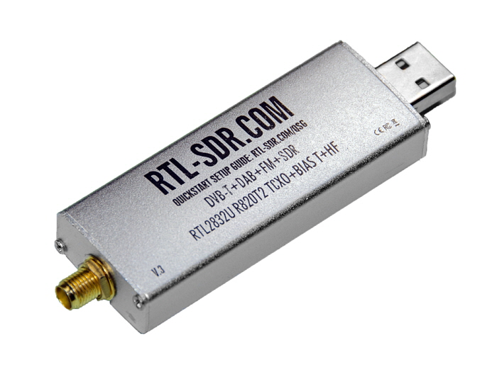
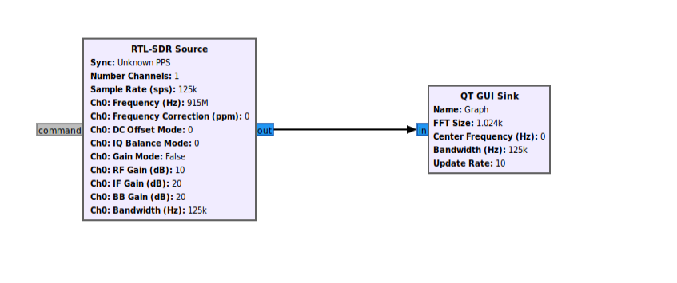
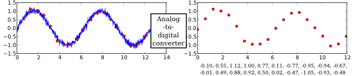
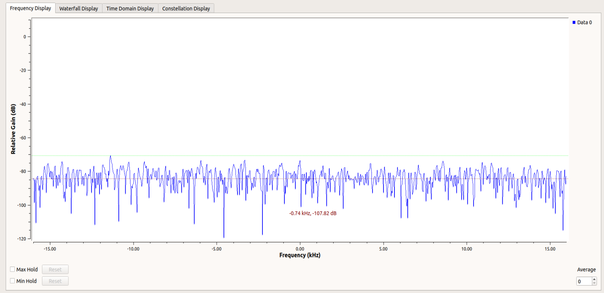

## [ SDR (Software Defined Radio) ]  
Software Defined Radio (SDR)는 신호 처리 로직이 Hardware 내의 회로에서 고정된 것이 아니라 Software로 동작하도록 설계된 무선 통신 장비이다. 이를 이용하면 신호처리에 대한 업데이트도 쉽고 하나의 장비로 여러 종류의 통신을 지원할 수 있다.  

오늘은 RTL-SDR이라는 실제 장비를 GNU Radio와 연결하여 장비를 통해 인식한 Signal을 살펴볼 것이다.  

## [ SDR Driver 설치 ]  
## [ SDR 블록이 내장된 GNU-Radio 설치 ]  
[https://goo-gy.github.io/2021-07-13-gnuradio](https://goo-gy.github.io/2021-07-13-gnuradio)에서 간단하게 GNU Radio를 설치하는 방법을 소개했지만, 아쉽게도 이 방법으로 설치할 경우 RTL-SDR 블록이 내장되어 있지 않다. 그래서 추가적으로 RTL-SDR 모듈을 설치하려고 하였지만 GNU Radio 3.8에서는 다른 좋은 방법을 찾지 못하고 GNU Radio 3.8을 설치할 때 같이 설치하는 방법만 발견하였다.  

[https://gist.github.com/gbevan/8e583b9cf87aa3c58102251454fa48a6](https://gist.github.com/gbevan/8e583b9cf87aa3c58102251454fa48a6)  
위 포스팅을 참고하고 하면 되지만 몇 가지 수정할 부분이 있어 다시 정리하였다.  

### pybomb 설치

```bash
sudo apt-get install python3-pip python3-apt
sudo -H pip3 install PyBOMBS
```

### recipes 추가

```bash
mkdir ~/sdr
cd ~/sdr
pybombs auto-config
pybombs recipes add gr-recipes git+https://github.com/gnuradio/gr-recipes.git
pybombs recipes add gr-etcetera git+https://github.com/gnuradio/gr-etcetera.git
pybombs prefix init ~/sdr
```

### setup_env.sh로 python3

```bash
sed -i 's/2\.6/3.6/g' setup_env.sh
sed -i 's/2\.7/3/g' setup_env.sh
```

### gnuradio recipe 수정

- `~/.pybombs/recipes/gr-recipes/gnuradio.lwr`
- "gitbranch"를 `maint-3.8` 로 수정 (master로 되어 있을거임)
- config_opt에 `-DENABLE_CTRLPORT_THRIFT=OFF` 추가

### uhd 설치

```bash
source ~/sdr/setup_env.sh
pybombs install uhd
sudo apt install git cmake g++ libboost-all-dev libgmp-dev \
  swig python3-numpy python3-mako python3-sphinx python3-lxml \
  doxygen libfftw3-dev libcomedi-dev libsdl1.2-dev libgsl-dev \
  libqwt-qt5-dev libqt5opengl5-dev python3-pyqt5 liblog4cpp5-dev \
  libzmq3-dev python3-yaml python3-click python3-click-plugins
```

### gnuradio 3.8 설치

```bash
pybombs install gnuradio
```

### gr-osmosdr 설치

- ~/.pybombs/recipes/gr-recipes/gr-iqbal.lwr 수정

    ```yaml
    category: common
    depends:
    - gnuradio
    - libosmo-dsp
    description: Gnuradio I/Q balancing
    #gitbranch: master
    gitbranch: maint-3.8
    inherit: cmake
    # Let's always build this from source, not binaries
    #source: git+https://git.osmocom.org/gr-iqbal
    source: git+https://github.com/velichkov/gr-iqbal.git
    ```

- ~/.pybombs/recipes/gr-recipes/gr-osmosdr .lwr 수정

    ```yaml
    category: common
    depends:
    - uhd
    - rtl-sdr
    - osmo-sdr
    - hackrf
    - gnuradio
    - gr-iqbal
    - bladeRF
    - airspy
    - soapysdr
    description: Interface API independent of the underlying radio hardware
    #gitbranch: master
    gitbranch: maint-3.8
    inherit: cmake
    # Let's always build this from source, not binaries
    #source: git+https://git.osmocom.org/gr-osmosdr
    source: git+https://github.com/velichkov/gr-osmosdr.git
    ```

- 설치

    ```bash
    pybombs install gr-osmosdr
    ```

### gnuradio 실행

```bash
source ~/sdr/setup_env.sh
gnuradio-companion
```

gnuradio를 실행하기 전에 항상 setup_env.sh 파일을 실행시켜줘야 한다.  

## [ RTL-SDR 테스트 ]  
  
* **Frequency**  
    하드웨어에서 관찰하고자 하는 중심 주파수를 지정한다.  
* **Bandwidth**  
    하드웨어에서 관찰하고자 하는 주파수 영역의 범위를 지정한다.  
* **Sample Rate**  
    
    [https://wiki.gnuradio.org/index.php/Guided_Tutorial_Introduction](https://wiki.gnuradio.org/index.php/Guided_Tutorial_Introduction)  
    하드웨어에서 얼마나 자주 signal을 캡처할 것인지를 지정한다. (Analog Signal을 Digital Signal로 변환해야 하기 때문에 sample rate가 필요하다)  


장비의 성능상 모든 주파수 대역 완벽하게 관찰할 수는 없기 때문에 이런 설정들이 필요하다. 그 외에도 여러 설정값들이 있지만 이 정도만 살펴보자.  

  
RTL-SDR 블록을 통해 외부에서 들어오는 Signal을 확인할 수 있다.  

## [ Signal Data 처리 ]  
새로운 블록 만들어서 RTL-SDR로 들어오는 data를 코드로 한번 살펴보자.  
OOT 블록을 만들 줄 모른다면 이전 포스터 [https://goo-gy.github.io/2021-07-13-gnuradio](https://goo-gy.github.io/2021-07-13-gnuradio)를 참고하자  

``` python
 def work(self, input_items, output_items):
    signal_size = len(input_items[0])
    output_items[0][:] = numpy.random.normal(size=self.sending_size)
    return len(output_items[0])
```
GNU Radio의 블록은 work 함수를 통해 input을 읽어 들이고 output을 내보낸다. 
input\_items[k]와 output\_items[k]은 init에서 설정한 type의 numpy 배열로 이루어져 있다. 이 배열로 들어오는 값은 신호의 **Amplitude(진폭)**을 의미하고, 각각의 값은 **1/sample_rate (s) 간격**으로 측정한 값이다.  

``` python
def __init__(self, sf, threshold, preamble_len):
    gr.sync_block.__init__(self,
        name="weak_lora_detect",
        in_sig=[numpy.complex64],
        out_sig=[numpy.complex64])
    self.set_output_multiple(self.sending_size)
```
numpy 배열의 size는 `self.set_output_multiple(size)`통해서 설정할 수 있다. 이는 sample_rate와 관계없이, 한 work 함수에서 몇 개의 data를 처리할 것인지에 대한 설정이다.  

## [ GNU Radio 참고 ]  
[https://wiki.gnuradio.org/index.php/Tutorials](https://wiki.gnuradio.org/index.php/Tutorials)에서 GNU Radio에 대한 개념 설명과 Tutorial을 제공하니 부족한 부분이 있다면 참고해보길 바라며, 다음에는 GNU Radio를 이용한 Lora PHY 분석을 다뤄볼 예정이다.  