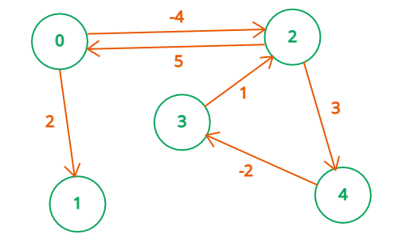
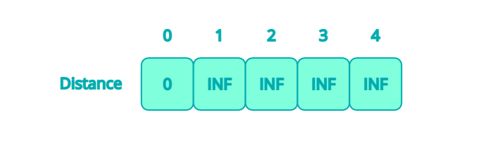
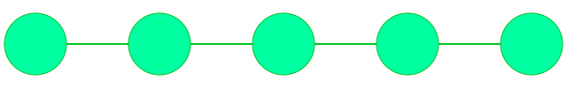
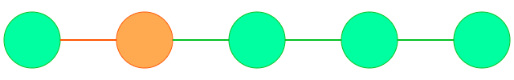
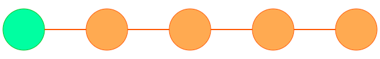
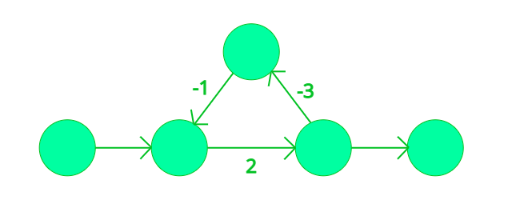

## \[ 벨만 포드(Bellman Ford) \]  
  
벨만 포드(Bellman Ford) 알고리즘은 그래프의 한 노드에서 다른 모든 노드까지의 최단 경로를 구할 수 있는 알고리즘이다. 최단 경로 알고리즘 중 하나인 다익스트라 알고리즘([https://goo-gy.github.io/2019-10-11-dijkstra](https://goo-gy.github.io/2019-10-11-dijkstra))보다 높은 시간 복잡도를 가진다. 대신 다익스트라 알고리즘은 그래프에 음수 cost가 있는 경우에는 사용할 수 없는 반면, Bellman Ford 알고리즘은 음수 cost가 있는 경우에도 사용할 수 있다.  
* **음수 cost 그래프에서 적용 가능**  
* **Negative Cycle 감지 가능**  
* **시간 복잡도 = O(NE)**  
    N(Node의 수), E(Edge의 수)

### 알고리즘  
1. **출발 노드 설정 & 최단 거리 테이블 초기화**  
    
    최단 거리 테이블의 기본값은 무한(INF), 출발 노드는 0으로 초기화   
2. **모든 Edge를 순회하면서 distance[src] + cost < distance[dst] 라면 업데이트**  
3. **2번을 N - 1 번 반복**  

### 증명  
다른 부분을 제외하고 출발지에서 임의의 노드로의 최단 경로만 살펴보자.  
  
최단 경로 순서대로 Edge를 순회한다면, 위 `2번 과정`을 한 번만 수행해도 최단 거리가 갱신된다.  
  
최악의 경우에도 `2번 과정`을 한 번 수행하면 최단 경로에 포함된 두 번째 노드의 최단 거리는 갱신된다.  
  
마찬가지로 `2번 과정`을 한 번 수행할 때마다, 최단 경로에 있는 노드가 차례로 하나씩 최단 거리를 보장하게 된다. 그래프의 노드 수가 N이라면 `2번 과정`을 N - 1번만 수행하면 그래프 내 모든 노드까지의 최단 경로를 갱신할 수 있다.  

### Negative Cycle  
위 증명은 그래프 내에 cost의 합이 음수가 되는 **Negative Cycle**이 없다고 가정했을 경우에 성립한다.  
  
그림처럼 경로 상에 **Negatvie Cycle**이 있다면, 최단 경로를 구하기 위해 **Negative Cycle**을 무한히 순회해야 하기 때문에 최단 경로를 정의하기 어렵다. 굳이 최단 거리를 따지자면 -∞이 될 것이다.  

* 그래프에 Negative Cycle이 존재하는지는 어떻게 알 수 있을까.  
위에서 Negative Cycle이 없을 경우 Edge를 N - 1번 순회하며 출발지에서 모든 노드까지의 최단 거리를 갱신할 수 있었다. 최단 거리가 갱신된 노드는 Distance가 업데이트될 일이 없다. 따라서 **그 이후 `2번 과정`을 더 수행하였을 때, 어떤 노드든 Distance가 업데이트된다면 그래프 내에 Netgative Cycle이 있음**을 알 수 있다.  

## \[ 코드 \]  
``` cpp
bool bellman_ford()
{
    distance_map[1] = 0;
    for(int n = 1; n <= N; n++)
    {
        for(map<pair<int,int>, long long>::iterator e = loads.begin(); e != loads.end(); e++)
        {
            int src = e->first.first;
            int dst = e->first.second;
            long long weight = e->second;
            if(distance_map[src] != INF && distance_map[dst] > distance_map[src] + weight)
            {
                distance_map[dst] = distance_map[src] + weight;
                if(n == N)
                    return true;
            }
        }
    }
    return false;
}
```
N번째에서 순회에서 Distance가 업데이트 될 경우 true(Negative Cycle 있음)를 리턴한다.  
