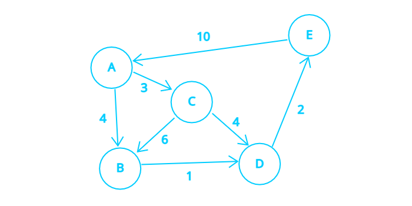

## \[ Floyd Warshall \]  
Floyd Warshall 알고리즘은 **모든 노드에서 모든 노드까지**의 최단 경로를 구할 수 있는 알고리즘이다.  
- 시간 복잡도 = O(N^3)  
- 가중치가 음수인 Edge가 존재할 때도 적용 가능
- 음수 Cycle 감지  

*N(Node의 수)*  


## \[ 알고리즘 \]   
  

- 그래프 연결 정보를 가지고 **distance[src][dst]**를 초기화해준다.  
    **distance[src][dst]**  

    |    |  A  |  B  |  C  |  D  |  E
    :----|:---:|:---:|:---:|:---:|:---:
    **A**|  0  |  4  |  3  | INF | INF 
    **B**| INF |  0  | INF |  1  | INF 
    **C**| INF |  6  |  0  |  4  | INF 
    **D**| INF | INF | INF |  0  |  2  
    **E**|  10 | INF | INF | INF |  0  
- 모든 노드를 순회하여 **거쳐갈 노드(middle)**를 지정한다.  
    - 나머지 모든 노드를 순회하여 **출발 노드(src)**를 지정한다.  
        - 나머지 모든 노드를 순회하여 **도착 노드(dst)**를 지정한다.  
            middle을 거쳐서 가는 경우가 distance[src][dst]보다 작다면 업데이트해 준다.  


### 과정
<details>
<summary>단계별 과정</summary>
<div markdown="1">       

|    |  A  |  B  |  C  |  D  |  E
:----|:---:|:---:|:---:|:---:|:---:
**A**|  0  |  4  |  3  | INF | INF 
**B**| INF |  0  | INF |  1  | INF 
**C**| INF |  6  |  0  |  4  | INF 
**D**| INF | INF | INF |  0  |  2  
**E**|  10 | INF | INF | INF |  0  

#### A를 거쳐가는 경우 업데이트  

|    |  A  |  B  |  C  |  D  |  E
:----|:---:|:---:|:---:|:---:|:---:
**A**|  0  |  4  |  3  | INF | INF 
**B**| INF |  0  | INF |  1  | INF 
**C**| INF |  6  |  0  |  4  | INF 
**D**| INF | INF | INF |  0  |  2  
**E**|  10 |**14**|**13**|INF|  0  

#### B를 거쳐가는 경우 업데이트  

|    |  A  |  B  |  C  |  D  |  E
:----|:---:|:---:|:---:|:---:|:---:
**A**|  0  |  4  |  3  |**5**| INF 
**B**| INF |  0  | INF |  1  | INF 
**C**| INF |  6  |  0  |  4  | INF 
**D**| INF | INF | INF |  0  |  2  
**E**|  10 |  14 |  13 |**15**| 0  

#### C를 거쳐가는 경우 업데이트  

|    |  A  |  B  |  C  |  D  |  E
:----|:---:|:---:|:---:|:---:|:---:
**A**|  0  |  4  |  3  |  5  | INF 
**B**| INF |  0  | INF |  1  | INF 
**C**| INF |  6  |  0  |  4  | INF 
**D**| INF | INF | INF |  0  |  2  
**E**|  10 |  14 |  13 |  15 | 0

#### D를 거쳐가는 경우 업데이트  

|    |  A  |  B  |  C  |  D  |  E
:----|:---:|:---:|:---:|:---:|:---:
**A**|  0  |  4  |  3  |  5  |**7**  
**B**| INF |  0  | INF |  1  |**3**  
**C**| INF |  6  |  0  |  4  |**6** 
**D**| INF | INF | INF |  0  |  2  
**E**|  10 |  14 |  13 |  15 |  0

#### E를 거쳐가는 경우 업데이트  

|    |  A  |  B  |  C  |  D  |  E
:----|:---:|:---:|:---:|:---:|:---:
**A**|  0  |  4  |  3  |  5  |  7    
**B**|**13**|  0  |**16**|  1  |  3  
**C**|**16**|  6  |  0  |  4  |  6 
**D**|**12**|**16**|**15**|  0  |  2  
**E**|  10 |  14 |  13 |  15 |  0

</div>
</details>  

## \[ 코드 \]  
``` python
for middle in range(1, N + 1):
    for src in range(1, N + 1):
        for dst in range(1, N + 1):
            if(src == dst):
                continue
            new_cost = load_map[src][middle] + load_map[middle][dst]
            if(new_cost < load_map[src][dst]):
                load_map[src][dst] = new_cost
```
