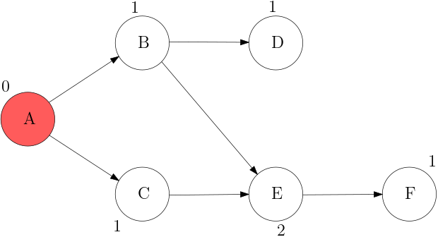
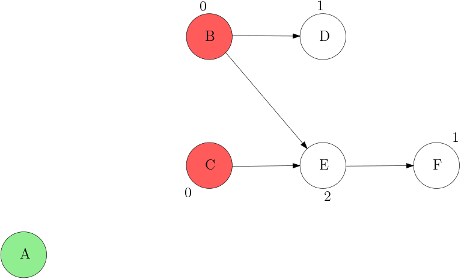
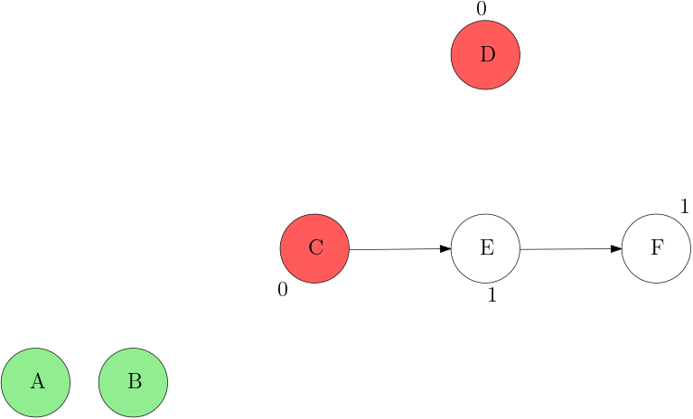
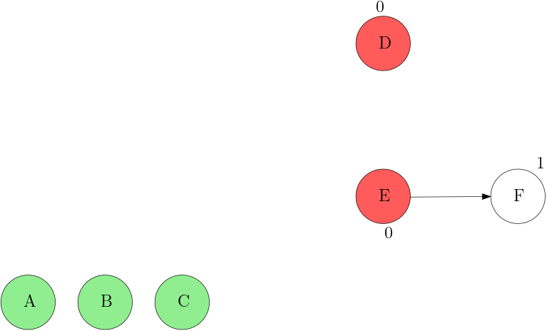
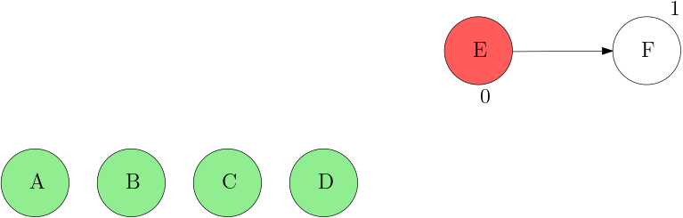
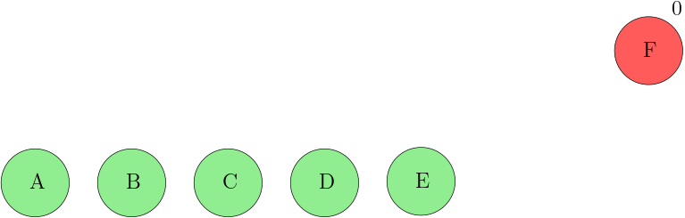
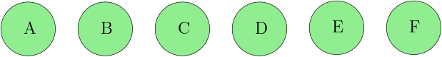

## 위상 정렬 (Topological Sort)  
위상 정렬은 사이클이 없는 방향 그래프 (Directed Acyclic Graphs)에서 순서를 거스르지 않고 모든 노드를 나열하는 알고리즘으로 **선후 관계(전제 조건)**를 지키면서 일의 순서를 결정하는 데 사용할 수 있다. 결과적으로 보았을 때 그냥 정렬 알고리즘처럼 보이지만, **값의 비교가 아닌 두 작업의 관계에서 순서**가 정해지는 경우에 위상 정렬 알고리즘을 사용하여 해결할 수 있다.  
  
 위 그래프의 경우 A와 B의 순서는 비교할 수 있지만, A와 E만을 보았을 때는 두 노드의 순서를 결정할 수 없다. 따라서 일반적인 정렬 알고리즘을 적용할 수 없고 위상 정렬 알고리즘을 사용해야 한다.  

## 알고리즘  
  

위상 정렬 알고리즘의 핵심은 전제 조건이 없는 (진입 차수가 0인) 작업을 먼저 수행하고, 그 일을 수행함으로써 전제 조건이 만족되는 작업들을 순서대로 수행하는 것이다.  


> **'진입 차수'**란 해당 노드를 가리키는 Edge의 개수를 뜻한다. 위 그래프의 경우 A의 진입 차수는 0, E의 진입 차수는 2이다.  

---
### 위상 정렬 단계    
위상 정렬 알고리즘을 간단하게 정리한다면 다음과 같다.  

**1.**	진입 차수가 0인 노드를 모두 Queue에 삽입한다.  

**2.**	Queue에서 노드를 꺼내 방문한다.  
- 연결된 Edge을 모두 제거한다.    
- 이때 진입 차수가 0이 된 노드를 Queue에 삽입한다.  

**3.** 모든 노드를 방문할 때까지 **2**를 반복한다.  

  
---  
  
---  
  
---  
  
---  
  
---  
  
---  
  
---  

눈치채신 분들도 있겠지만, 진입 차수가 0이 되는 노드가 동시에 여러 개 발생한다면 Queue에 무엇을 먼저 넣느냐에 따라서 결과가 달라질 수 있다. 하지만 별다른 조건이 없다면 이들은 모두 정답이 될 수 있다.  

## 예제  
위상 정렬 알고리즘을 적용하여 [\[BAEK-JOON 1766\]](https://www.acmicpc.net/problem/1766)   문제를 풀어보자.  

`먼저 푸는 것이 좋은 문제가 있는 문제는, 먼저 푸는 것이 좋은 문제를 반드시 먼저 풀어야 한다.` 라는 조건은 위상 정렬을 이용하면 된다.
하지만 다른 조건 `가능하면 쉬운 문제부터 풀어야 한다.` 도 만족시키기 위해 Queue 대신 **Priority Queue**를 사용하였다.

``` cpp
#include <iostream>
#include <vector>
#include <queue>
#include <algorithm>

using namespace std;

int N, M;
vector<vector<int>> vv_graph;
vector<int> v_degree;

void solution()
{
    priority_queue<int, vector<int>, greater<int>> pq_node;
    for (int i = 1; i <= N; i++)
    {
        if(v_degree[i] == 0)
            pq_node.push(i);
    }

    while(!pq_node.empty())
    {
        int cur = pq_node.top(); pq_node.pop();
        cout << cur << " ";
        for(int dst : vv_graph[cur])
        {
            v_degree[dst]--;
            if(v_degree[dst] == 0)
                pq_node.push(dst);
        }
    }
    cout << "\n";
}

void input()
{
    cin >> N >> M;
    vv_graph.resize(N + 1);
    v_degree.resize(N + 1);
    for (int i = 1; i <= M; i++)
    {
        int src, dst;
        cin >> src >> dst;
        vv_graph[src].push_back(dst);
        v_degree[dst]++;
    }
}

void pre_setting()
{
    ios_base::sync_with_stdio(false);
    cin.tie(NULL);
}

int main()
{
    pre_setting();
    input();
    solution();
    return 0;
}
```  
