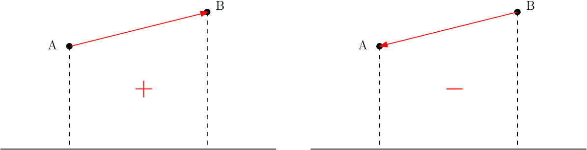

## 부호 면적 (Signed Area)  
  
기하학의 벡터에서는 부호 면적(Signed Area)를 구할 수 있다. 부호 면적은 벡터의 양 끝 점에서 x축에 수선을 내렸을 때 생기는 도형의 면적으로, 부호는 벡터의 기울기로 결정된다. 따라서 면적의 부호가 정해지려면 선분의 방향이 존재해야 한다. 위 그림과 같이 벡터 AB의 기울기가 양수라면 이 벡터의 부호 면적은 양수가 된다. 반대로 오른쪽 그림과 같이 기울기가 음수라면 벡터의 부호 면적도 음수가 된다.  

## 삼각형의 부호 면적
  
벡터의 부호 면적을 이용하여 도형에도 부호 면적을 적용할 수 있다. 삼각형의 부호 면적은 삼각형을 이루는 세 벡터의 부호 면적 합이다. 삼각형의 부호 면적은 삼각형을 이루는 벡터들이 시계 방향이라면 양수, 반시계 방향이라면 음수가 된다.  
---  
### 외적을 이용한 삼각형의 부호 면적  
그럼 삼각형의 부호 면적을 계산해 보자. 앞에서 본 그림과 같이 각 벡터의 (사다리꼴 모양의) 부호 면적을 직접 계산하여 더하는 대신 외적(Cross Product)을 이용하면 삼각형의 부호 면적을 쉽게 구할 수 있다.  
  
두 벡터 AB(xb - xa, yb - ya, 0)와 BC(xc - xb, yc - yb, 0)를 외적한 절댓값은 이 두 벡터를 두 변으로 하는 평행사변형의 면적과 같다. 따라서 이를 반으로 나눈 값이 이 두 벡터를 두 변으로 하는 삼각형의 면적이 된다. 부호 면적의 부호는 외적 벡터의 방향으로 알 수 있는데, 외적의 방향은 **오른손의 법칙**을 이용하여 구할 수 있다. 오른손 법칙에 따르면 삼각형을 그리는 방향이 반시계 방향이라면, 부호 면적이 양수가 되고, 시계 방향이라면 부호 면적은 음수가 된다. 확인을 해보고 싶다면 앞에서 다룬 [#삼각형의 부호 면적](#삼각형의-부호-면적)과 비교해 보자.  
<!-- [그림-오른손 법칙]   -->
<!-- 여기서는 삼각형 모형을 그대로 유지한 외적이라 헷갈릴 수 있는데, 헷갈리시는 분은 아래 그림과 같이 벡터 AB를 평행이동하여 외적해보면 익숙할 것이다.   -->
---  

### 계산식  
삼각형 ABC의 부호 면적을 두 벡터 AB, BC의 외적으로 계산하면 다음과 같다. 
  
이때 계산한 부호 면적이 양수라면 삼각형이 시계방향을 이루고, 음수라면 반시계 방향을 이루고 있는 것이다.  

---  

### Signed Area 장점  
- 적은 연산량  
- Float 연산의 최소화  

삼각형의 면적을 구할 때 벡터의 외적을 이용한 Signed Area 계산은 헤론의 공식보다 연산량이 적다. 그리고 Signed Area를 이용하면 삼각형의 면적 비교나 점들의 회전 방향 등을 Float를 사용하지 않고 정수 연산만으로도 답을 얻을 수 있다.  

## 예제  
부호 면적을 이용하여 [\[BAEK-JOON 11758\]](https://www.acmicpc.net/problem/11758) 문제를 풀어보자. 11758는 세 점 P1, P2, P3가 순서대로 주어질 때 이 점을 이은 선들이 시계 방향을 이루는지 반시계 방향을 이루는지 알아내는 문제이다. 이는 세 점 P1, P2, P3가 이루는 삼각형의 부호 면적을 계산하여 방향을 알아낼 수 있다.  
``` cpp
#include <iostream>
#include <vector>

using namespace std;

struct Point
{
    int x, y;
};

vector<Point> v_point;

void solution()
{
    int signedArea = 0;
    for (int i = 0; i < 3; i++)
    {
        signedArea += (v_point[i].x * v_point[i + 1].y);
        signedArea -= (v_point[i].y * v_point[i + 1].x);
    }
    if (signedArea > 0)
        cout << "1" << endl;
    else if (signedArea < 0)
        cout << "-1" << endl;
    else
        cout << "0" << endl;
}

void pre_setting()
{
    ios_base::sync_with_stdio(false);
    cin.tie(NULL);
}

void input()
{
    for (int i = 1; i <= 3; i++)
    {
        int x, y;
        cin >> x >> y;
        v_point.push_back({x, y});
    }
    v_point.push_back(v_point[0]);
}

int main()
{
    pre_setting();
    input();
    solution();
    return 0;
}
```
