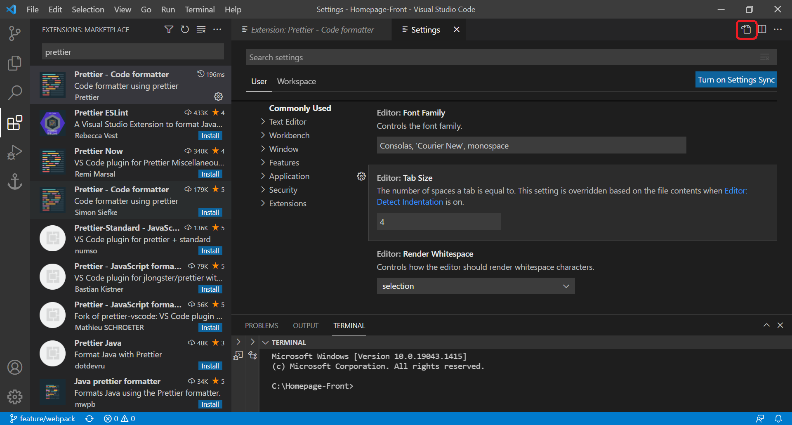

팀원들과 함께 프로젝트를 진행하다 보면 다른 사람이 작성한 코드를 볼 일이 굉장히 많다. 그때 팀원들과 코드 스타일이나 정렬 방법 등이 많이 다르다면 코드를 이해하기 어려울 것이다. 그래서 오늘은 Code formatter인 Prettier와, 프로젝트에서 정렬 방식을 통일하는 방법을 소개하려고 한다.  

## Prettier  
 Prettier는 VScode에서 확장 프로그램으로 제공하는 Code formatter이다. Prettier는 말 그대로 우리가 작성한 코드를 일관된 방식으로 보기 좋게 정렬해 준다.  

### VScode Prettier 사용하기
  

VScode 확장 프로그램에서 Prettier를 검색하여 Prettier - Code formatter를 설치한다.  

  

Prettier를 설치했으면 `ctrl + ,`를 눌러 Settings으로 가자. Settings에서 Prettier를 검색하면 Prettier에 대한 설정을 조작할 수 있다. 하지만 이렇게 보는 것보다 `settings.json`을 직접 수정하는 게 편하다면 오른쪽 위에 표시한 아이콘을 클릭해 json 파일로 넘어가자.  

  

setting.json에서 코드 정렬에 관한 부분은 editor와 방금 전에 우리가 설치한 prettier이다.  

- **editor.defaultFormatter**  
    기본 Code formatter로 사용할 것인지 설정한다.  
- **editor.formatOnSave**  
    true로 설정하면 파일이 저장될 때 자동으로 정렬한다.  

[#Prettier 문법](#prettier-문법)에는 자주 사용하는 Prettier 설정을 몇 가지 정리해 두었다. VScode의 setting.json 에서는 `"prettier.tabWidth": 4` 와 같이 앞에 "prettier."를 붙여주면 된다.    

---  

### 정렬하기  
VScode에서 기본적인 정렬 단축키는 (Window 기준으로) `Alt + Shift + f`이다. `"editor.defaultFormatter": "esbenp.prettier-vscode"`로 설정해 두었다면 Prettier 설정에 따라서 정렬된다. 매번 단축키를 입력하는 것이 귀찮다면 `"editor.formatOnSave": true`로 설정하자.  

---  

### 팀원들과 정렬 방식이 다르다면  
  

Prettier를 통해서 코드를 보기 좋게 정렬했지만, 나와 팀원의 Prettier 설정이 다르다면 코드를 읽는 것이 익숙하지 않을 것이다. 무엇보다도 그냥 정렬을 했을 뿐인데, github에서 많은 부분이 수정되어 Commit 내용을 알아보기 힘든 불상사가 생길 수 있다.  

## Prettier Node module 사용하기  

위와 같은 문제를 해결하기 위해서 우리는 프로젝트에 Prettier 설정을 저장해둘 수 있다.  

``` shell
npm install --save-dev --save-exact prettier  
```  

프로젝트에서 Prettier 모듈을 관리하도록 Local에 Prettier를 설치한다.  

---  

### Configuration file  
Prettier 공식 페이지 [https://prettier.io/docs/en/configuration.html](https://prettier.io/docs/en/configuration.html) 에서 Configuration을 적용하는 방법을 알려주고 있다. 여러 가지 방법이 소개되어 있지만, 프로젝트 폴더에 `.prettierrc` 파일을 생성하여 Prettier 설정을 적용해보자.   

- **.prettierrc**  

``` json
{
    "tabWidth": 2,
    "printWidth": 80,
    "singleQuote": true,
    "arrowParens": "always",
    "trailingComma": "es5",
    "semi": true
}
```
Prettier configuration의 우선순위는 앞에서 살펴본 `setting.json (VScode)` 보다 프로젝트 내의 `.prettierrc`가 더 높기 때문에 팀원들과 통일된 정렬 방법을 사용할 수 있다.  

## Prettier 문법  

- **prettier.arrowParens**  
    javascript의 화살표 함수(arrow function)에서 단일 파라미터에 괄호(parenthesis)를 붙일지 설정한다.  
    "always"로 설정하면 괄호를 붙이고 "avoid"로 설정하면 붙이지 않는다.  
- **prettier.tabWidth**  
    tab의 크기를 설정한다. 
- **prettier.printWidth**  
    한 line에 표시할 코드의 길이를 설정한다.  
- **prettier.semi**  
    true로 설정하면 statement 끝에 세미콜론을 붙인다.  
- **prettier.singleQuote**  
    true로 설정하면 문자열에 single quote를 사용하고,  
    false로 설정하면 문자열에 double quote를 사용한다.  


자세한 Option은 Prettier 공식 페이지 [https://prettier.io/docs/en/options.html](https://prettier.io/docs/en/options.html) 를 참고하자.  