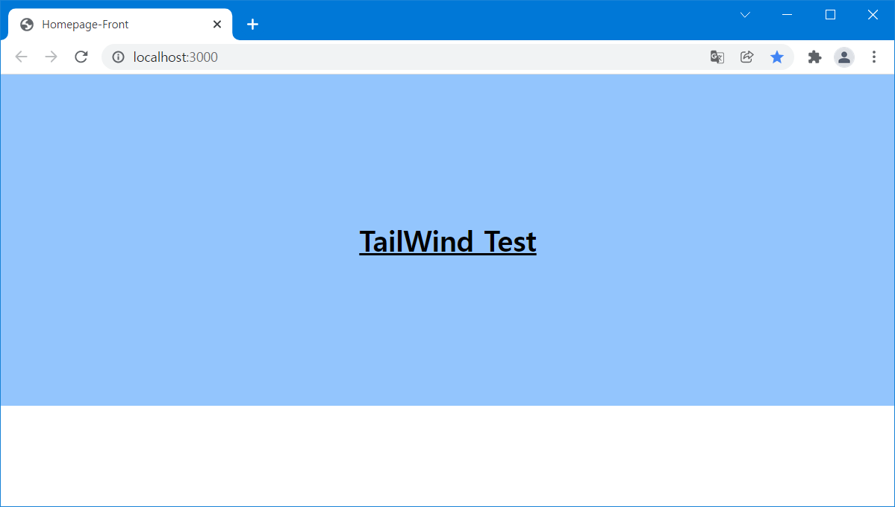

이전 프로젝트에서는 기능적인 부분은 쉽게 만들 수 있는  Material-UI와, 불편한 style 방식을 해결하기 위해 styled-components와 함께 사용했다. 하지만 styled-components의 (또는 class)의 Naming과 작은 style 때문에 Component가 너무 많아지는 것이 불편했다. 그래서 다른 디자인 라이브러리를 찾아보던 중 아주 맘에 드는 TailWind를 발견하여 이번 프로젝트에 적용해 보았다.  

## Tailwind  
[https://tailwindcss.com/](https://tailwindcss.com/)  

---  

### Core Concepts

TailWind의 Core Concept은 다음과 같다.  

- Utility-First Fundamentals  
- Handling Hover, Focus, and Other States  
- Responsive Design
- Dark Mode  
- Reusing Styles  
- Custom Styles  

---  

### 장점  
- Class Naming 불필요  
- Javascript 분리    
- 커스터마이징  

먼저 utility class를 사용하기 때문에 class 명을 고민하지 않아도 된다. 그리고 BootStrap의 경우 javascript를 사용해서 스타일 ㄴ하는 경우가 많은데, Tailwind는 css로만 구현한다는 점도 아주 마음에 들었다. 그리고 [https://tailwindui.com/](https://tailwindui.com/) 에서 Tailwind로 작성된 다양한 Component를 제공해 주면서도 쉽게 커스터마이징 할 수 있다는 것이 매력적이었다.  

---  

### 단점  

- 러닝 커브  
- html (jsx) 코드 길이  

Low 레벨의 스타일링을 할 수 있는 만큼 utility class를 사용하기 위해 공부해야 한다. 하지만 문법도 간단해서 css를 잘 이해하고 있다면 금방 익숙해질 것 같다. 또 다른 단점이라면 html (jsx)의 코드가 길어진다는 점이 있다. 

## Tailwind 시작하기

### Tailwind 설치

[Installation: Tailwind CSS with Create React App - Tailwind CSS](https://tailwindcss.com/docs/guides/create-react-app)

```bash
npm install -D tailwindcss postcss autoprefixer
```

- tailwindcss
- postcss
- autoprefixer

Tailwind와, 함께 필요한 dependency를 모두 설치해 주자.

---  

### Template 설정

```bash
npx tailwindcss init -p
```

실행하면 `tailwind.config.js`와 `postcss.config.js`가 생성된다.

- **tailwind.config.js**  

```jsx
module.exports = {
  content: ["./src/**/*.{html,js,jsx,ts,tsx}"],
  theme: {
    extend: {},
  },
  plugins: [],
};
```

src 디렉터리의 모든 Html 또는 React Component에서 Tailwind css를 사용할 수 있도록 설정한다.

---  

### 코드 작성  

- **tailwind.css**  

```css
@tailwind base;
@tailwind components;
@tailwind utilities;
```  

Tailwind 문법을 import 하도록 css에 작성한다.
  

- **index.js**  

```jsx
import React from 'react';
import ReactDOM from 'react-dom';
import App from './App';
import './tailwind.css';

ReactDOM.render(<App />, document.getElementById('root'));
```

React의 시작 Entry인 `index.js`에서 `tailwind.css`를 import 한다.

---  

- webpack-loader Error

```jsx
Compiled with problems:X

ERROR in ./src/tailwind.css 1:0

Module parse failed: Unexpected character '@' (1:0)
You may need an appropriate loader to handle this file type, currently no loaders are configured to process this file. See https://webpack.js.org/concepts#loaders
> @tailwind base;
| @tailwind components;
| @tailwind utilities;
```

프로젝트를 Create-React-App으로 생성했다면 문제 없겠지만, Webpack에서 필요한 loader가 설정되어 있지 않다면 위와 같은 에러를 볼 수 있다. [Webpack loader 설정](#webpack-loader-설정) 으로 가서 loader를 설정하자

## Tailwind 문법 사용

Tailwind 설정을 마쳤다면 다음과 같이 Tailwind css 문법을 사용할 수 있다.  

- **App.js**  

```jsx
import React from 'react';

const App = () => {
  return (
    <div className="bg-blue-300 p-40">
      <h1 className="text-3xl font-bold underline text-center">
        TailWind Test
      </h1>
    </div>
  );
};

export default App;
```

  

자세한 Tailwind css 문법은 [Tailwind 페이지](https://tailwindcss.com/docs/aspect-ratio)의 document를 참고하자.  

---  

### **Tailwind CSS IntelliSense**

처음부터 Tailwind css에 익숙하진 않을 것이다.

  

vscode 확장 프로그램 **Tailwind CSS IntelliSense**를 사용하면 자동완성 기능으로 좀 더 편리하게 스타일 할 수 있다.

## Webpack loader 설정

Webpack을 직접 구성한다면 TailWind를 사용하기 위해 style-loader, css-loader, postcss-loader가 필요하다.  

- loader 설치

```bash
npm install --save-dev style-loader css-loader postcss-loader
```

- webpack.config.js ( loader 설정 )

```bash
module: {
    rules: [
		...
      {
        test: /.css?$/,
        exclude: [],
        use: ["style-loader", "css-loader", "postcss-loader"],
      },
		...
    ],
},
```

module의 rules에 위와 같이 style-loader, css-loader, postcss-loader를 사용하도록 추가해 준다.  
