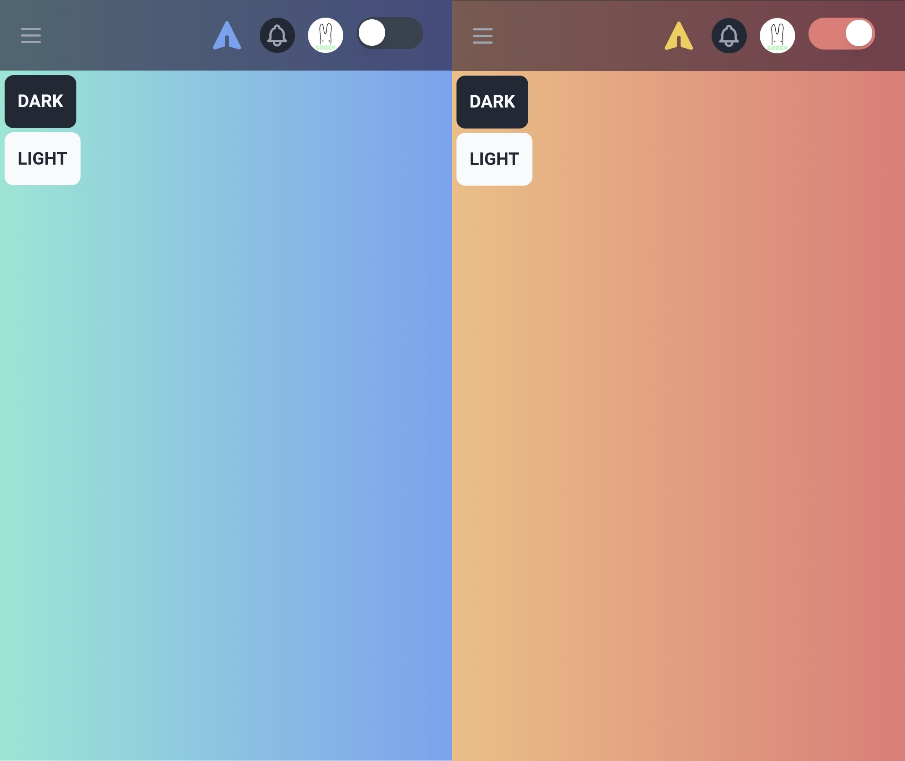
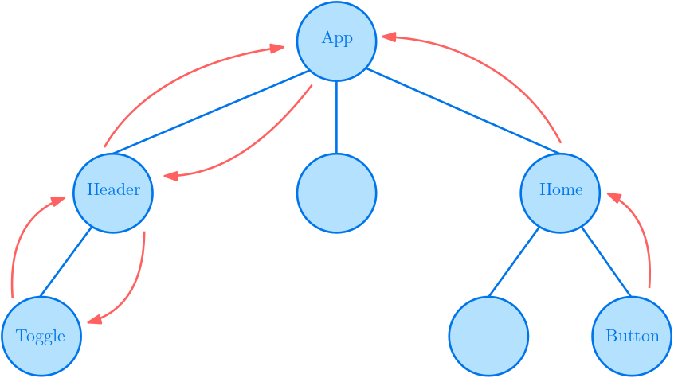

## Redux

### 왜 Redux를 사용하는가?

- props 지옥 해결
- global state를 사용하기 편리함
- global state의 버그를 찾기 쉬움  
  redux 파일에서만 state를 업데이트하기 때문에

---

### 예제 [Dark Mode]



우리는 프로젝트에 다크 모드를 적용하려고 한다. App 컴포넌트에서 다크 모드 설정에 대한 값을 읽을 수 있어야 하며, 이 다크 모드는 DarkModeToggle 컴포넌트에서와 Home 컴포넌트의 버튼을 통해서 제어할 수 있어야 한다.



컴포넌트 구조상 Home에서 수정된 다크 모드 state는 최상위 컴포넌트로 전달되었다가, 다시 Header 컴포넌트를 거쳐 Toggle 컴포넌트로 전달되어야 한다. 이런 복잡한 props 전달 구조를 해결하기 위해 Redux는 state를 전역 변수처럼 관리할 수 있도록 해준다.

---

### Redux 이해하기


출처: [https://redux.js.org/tutorials/fundamentals/part-1-overview#data-flow](https://redux.js.org/tutorials/fundamentals/part-1-overview#data-flow)

redux는 state를 저장하는 **store**와 state를 업데이트할 수 있는 **reducer**로 이루어져 있고 **dispatch**를 통해 **action**을 reducer에 전달한다.

- **store**  
  state를 저장한다.
- **reducer**  
  state의 형태와 state를 업데이트하는 로직을 담고 있다. (전달받은 action에 따라서 처리한다.)
- **action**  
  state를 처리할 방식(type)과 필요한 parameter를 담고 있다.
- **dispatch**  
  action을 reducer에 전달하는 역할을 한다.

## Redux 시작하기

React에서 Redux를 사용하는 방법에는 다양한 형태가 있고, Redux toolkit을 사용하는 것을 권장하지만, Redux를 더 잘 이해하기 위해서 가장 기본적인 형태부터 하나씩 알아보자.

---

### 설치

```shell
npm install redux react-redux
```

redux를 설치했으면 **store.js**를 생성해서 redux 코드를 작성해 보자. (이름은 상관없지만 일반적으로 이렇게 사용하는 것 같다. store 외에도 reducer, action 등을 담고 있기 때문에 redux.js가 적절할 것 같지만, 모듈 이름과 겹치기 때문에 일반적으로 store.js로 사용하는 것 같다.)

---

### reducer

먼저 reducer를 생성하자. reducer는 그냥 state와 action을 받아서 처리하는 함수이다.

```js
const actionTypes = {
  darkMode: {
    toggle: "darkMode/toggle",
    set: "darkMode/set",
  },
};

const initialState = {
  darkMode: false,
};
const reducer = (state = initialState, action) => {
  switch (action.type) {
    case actionTypes.darkMode.toggle:
      return { ...state, darkMode: !state.darkMode };
    case actionTypes.darkMode.set:
      return { ...state, darkMode: action.value };
  }
  return state;
};
```

- **actions**  
  reducer에서 사용할 action type을 지정해 둔다. reducer 내부에서 string으로 처리할 수도 있지만 오타로 인한 버그가 발생할 수 있기 때문에 이렇게 미리 정의해두는 것을 권장한다.
- **initial state**  
  초깃값으로 사용할 state를 지정해 주어야 한다.
- **reducer 함수**  
  action의 type에 따라서 업데이트한 state를 return 하면 된다.
  이때 parameter로 입력받은 state를 수정(mutate) 하면 안 된다.
  반드시 state를 복사해서 업데이트한 새로운 state를 return 해주어야 한다.

`redux의 모든 state는 이 reducer 내에서만 업데이트하도록 약속한다. (이 덕분에 state 관리에서 버그가 발생하면 어디서 발생했는지 쉽게 찾을 수 있다.)`

---

### store

reducer를 작성했으니 이제 state를 저장하는 store를 만들어보자.

```js
import { createStore } from "redux";

...

const store = createStore(reducer);
```

store는 특별한 처리를 해줄 것은 없고 createStore의 인자로 앞에서 만든 reducer를 연결해 주면 된다.

---

### state 조회/업데이트

그러면 이제 어떤 state를 저장할지, 어떻게 처리할지는 모두 작성해 주었다. 그러면 어떻게 저장된 state를 읽고 업데이트 요청을 하는지 알아보자.

```js
console.log(store.getState());
```

store에서 getState를 호출하여 state를 조회할 수 있다.

```js
store.dispatch({ type: actionTypes.darkMode.toggle });
```

위와 같이 store에서 dispatch를 호출해서 reducer에 action을 보낼 수 있다.

## React Redux

우리는 store에서 직접 getState(), dispatch()를 호출하는 대신 react redux 모듈을 사용할 것이다.

---

### actions

- **store.js**

```js
import { createStore } from "redux";

const actionTypes = {
  darkMode: {
    toggle: "darkMode/toggle",
    set: "darkMode/set",
  },
};

const initialState = {
  darkMode: false,
};
const reducer = (state = initialState, action) => {
  switch (action.type) {
    case actionTypes.darkMode.toggle:
      return { ...state, darkMode: !state.darkMode };
    case actionTypes.darkMode.set:
      return { ...state, darkMode: action.value };
  }
  return state;
};

const store = createStore(reducer);

const actions = {
  darkMode: {
    toggle: () => ({
      type: actionTypes.darkMode.toggle,
    }),
    set: (value) => ({
      type: actionTypes.darkMode.set,
      value: value,
    }),
  },
};

export { actions };
export default store;
```

앞에서 작성한 redux 코드에 외부에서 함수 호출만으로 쉽게 action을 생성할 수 있도록 actions를 만들어 export 해주었다. 이로써 redux를 처리하는 코드는 모두 store.js 에서 관리한다.

---

### Provider

- **index.js**

```js
...
import { Provider } from 'react-redux';
import store from './store';

ReactDOM.render(
  <Provider store={store}>
    <BrowserRouter>
      <App />
    </BrowserRouter>
  </Provider>,
  document.getElementById('root')
);
```

우선 모든 컴포넌트에서 redux를 사용할 수 있도록 최상위 컴포넌트를 Provider로 감싸고 store를 연결한다.

---

### connect(mapStateToProps, mapDispatchToProps)

- **DarkModeToggle.jsx**

```js
...
import { connect } from "react-redux";

// local
import { actions } from "store";

const DarkModeToggle = (props) => {
  const darkMode = props.darkMode;

  const handleToggle = () => {
    props.darkModeToggle();
  };

  ...
};

const mapStateToProps = (state, ownProps) => {
  return { darkMode: state.darkMode };
};
const mapDispatchToProps = (dispatch, ownProps) => {
  return {
    darkModeToggle: () => dispatch(actions.darkMode.toggle()),
  };
};
export default connect(mapStateToProps, mapDispatchToProps)(DarkModeToggle);
```

redux를 사용하려는 컴포넌트를 connect로 연결하자. 이때 mapStateToProps, mapDispatchToProps를 연결해 주는데 두 함수에 대해서 알아보자.

- **첫 번째 parameter**  
  mapStateToProps의 첫 번째 parameter는 store에 저장된 **state**, mapDispatchToProps의 첫 번째 parameter는 store의 **dispatch** 메서드이다.
- **두 번째 parameter**  
  부모 컴포넌트에서 넘겨준 props이다.
- **return 값**  
  mapStateToProps와 mapDispatchToProps의 return 값은 모두 컴포넌트의 props로 들어간다.

redux를 사용할 컴포넌트에 모든 state와 dispatcher를 줄 수 있지만, 필요한 것만 넘겨주도록 하자.

`actions를 import 하는 대신 react-redux에서 정의된 dispatcher를 전달해 준다면, 컴포넌트에서의 작성할 부분이 줄어들고 더 많은 부분을 store.js에서 처리할 수 있었을 텐데 아쉬웠다.`

---

### 업데이트만 필요한 컴포넌트

```js
import React from "react";
import { connect } from "react-redux";

// local
import { actions } from "store.js";

const Home = (props) => {
  const handleDark = () => {
    props.darkModeSet(true);
  };

  const handleLight = () => {
    props.darkModeSet(false);
  };

  ...
};

const mapDispatchToProps = (dispatch, ownProps) => {
  return {
    darkModeSet: (value) => dispatch(actions.darkMode.set(value)),
  };
};
export default connect(null, mapDispatchToProps)(Home);
```

Home 컴포넌트에서는 다크 모드를 수정하기만 하면 되므로 mapStateToProps 자리는 null을 넣어주었다.

## Redux toolkit

지금까지 React Redux를 사용해 봤는데, 설정해 줄 것들이 많아 코드도 길다. Redux toolkit은 이 redux를 보다 간결한 코드로 작성할 수 있도록 해준다.

---

### 설치

```shell
npm install @reduxjs/toolkit
```

---

### createAction

```js
import { createAction } from "@reduxjs/toolkit";

const action = createAction("darkMode/set");
console.log(action.type);
console.log(action);
console.log(action("value"));
```

지금까지는 action type과 action 객체를 생성해 주는 함수를 직접 따로 제작해 주었다. 하지만 redux toolkit의 createAction은 action type이 담겨있는 함수를 제작해 준다. 생성된 함수의 parameter는 return 값의 payload로 들어간다. 이를 이용해서 앞의 redux 코드를 수정해 보자.

```js
import { createStore } from "redux";
import { createAction } from "@reduxjs/toolkit";

const actions = {
  darkMode: {
    toggle: createAction("darkMode/toggle"),
    set: createAction("darkMode/set"),
  },
};

const initialState = {
  darkMode: false,
};
const reducer = (state = initialState, action) => {
  switch (action.type) {
    case actions.darkMode.toggle.type:
      return { ...state, darkMode: !state.darkMode };
    case actions.darkMode.set.type:
      return { ...state, darkMode: action.payload };
  }
  return state;
};

const store = createStore(reducer);

export { actions };
export default store;
```

action type과 action creator를 동시에 묶어서 생성해 주었다. 우리는 `store.js` 파일만 수정했다. 그리고 action creator 함수는 직접 작성해 주지도 않았는데, 놀랍게도 앞의 코드와 동일하게 동작한다.

---

### createReducer

```js
import { createStore } from "redux";
import { createAction, createReducer } from "@reduxjs/toolkit";

const actions = {
  darkMode: {
    toggle: createAction("darkMode/toggle"),
    set: createAction("darkMode/set"),
  },
};

const initialState = {
  darkMode: false,
};
const reducer = createReducer(initialState, {
  [actions.darkMode.toggle]: (state, action) => ({
    ...state,
    darkMode: !state.darkMode,
  }),
  [actions.darkMode.set.type]: (state, action) => ({
    ...state,
    darkMode: action.payload,
  }),
});

const store = createStore(reducer);

export { actions };
export default store;
```

createReducer는 코드를 엄청 줄여주지는 않지만, swtich를 사용하지 않고 각 action에 따라서 함수를 분리하여 생성하여 코드를 깔끔하게 작성할 수 있다.

---

### createSlice

```js
import { createStore } from "redux";
import { createSlice } from "@reduxjs/toolkit";

const darkMode = createSlice({
  name: "darkMode",
  initialState: {
    darkMode: false,
  },
  reducers: {
    toggle: (state, action) => ({
      ...state,
      darkMode: !state.darkMode,
    }),
    set: (state, action) => ({
      ...state,
      darkMode: action.payload,
    }),
  },
});

const store = createStore(darkMode.reducer);

export const actions = darkMode.actions;
export default store;
```

createSlice를 사용하면 action과 reducer를 모두 한 번에 생성할 수 있다. action type과 action 함수는 직접 지정해 주지 않아도 reducers를 통해서 알아서 생성해 준다.

---

### 선택

createSlice는 redux 코드를 정말 많이 줄여준다. 하지만, createAction과 createReducer를 함께 사용하는 것이 좀 더 직관적이라고 생각한다. 그리고 createSlice를 이용하면 state 마다 분리하여 작성해야 해서 불편하다고 느꼈다. 물론 좀 더 공부해 보고 하나의 reducer/store로 모든 state를 관리하는 게 성능적으로 비효율적이라면 createSlice를 사용할 것 같다.
