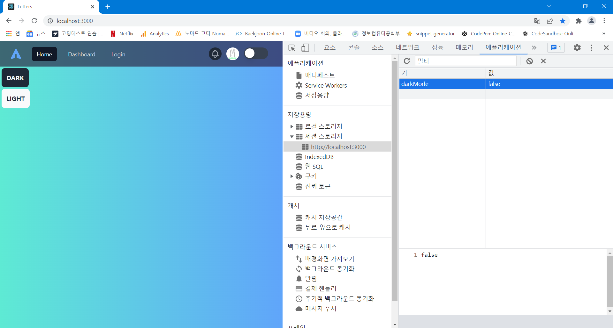

## 들어가기 전에

노마드코더 강의를 보면서 Redux 기초부터 toolkit을 사용하는 방법까지 공부해 봤다. 하지만 프로젝트를 진행하기 위해서는 좀 더 체계적인 redux 관리가 필요하다고 생각했다. 그래서 redux-persist를 적용하기 전에 redux 코드를 깔끔하게 정리해 두고 들어가려고 한다.

## redux 구조 정리

이전에는 **action, reducer, store**를 모두 `store.js` 한 파일에 작성하였다. ([https://goo-gy.github.io/2022-01-26-react-redux](https://goo-gy.github.io/2022-01-26-react-redux)). 하지만 redux state가 많아지고 코드가 방대해진다면 관리하기 어렵겠다는 생각이 들었다. 그래서 redux 구조를 다음과 같이 작성하여 action, reducer, store를 분리하였다.

<details style="font-weight:700">
	<summary>redux</summary>
		<ul>
				<details>
					<summary>
						action
					</summary>
					<ul>
						<div>darkMode.js</div>
						<div>user.js</div>
					</ul>
				</details>
								<details>
					<summary>
						reducer
					</summary>
					<ul>
						<div>darkMode.js</div>
						<div>user.js</div>
					</ul>
				</details>
				<div markdown="1">store.js</div>
		</ul>
	</summary>
</details>

action은 외부 파일에서 import 하여 사용하기 때문에, reducer 파일에 같이 작성하는 대신 분리해 주었다. 그리고 하나의 reducer로 모든 state를 관리하는 대신, state 종류마다 분리된 reducer를 작성하여 `redux/reducer/root.js`에서 이들을 combine 해주었다.

---

### action

- **redux/action/darkMode.js**

```js
import { createAction } from "@reduxjs/toolkit";

const actionDarkMode = {
  toggle: createAction("toggle"),
  set: createAction("set"),
};
export default actionDarkMode;
```

---

### reducer

- **redux/reducer/darkMode.js**

```js
import { createReducer } from "@reduxjs/toolkit";
// local
import actionDarkMode from "redux/action/darkMode";

const initialState = false;

const reducerDarkMode = createReducer(initialState, {
  [actionDarkMode.toggle]: (state, action) => !state,
  [actionDarkMode.set]: (state, action) => action.payload,
});

export default reducerDarkMode;
```

- **redux/reducer/root.js**

```js
import { combineReducers } from "redux";
// local
import reducerDarkMode from "./darkMode";
import reducerUser from "./user";

const rootReducer = combineReducers({
  darkMode: reducerDarkMode,
  user: reducerUser,
});

export default rootReducer;
```

---

### store

```js
import { createStore } from "redux";
import { persistStore } from "redux-persist";
// local
import rootReducer from "redux/reducer/root.js";

const store = createStore(rootReducer);
persistStore(store);

export default store;
```

자 이렇게 action, reducer, store을 분리해 보았는데, 정리하자면 다음과 같다.

- **여러 종류의 reducer를 분리**  
  여러 reducer를 다른 파일에 분리하여 작성하면서 한 reducer가 너무 길어지는 것을 방지하고 로직을 변경할 때 충돌이 줄어들었다.
- **action, reducer, store 분리**  
  action, reducer, store를 분리된 파일에 저장하여 코드의 역할이 명확해졌다. action이 필요할 때 reducer나 store가 아닌 action 파일만 import 하면 된다.

## Web storage 사용하기

redux는 기본적으로 새로고침이나 페이지 이동 시에 state가 유지되지 않는다. 하지만 일반적으로 redux state는 여러 컴포넌트에서 사용되기 때문에 저장된 state를 유지할 필요가 있다. 이때 우리는 Data를 크롬 등의 브라우저에 저장해 두고 저장된 값을 읽어 사용하는 Web storage를 사용할 수 있다. Web storage에는 Data가 항상 유지되는 **local storage**와 session이 종료되면 사라지는 **session storage**가 있다.

---

### local storage (vanila-js)

- 저장

```js
window.localStorage.setItem("darkMode", !darkMode);
darkModeToggle();
```

- 조회

```js
const savedDarkMode = window.localStorage.getItem("darkMode") === "true";
if (savedDarkMode) darkModeSet(savedDarkMode);
```

---

### session storage (vanila-js)

- 저장

```js
window.sessionStorage.setItem("darkMode", !darkMode);
darkModeToggle();
```

- 조회

```js
const savedDarkMode = window.sessionStorage.getItem("darkMode") === "true";
if (savedDarkMode) darkModeSet(savedDarkMode);
```

위처럼 redux state를 업데이트할 때마다, web storage에 저장해 주고, redux state를 가져오기 전에 web storage를 참조할 수 있다.



## redux persist

위와 같이 vanila-js의 방식을 사용하여 Web storage에 값을 저장하고 읽을 수 있다. 하지만, 이렇게 업데이트나 조회할 때마다 Web storage를 수정, 참조하는 코드를 작성하는 대신 redux-persist를 이용하면 훨씬 더 간결하고 쉽게 Web storage를 이용할 수 있다.

---

### 설치

```shell
npm install redux-persist
```

---

### redux/reducer/root.js

```js
import { combineReducers } from "redux";
import { persistReducer } from "redux-persist";
import localStorage from "redux-persist/lib/storage";
import sessionStorage from "redux-persist/lib/storage/session";
// local
import reducerDarkMode from "./darkMode";
import reducerUser from "./user";

const persistConfig = {
  key: "root",
  storage: localStorage,
  whitelist: ["user", "darkMode"],
};

const rootReducer = combineReducers({
  darkMode: reducerDarkMode,
  user: reducerUser,
});

const persistedReducer = persistReducer(persistConfig, rootReducer);

export default persistedReducer;
```

먼저 redux-persist를 적용하려면 persist에 관한 설정이 필요하다.

- **key**  
  web storage에 저장될 key를 지정한다.
- **storage**  
  사용할 web storage의 종류로 redux-persist에서 제공하는 local storage 또는 session storage를 사용할 수 있다.
- **whitelist (blacklist)**  
  특정 reducer에만 persist를 적용하고 싶다면, whitelist나 blacklist를 설정하면 된다.

---

### redux/store.js

```js
import { createStore } from "redux";
import { persistStore } from "redux-persist";

// local
import rootReducer from "redux/reducer/root.js";

const store = createStore(rootReducer);
persistStore(store);

export default store;
```

store에 persistStore를 적용해 주면 된다.

## 예제

<iframe src="https://codesandbox.io/embed/blog-redux-persist-0ykpts?fontsize=14&hidenavigation=1&theme=dark"
     style="width:100%; height:500px; border:0; border-radius: 4px; overflow:hidden;"
     title="Blog-redux-persist"
     allow="accelerometer; ambient-light-sensor; camera; encrypted-media; geolocation; gyroscope; hid; microphone; midi; payment; usb; vr; xr-spatial-tracking"
     sandbox="allow-forms allow-modals allow-popups allow-presentation allow-same-origin allow-scripts"
></iframe>

새로고침을 하더라도 Dark mode가 유지되는 것을 볼 수 있다.
