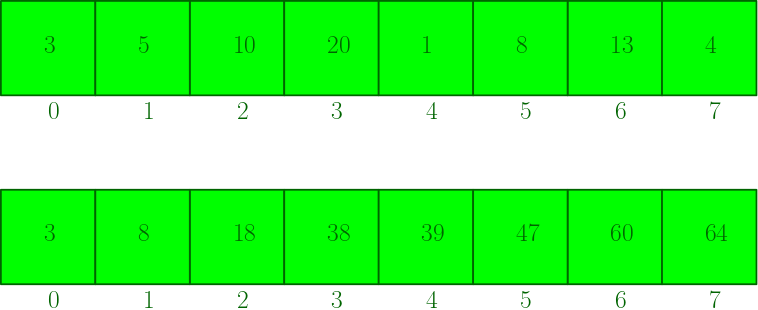
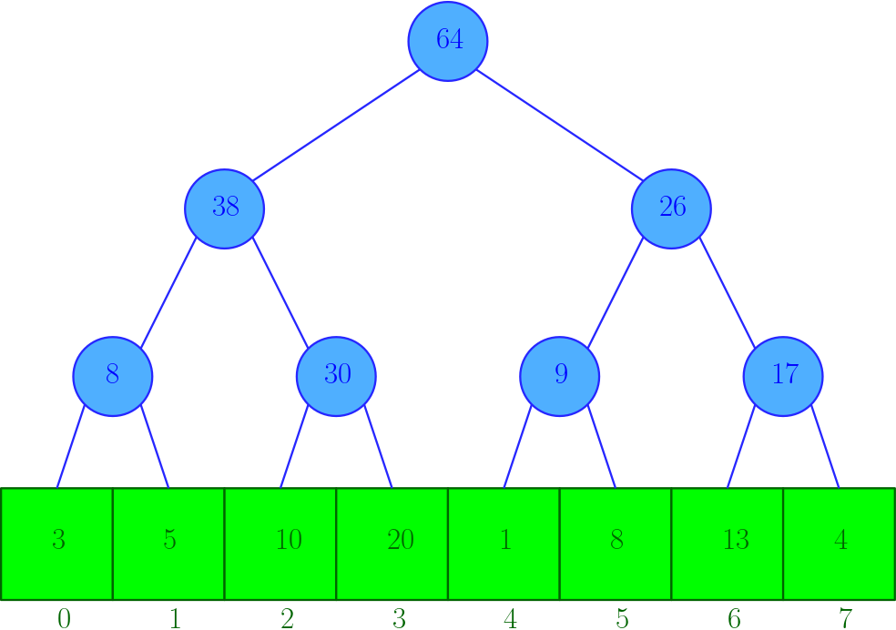
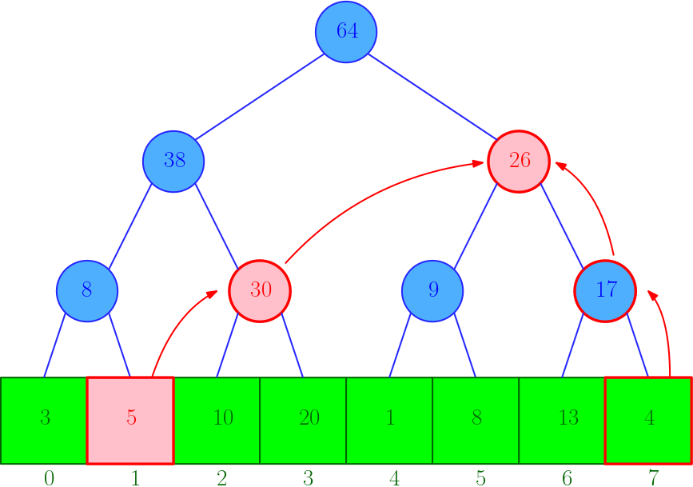

## 구간 합 알고리즘

인덱스 트리가 해결할 수 있는 가장 대표적인 문제는 구간 합 문제이다. 구간 합을 구하는 전형적인 알고리즘은 다음과 같다.

- 구간을 순회하여 더하기
- 처음부터 index까지의 합을 저장하는 서브 배열 만들기
- 인덱스 트리
- 세그먼트 트리

---

### 구간을 순회하여 더하기

이 방법은 가장 단순한 방법으로 시간복잡도는 **O(N)**이다. 하지만 구간 합을 K번 구해야 한다면 시간복잡도는 **O(K\*N)**이 된다.

---

### 합을 저장하는 서브 배열 만들기

이 방법은 구간 합을 여러 번 구해야 할 때 효율적이다.  
  
서브 배열을 만들어 처음부터 K의 합을 sub[K]에 저장한다. 그러면 뺼셈 한 번으로 구간 합을 구할 수 있다. 따라서 **O(1)**로 수행할 수 있고, 구간 합을 K번 구할 때의 시간복잡도는 **O(N + K)**가 된다.

하지만, 배열에 저장된 값이 수시로 업데이트된다면, 업데이트가 일어날 때마다 구간 합을 다시 저장해야 하며 그때마다 **O(N)**의 작업이 필요하다.

## 인덱스 트리(Index Tree)

인덱스 트리는 처음 트리를 구성할 때 **O(N)**의 작업이 필요하다. 그러면 이후에 데이터를 조회할 때도 **O(log N)** 만에 수행할 수 있고, 배열의 데이터가 수정되어도 **O(log N)**만에 트리를 업데이트할 수 있다. 따라서 앞에서처럼 데이터가 자주 업데이트되는 경우에 유용하게 사용할 수 있다. 인덱스 트리는 구간 합이 아닌 구간 Max, Min 등 다양한 목적으로도 사용할 수 있다.

---

### 구현



구간 합을 위한 인덱스 트리는 인접한 두 노드의 합을 부모 노드에 저장하여 트리를 구성한다. 인덱스 트리는 일반적으로 완전 이진 트리를 이용해 구현한다.

---

### 구간 합 구하기



1. **left, right를 구간의 시작 노드, 끝 노드로 설정한다.**
2. **left는 오른쪽 위 노드를, right는 왼쪽 위 노드를 next로 설정한다.**
3. **각각의 next가 부모 노드가 아니라면 현재 노드 value를 sum에 더한다.**
4. **left, right를 각각의 next로 이동한다.**
5. **left >= right일 때까지 2,3,4를 반복한다.**
6. **left == right라면 해당 노드도 sum에 더한다.**

---

### 데이터 업데이트

배열의 데이터가 수정이 일어나면 모든 트리를 수정할 필요 없이 자신과 연결된 조상 노드들만 업데이트해 주면 된다. 따라서 업데이트도 **O(log N)** 만에 수행할 수 있다.

## Code

Index tree를 문제를 풀기 위해 만들어 둔 code snippet을 가져왔다. Index tree를 쓰는 것만으로도 code 규모가 꽤나 크고, 정형화된 변수와 로직이 있기 때문에 class로 제작하였다.

```cpp
#include <vector>

using namespace std;

class IndexTree
{
public:
    int leafLeft;
    int treeSize;
    vector<long long> v_tree;
    IndexTree(int N)
    {
        for (leafLeft = 1; leafLeft < N; leafLeft *= 2)
            ;
        treeSize = leafLeft * 2;
        v_tree.resize(treeSize);
    }

    long long logicFun(long long num1, long long num2)
    {
        // TODO : set logic
        return num1 + num2;
    }

    void updateTree(int index)
    {
        if (index == 0)
            return;
        v_tree[index] = logicFun(v_tree[2 * index], v_tree[2 * index + 1]);
        updateTree(index / 2);
    }

    void update(int order, long long data)
    {
        int index = leafLeft + order - 1;
        v_tree[index] = data;
        updateTree(index / 2);
    }

    long long query(int begin, int end)
    {
        int L = leafLeft + begin - 1;
        int R = leafLeft + end - 1;

        // TODO: set initial
        long long result = 0;
        while (L < R)
        {
            int nextL = (L + 1) / 2;
            int nextR = (R - 1) / 2;

            if (nextL != L / 2)
                result = logicFun(result, v_tree[L]);
            if (nextR != R / 2)
                result = logicFun(result, v_tree[R]);

            L = nextL;
            R = nextR;
        }
        if (L == R)
            result = logicFun(result, v_tree[L]);
        return result;
    }
};
```

---

### 문제풀이

- [백준 2243: 사탕상자](https://www.acmicpc.net/problem/2243)  
  코드: [https://github.com/goo-gy/Algorithm/blob/master/baekjoon/2243_indexTree.cpp](https://github.com/goo-gy/Algorithm/blob/master/baekjoon/2243_indexTree.cpp)
- [백준 2517: 달리기](https://www.acmicpc.net/problem/2517)  
  코드 : [https://github.com/goo-gy/Algorithm/blob/master/baekjoon/2517_indexTree.cpp](https://github.com/goo-gy/Algorithm/blob/master/baekjoon/2517_indexTree.cpp)
