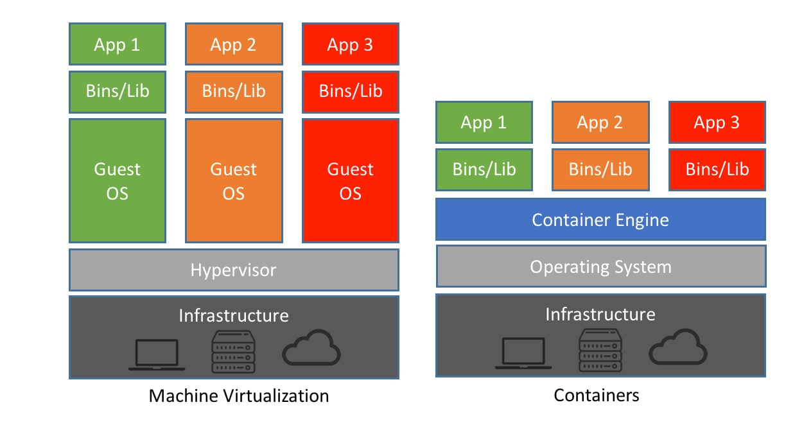
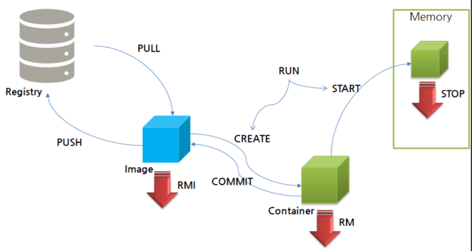

## Docker를 사용하는 이유

개발을 시작할 때 팀원들은 나와 다른 운영체제를 사용하고 있을 수 있다. 하지만 여러 하드웨어에서 개발하더라도 개발이 진행되는 OS나 아키텍처를 통일할 필요가 있다. 기존에는 virtual machine을 통해 가상의 환경을 만들고 작업하였지만, 이 가상환경도 구성하는 데 굉장히 오래 걸리고 부하가 크다는 단점이 있다. 하지만 Docker를 사용하면 쉽고 빠르게, 가벼운 가상환경을 구축할 수 있다.

---

### Virtual Machine vs Container



이미지: https://www.netapp.com/blog/containers-vs-vms/

vmware나 virtual box 등의 Virtual Machine에서는 Hypervisor로 가상의 하드웨어를 생성하고 그 위에 Guest OS를 새로 올린다. 따라서 Hypervisor와 새로운 OS로 인해 굉장히 많은 리소스를 사용하게 된다. 반면 Container 기술은 Container Engine을 이용하여 분리된 Container를 생성하는데 이는 각각의 OS를 새로 올리는 것보다 적은 리소스로 가상화를 수행할 수 있다.

## Docker

Docker는 가장 대표적인 Container 기술로 Linux, MacOs, Windows 등 다양한 운영체제에서 사용 가능하다. 그리고 Docker에서는 애플리케이션의 의존성 및 파일 시스템까지 함께 패키징하여 빌드, 배포가 가능하다.

---

### Docker의 가상화

Docker는 Linux의 각 프로세스에 독립된 File system, Network, User, Host name을 제공하는 name space와 각 프로세스가 소비 가능한 리소스(CPU, Memory, I/O, Network 등)를 제한하는 cgroups 등의 커널 기능을 사용해 가상화한다고 한다. 따라서 윈도우에서 이 기술을 적용하기 위해선 결국 Hypervisor를 사용해야 한다. 때문에 Container가 Virtual machine 보다 가지고 있던 이점을 윈도우에서는 활용하기 어렵다.

---

### Docker Life Cycle



이미지: https://blog.naver.com/isc0304/222337021799

Docker는 배포, 운영할 수 있는 Life Cycle이 존재하는데, 크게 **Registry, Image, Container**로 구분할 수 있다. Registry와 Image는 Github의 (Remote / Local) Repository와 유사하다고 볼 수 있다. Docker Hub라는 Registy에서 Docker Image를 받고 이 Image를 통해서 Container를 생성할 수 있다.

- **pull**  
  registry에서 image를 다운로드
- **push**  
  image를 registry에 올림
- **create**  
  image를 가지고 container를 생성
- **commit**  
  사용하고 있는 container를 Image 화
- **start**  
  container를 실행해서 memory에 올림
- **stop**  
  container를 종료해서 memory에서 내림
- **rm**  
  container 삭제
- **rmi**  
  image 삭제
- **run**  
  pull + create + start를 한 번에 실행

## Docker 시작하기

그럼 이제 Docker Life Cycle을 기억하면서 직접 Mysql Image를 통해 Container를 생성하고 메모리에 올려보자.

---

### 설치

- 윈도우 & MAC  
  [https://www.docker.com/products/docker-desktop](https://www.docker.com/products/docker-desktop)  
  위 링크에서 Docker를 설치한다.

- 리눅스
  ```shell
  apt install docker.io
  ```
  ubuntu의 경우 apt를 통해 설치할 수 있다.

```shell
docker -v
```

설치가 되었다면 위 명령어로 확인해 보자.

---

### image 찾기

```shell
docker search mysql
```

docker search 명령어를 통해서 image를 검색할 수 있다.

또는 [https://hub.docker.com/](https://hub.docker.com/)에 접속하여 찾아보는 방법도 있다.

---

### image pull

```shell
docker pull mysql:8.0
```

registry에 있는 docker image를 local에 다운로드한다.  
: 뒤 숫자는 tag로, 생략할 경우 기본 값으로 latest가 들어간다.

```shell
docker images
```

images 명령어를 통해 local에 다운로드 한 docker image를 확인할 수 있다.

---

### container 생성

```shell
docker create --name mysqlContainer -p 3306:3306 -e MYSQL_ROOT_PASSWORD=qwer1234 mysql
```

docker image를 가지고 container를 생성한다. docker가 어렵게 느껴진다면 다양한 옵션들 때문일 것이다. 하나씩 차근차근 알아보자.

- **--name**  
  생성될 container의 이름을 지정한다.
- **-p**  
  포트포워딩 정보를 입력한다. [out-port]:[in-port]로 적용된다.
- **-e**  
  환경변수를 지정한다. 위 예시의 경우 mysql password를 환경변수를 통해 넘겨주었다.

```shell
docker ps -a
```

컨테이너를 생성했다면 ps 명령어로 컨테이너를 확인할 수 있다. 여기서 -a 옵션을 줘야 실행 중이지 않은 container까지 확인할 수 있다.

---

### container 실행

```shell
docker start mysqlContainer
```

생성된 container를 실행하자.

```shell
docker ps
```

ps 명령어로 실행된 container를 확인해 보자.

---

### container 접속

```shell
docker exec -it mysqlContainer /bin/bash
```

exec 명령어를 이용하면 docker container 내부에서 명령어를 실행할 수 있다. 예제에서는 docker exec를 통해 container 내부에서 /bin/bash 명령어를 수행하였다. 하지만 -it를 옵션을 주지 않으면 bash 쉘이 실행되었다가 종료된다. -it 옵션은 해당 프로그램에서 상호 입출력이 가능하게 한다.

---

### run으로 한 번에 수행하기

```shell
docker run --name [container name] -p 3306:3306 -e MYSQL_ROOT_PASSWORD=[password] -d mysql
```

docker run 명령어를 이용하면 pull, create, run 명령어를 한 번에 실행할 수 있다. 이미 pull 받은 image라면 pull은 생략되지만, container가 중복되더라도 그대로 실행되니 한 번 run으로 만든 container는 start를 이용해서 실행하도록 하자.

- **-d**  
  이 옵션을 주면 backgroud process로 실행할 수 있다.
