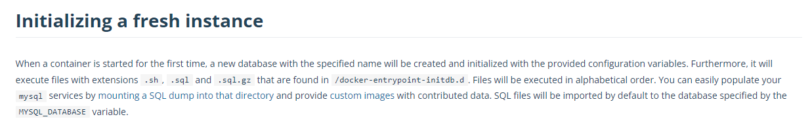
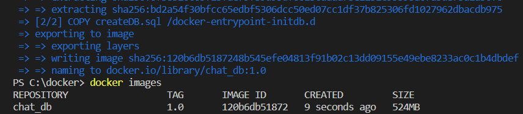
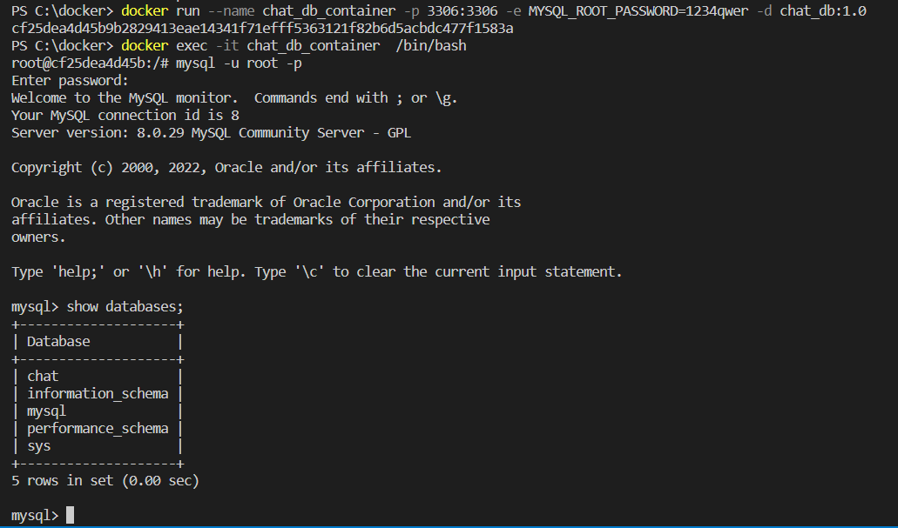

## Database 구축하기

서비스를 개발하려면 Database는 필수적이다. 하지만 Database 구축하고 관리하는 것은 쉽지 않다. 하지만 Docker를 이용하면 간편하게 Database를 구축하고 관리할 수 있다. 오늘은 Docker를 이용해 MySQL container를 올리는 방법과 dockerfile, docker-compose 등을 이용해 여러 추가 작업까지 해주는 방법을 알아볼 것이다. Docker에 대해서 잘 모르는 분은 이전 포스팅 [Docker로 MySQL 컨테이너 만들기](https://goo-gy.github.io/2022-03-11-docker)를 먼저 읽고 오면 어렵지 않게 이해할 수 있을 것이다.  


## MySQL image  

[https://hub.docker.com/_/mysql](https://hub.docker.com/_/mysql)  
먼저 Docker hub의 MySQL image 문서에서 필요한 정보를 얻을 수 있으니 한 번 읽어보자.  

---

### MySQL container 생성  

``` shell
docker run --name [container name] -p 3306:3306 -e MYSQL_ROOT_PASSWORD=[password] -d mysql:8.0
```
가장 간단한 방법으로 위 명령어로 MySQL conatiner를 올릴 수 있다. `-p` 옵션으로 포트포워딩을 해주고, `-e` 옵션으로 Password로 사용할 환경변수를 설정해 줄 수 있다. 이렇게 명령어 한 줄로 mysql container를 올려두면, 우리의 서비스에서 이 Database를 사용할 수 있다.  

---

### MySQL image  

  
문서를 살펴보면 위와 같은 내용을 확인할 수 있다. container가 처음으로 시작될 때, `/docker-entrypoint-initdb.d` 경로에 있는  `.sh`, `.sql`, `.sql.gz` 파일을 실행시킨다고 한다. Dockerfile을 이용해서 해당 경로에 파일을 복사하는 작업을 수행해 보자.    


## dockerfile  

개발환경을 구축할 때 우리는 이미 MySQL이라는 Image를 통해 편하게 MySQL 서비스를 올릴 수 있었지만, Database에는 아무것도 들어있지 않다. 
**Dockerfile을 활용하면, Docker Image를 커스터마이징 해서 추가적인 작업을 할 수 있다.** 
그러면 개발 환경을 구성할 때 매번 MySQL에 접속해서 Database를 생성하는 작업을 하지 않아도 되도록, 
Dockerfile을 이용해서 `/docker-entrypoint-initdb.d` 경로에 Database를 생성하는 `createDB.sql` 파일을 작성하자. (그러면 mysql container가 알아서 실행해 줄 것이다.)  

---  

### SQL query 작성    

- **createDB.sql**  

```sql
CREATE DATABASE chat
```  
MySQL 컨테이너가 실행되면 실행할 SQL query를 작성해두었다.  

---  

### dockerfile 작성  

- **dockerfile**

```docker
FROM mysql:8.0

COPY createDB.sql /docker-entrypoint-initdb.d
```  

먼저 mysql:8.0 컨테이너로부터 시작한다. 
추가적으로 컨테이너가 생성될 때 `createDB.sql` 파일을 `/docker-entrypoint-initdb.d` 경로에 복사한다. 
복사 작업 외에도 Container가 실행될 때 명령어를 실행하는 등의 여러 가지 작업을 할 수 있다.  

- **FROM**  
  추가적인 작업을 할 Base image를 지정한다. (Github에서 fork/clone 하여 작업하는 것과 유사하다.)  
- **COPY**  
  Container에 파일을 복사한다. (현재 경로보다 상위 Directory에 있는 파일을 복사할 수는 없다.)
- **RUN**  
  컨테이너를 Build 할 때 (Image 단에서) 실행할 명령어를 지정한다.  
- **CMD**  
  컨테이너가 시작될 때 실행하는 명령어를 지정한다.  
- **WORKDIR**  
  명령이 실행될 경로를 지정한다.  

dockerfile의 더 자세한 문법은 [https://docs.docker.com/engine/reference/builder/](https://docs.docker.com/engine/reference/builder/)을 참고하자.  

---  

### 빌드 및 실행  

``` shell
docker build --tag [image name] .
```

Dockerfile을 Build 하는 것은 Docker image를 만드는 작업이다. 따라서 `--tag` 옵션을 통해 Image 이름을 지정해 주자.  

  

``` shell
docker images
docker run --name [container name] -p 3306:3306 -e MYSQL_ROOT_PASSWORD=[password] -d [image name]
```  

Build 했다면 Docker image가 제대로 생성되었는지 확인하고 새로 만든 이미지로 실행하자. 

---  

### 확인  

Docker build부터 실행까지 모두 완료했으니 이제 접속해서 원하는 작업이 완료되었는지 확인해 보자.  

``` shell
docker exec -it [container name] /bin/bash
```

  

앞서 작성한 SQL이 실행되어 **'chat'** Database가 생성된 것을 확인할 수 있다.  


## docker-compose  

dockerfile을 작성하여 Database를 생성하는 작업을 자동화해주었다. 하지만 아직 run 명령어에서 여러 가지 설정도 해주어야 하는 불편함이 있다. docker-compose를 이용해서 더 간단한 명령어로 MySQL container를 구축해 보자.  

---  

### .env  

- **.env**  

```
DB_HOST=localhost
DB_USER=root
DB_PASSWORD=1234qwer
```

비밀번호와 같이 민감한 정보들은 docker-compose.yml 파일에 바로 작성하는 대신 `.env`에 저장하여 사용하자.  

---  

### docker-compose.yml  

- **docker-compose.yml**  

``` yaml
version: "3.0"
services:
  chat_db:
    container_name: chat_db_container
    build: .
    ports:
      - "3306:3306"
    environment:
      MYSQL_ROOT_PASSWORD: ${DB_PASSWORD}
```

- version  
  docker-compose에서 사용할 version을 지정한다. 
- services  
  compose에서 등록할 service들을 지정한다. 각 service에서 아래와 같은 설정들을 지정할 수 있다.  
- image  
  Base image를 지정한다.  
- build  
  image를 지정하는 대신 dockerfile을 build 하여 사용할 수도 있다.  
  생성될 Image name은 따로 지정하지 않는다면 `directory이름_service이름`으로 결정된다.  
- environment  
  환경변수를 지정한다.  
- ports  
  포트포워딩을 설정한다.  
  

`docker-compose.yml` 내용을 살펴보면 우리가 MySQL container를 실행할 때 사용했던 Option들을 지정해 줄 수 있다. 더 자세한 문법은 [https://docs.docker.com/compose/compose-file/](https://docs.docker.com/compose/compose-file/)를 참고하자.

---  

### 실행  

``` shell
docker-compose up -d
```

`dockerfile`과 `docker-compose.yml`을 잘 구성하여 배포하면, 다른 개발자들은 이렇게 간단한 명령어로 쉽게 개발환경을 구축할 수 있다. 그리고 비밀번호와 같이 민감한 정보들을 `.env`에 저장하여 활용할 수 있었다.  


---  

### docker-compose 명령어

마지막으로 docker-compose의 몇 가지 명령어를 살펴보자.  

- **up**  
  Container 생성/시작
- **down**  
  Container 중지/삭제
- **start**  
  Container 시작
- **stop**  
  Container 중지
- **logs**  
  Container 로그 출력  
- **config**  
  Docker-compose 설정 확인  
  (env 변수 등을 활용할 때 제대로 적용되었는지 확인해 볼 수 있다.)
  

docker-compose 명령어는 `docker-compose.yml`이 있는 경로에서 실행하거나 `-f` 옵션을 통해 docker-compose 파일을 지정해야 한다.  