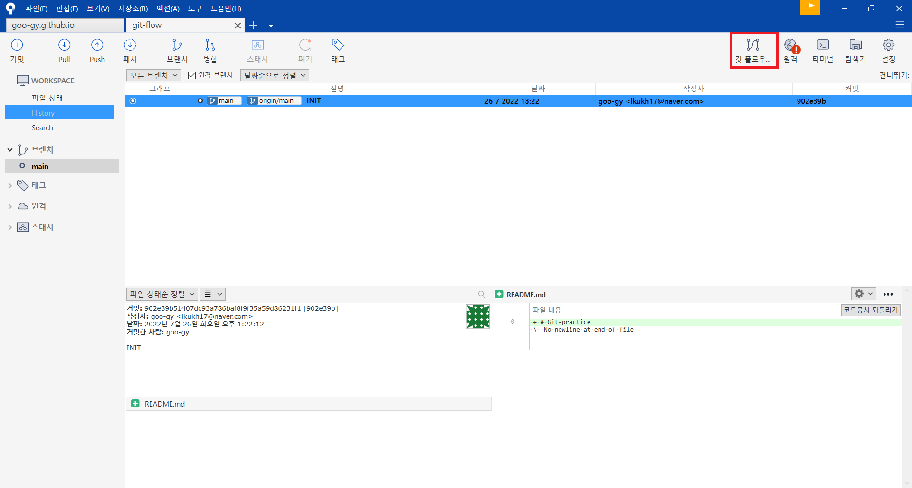
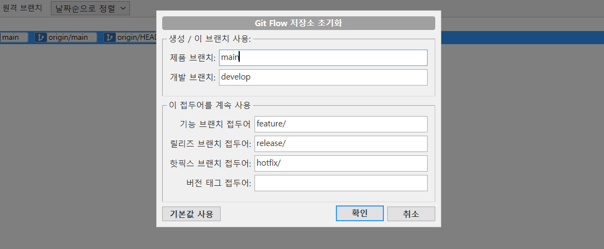
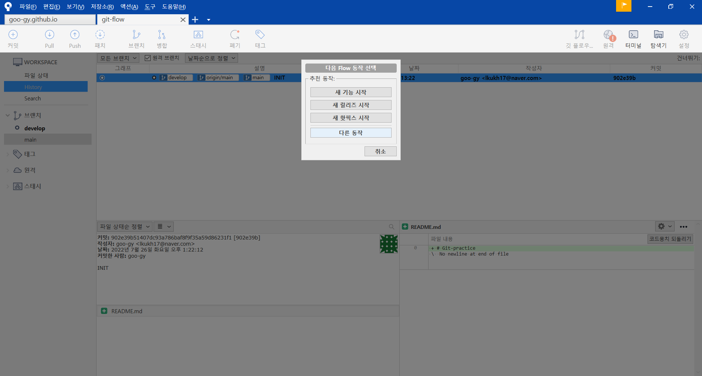
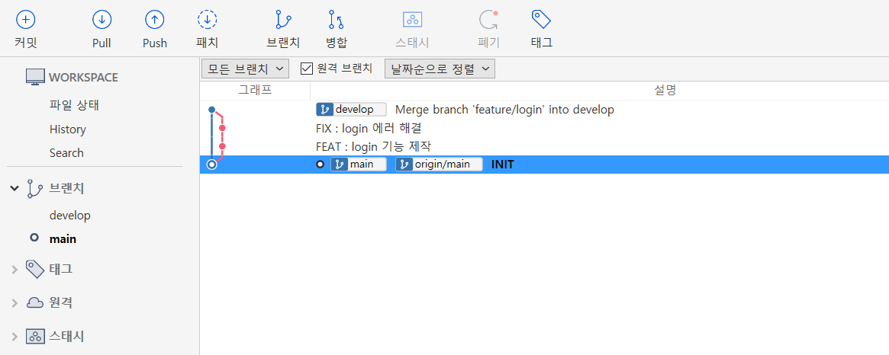
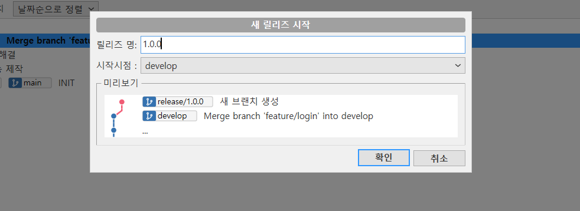
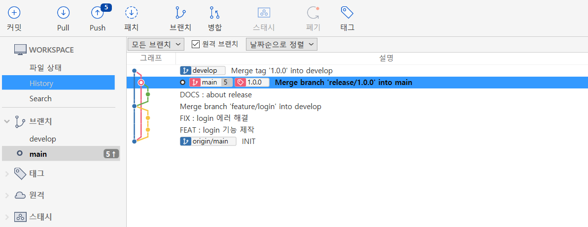
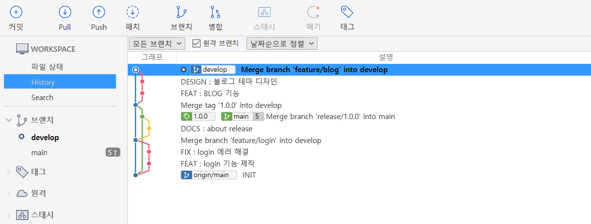
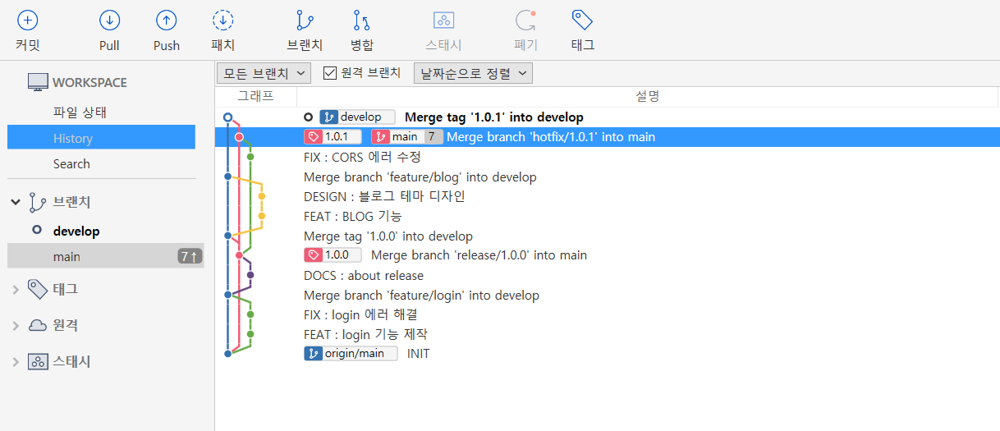

## 들어가기 전에

Git-flow는 Git 브랜치 관리 모델 중 하나이다. 하나의 프로젝트에서 팀원들이 원활하게 협업하기 위해서 브랜치를 활용하는데, 이 Git 브랜치를 쉽게 관리할 수 있도록 패턴을 적용한 것이 Git-flow 모델이다.  

Git-flow를 처음 배우면 작업들이 어디서 시작되어 어디로 합쳐지는지, 왜 그런 방식을 사용하는지 많이 헷갈리는 것 같다. Git-flow를 처음 접하는 팀원들이 Git-flow를 이해하고 혼자서 따라 해 볼 수 있도록 이렇게 포스팅을 작성하게 되었다.  

## Git-flow

https://www.campingcoder.com/2018/04/how-to-use-git-flow/ 에서 Git-flow를 이해하기 좋게 그려 놓아서 가져왔다. 그림을 보면 Master, Develop, Feature, Release, Hotfix 라는 브랜치를 확인할 수 있다. 

- 핵심 브랜치  
    - **Master**
    - **Develop**
- 인스턴스 브랜치  
    - **Feature**
    - **Release**
    - **Hotfix**

Git-flow에서 브랜치는 계속 업데이트하여 유지되는가에 따라 위와 같이 두 가지로 나눌 수 있다. 개인적으로 Git-flow를 이해하는 데 가장 중요한 개념이라고 생각한다. 그림을 살펴보면 **Master, Develop** 브랜치는 계속 업데이트되어 뻗어 나간다. 하지만 **Feature, Release, Hotfix** 브랜치는 핵심 브랜치에서 분기되어 핵심 브랜치로 합쳐지고 사라지는 인스턴스식 브랜치이다.  

--- 

### Git-flow branch  

왜 이런 특성을 가지는지 이해하기 위해 각 브랜치의 목적을 이해해 보자.  

- **Master**  
  실제로 서비스에 배포되는 브랜치이다.
- **Develop**  
  새 버전에 대한 개발을 진행하는 브랜치이다.  
- **Feature**  
  개발의 기본 단위인 기능을 추가하기 위한 브랜치이다.  
  (Develop에서 시작되어 Develop으로 합쳐진다.)  
- **Release**  
  Develop에서 새 버전에 대한 개발이 마무리되어 출시하기 위한 브랜치이다.  
  (Develop에서 시작되어 Master와 Develop으로 합쳐진다.)  
- **Hotfix**  
  Master에서 생긴 버그를 급하게 해결하기 위한 브랜치이다.  
  (Master에서 시작되어 Master와 Develop으로 합쳐진다.)  

**Master, Develop** 브랜치는 실제로 배포하거나 개발자들이 공유하기 위해 보존되어야 하는 브랜치이다. 하지만 **Feature, Release, Hotfix** 브랜치는 Develop 또는 Master 브랜치를 업데이트하기 위한 수단이라는 걸 알 수 있다.  

## 시나리오  

Git-flow를 더 잘 이해하기 위해 몇 가지 시나리오를 준비했다.  

- 로그인 기능 제작 (Feat)  
- 1.0.0 버전 배포 (Release)  
- 배포된 서비스에서 발견된 버그 수정 (Hotfix)  

Git-flow를 기능으로 제공해주는 Source Tree를 사용하여 실습해보자.  

---

### Git-flow 시작  

  

Source tree에서 레포지토리를 열고 `alt + shift + f` 또는 오른쪽 상단의 버튼을 통해 Git-flow를 시작할 수 있다.  
Source tree를 사용하지 않는다면 `git flow init` 명령어를 통해 시작할 수 있다.  

  

제품 브랜치(Master)와 개발 브랜치 (Develop)은 하나의 브랜치가 계속 이어 나가기 때문에 브랜치 이름을 설정한다. 기능(Feature), 릴리즈(Release), 핫픽스(Hotfix) 브랜치는 만들었다가 합쳐진 후 사라지는 브랜치이기 때문에 접두어를 설정한다.  

※ Source tree에서는 제품 브랜치가 master로 되어 있지만, 내 레포지토리는 기본 브랜치 이름이 main으로 설정되어 있기 때문에 master -> main으로 바꿔주었다.  

--- 

### Feat: 로그인 기능 제작  

Git-flow를 시작했다면 develop 브랜치가 자동으로 생성되고, 다시 Git-flow를 켜면 다음과 같이 Feature, Realease, Hotfix 등의 동작을 수행할 수 있다.  

  

새 기능 시작을 누르고 이름을 설정하면 새 Feature가 만들어진다.  
또는 `git flow feature start [feature 이름]` 명령어를 통해 시작할 수 있다.  

  

마찬가지로 Source tree의 Git-flow 기능이나 `git flow feature finish` 를 통해 기능을 마무리하면 develop으로 합쳐진다.  

---

### Release: 1.0.0 버전 배포  

  

모든 기능을 완성해 기능을 배포한다고 하자. Git flow를 통해 Release를 시작하고 Release 이름을 위와 같이 버전으로 설정해주었다. 버전 관리 방법은 회사나 팀이 정하기 나름이겠지만, 내가 진행했던 프로젝트는 모두 **major.minor.hofix** 형식으로 사용하였다.  

  

일반적으로 Release는 Develop 브랜치를 Master(main) 브랜치에 반영하기 위한 것이다. 하지만 Release를 열고 검토하는 중에 에러를 고치거나 문서를 추가하는 등의 커밋이 이루어질 수 있다. 이때 Develop에도 다시 반영할 필요가 있기 때문에 Release를 마무리하면 자동으로 **Release -> Master(main) -> Develop**으로 머지한다.  

- `git flow release start [release 이름]`  
- `git flow release finish`  

---

### Hotfix: 서비스에서 발견된 버그 수정  

  

v1.0.0을 배포한 후 다음 버전을 위한 개발을 진행하던 중에, 배포된 서비스(main)에서 발견된 버그를 해결해야 한다고 하자. Develop에서 버그를 수정하고 Release 한다면 의도치 않게 다음 버전에 배포하려고 했던 블로그 등의 기능이 같이 배포될 것이다. 대신 우리는 Hotfix를 이용할 수 있다.  

  

Master(main)에서 Hotfix를 열고 에러를 해결하여 마무리하면 그림과 같이 **Hotfix -> Master(main) -> Develop** 순으로 머지되는 것을 볼 수 있다. 이러면 Develop과 별개로 Hotfix를 Master(main)에 반영하고, 이 내용을 Develop에 동기화할 수 있다.  

- `git flow hotfix start [hotfix 이름]`  
- `git flow hotfix finish`  