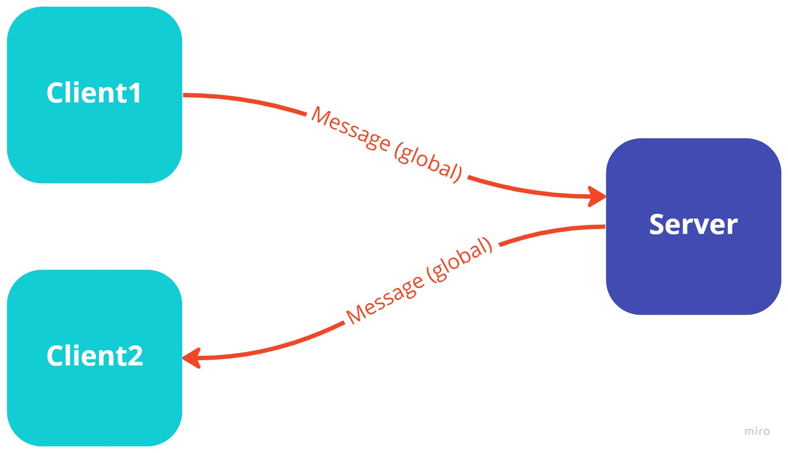
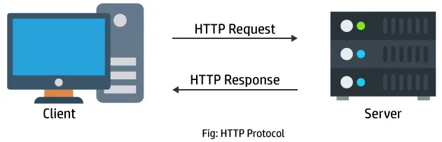
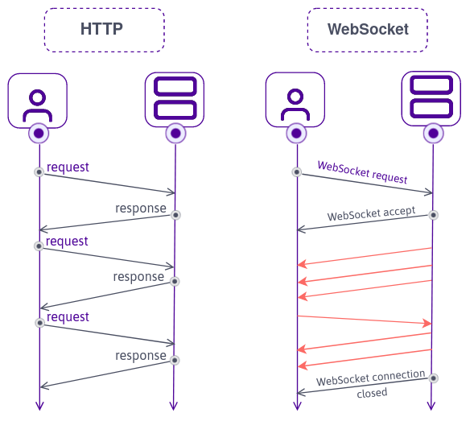
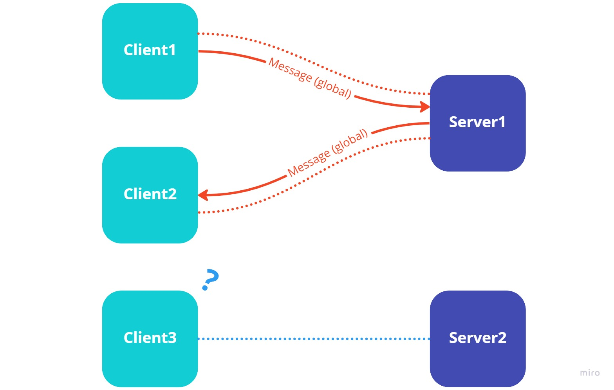
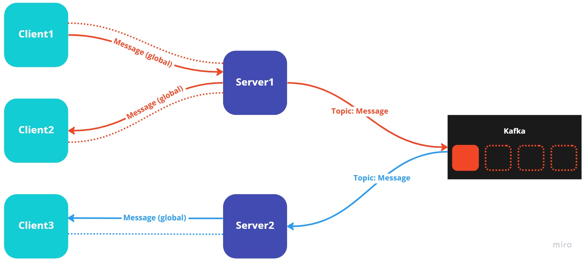
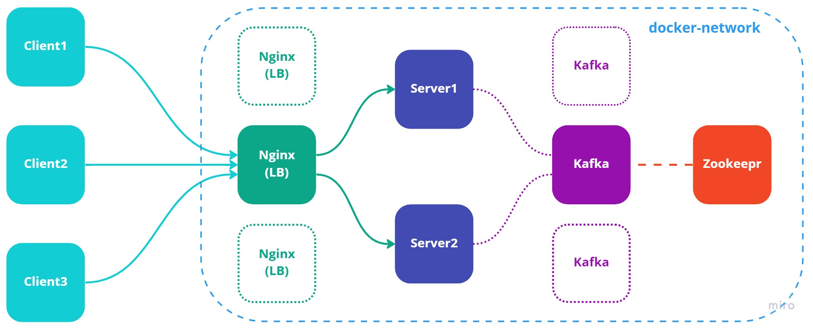

## 목차

- 요구사항
- 웹 채팅 서비스
- Web Socket
- Message Queue
- 구성도

## 요구사항

[https://github.com/goo-gy/letters-react](https://github.com/goo-gy/letters-react)

[https://github.com/goo-gy/letter-chat-server](https://github.com/goo-gy/letter-chat-server)

- Letters라는 웹 어플리케이션에서 채팅 기능을 제공하려고 한다.
- 서버의 수를 늘려서 Scale-out 하고 싶다.

## 웹 채팅 서비스





[https://www.w3schools.in/http/intro](https://www.w3schools.in/http/intro)

HTTP 통신은 클라이언트가 보낸 요청(Request)에 대해서만 응답(Response)을 보내줄 수 있고, 채팅 서비스에 필요한 서버 → Client로 먼저 데이터를 보내는 기능이 없습니다. 이를 해결하기 위해 우리는 WebSocket이라는 것을 사용할 수 있습니다.

## Web Socket



[https://blog.scaleway.com/iot-hub-what-use-case-for-websockets/](https://blog.scaleway.com/iot-hub-what-use-case-for-websockets/)

WebSocket을 이용하면 한번 Socket 연결을 맺고 나면, 양 측에서 언제든지 메세지를 보낼 수 있습니다.

---

### Web Socket in Java Spring

- Web Socket
- SockJS
- Stomp

---

### Stomp

```java
@RestController
@CrossOrigin
public class ChatController {
    @Autowired
    private SimpMessagingTemplate simpMessagingTemplate;

    @MessageMapping("/chat") // /pub/chat
    public void publishChat(ChatDto chatDto) {
        simpMessagingTemplate.convertAndSend("/sub/chat/" + chatDto.getChannel(), chatDto);
    }
}
```

## 다중 서버

한 서버가 수많은 클라이언트와 소켓 연결을 맺는 부하를 감당하기는 어렵기 때문에 Scale-out하여 여러 대의 서버를 사용하게 됩니다.



위와 같이 채팅 서버가 다중화 되어 있는 경우, 같은 서버에 연결된 클라이언트 끼리는 서로 통신할 수 있지만, 다른 서버에 연결되어 있다면, 서로의 채팅을 전달할 수 없습니다.

## Message Queue

위 처럼 여러 서버 간에 데이터를 실시간으로 동기화 하기 위해서 Message Queue를 사용할 수 있습니다.



### RabbitMQ vs Kafka

대표적인 Message Queue의 예로 RabbitMQ와 Kafka를 들 수 있습니다.

- RabbitMQ
  - Message Broker
  - 처리하고 삭제
- Kafka
  - Event Broker (Message broker의 역할을 할 수 있다.)
  - 처리해도 데이터 유지, Offset으로 관리

둘 다 장단점이 있겠지만, Kafka가 더 범용적인 목적으로 사용할 수 있을 것 같아 Kafka를 공부하여 사용해 보았습니다.

## 구성도

- React
- Docker-compose
  - Nginx
  - Java Spring
  - Kafka
  - Zookeeper

Nginx, Spring server, Kafka, Zookeeper를 docker-compose로 함께 배포하면서 같은 서브넷에서 서로 통신할 수 있도록 구성하였습니다.



- Nginx Container만 포트포워딩하여 로드밸런서를 통해서만 진입할 수 있도록 구성
- 로드밸런서, Kafka, Zookeeper를 다중화 하면 좋겠지만, 테스트 환경에서는 단일 노드로 구성

---

### docker-compose

```yml
version: "3.0"

services:
  zookeeper:
    container_name: letters_zookeeper
    image: bitnami/zookeeper:3.6
    environment:
      - ALLOW_ANONYMOUS_LOGIN=yes
      - ALLOW_PLAINTEXT_LISTENER=yes
    networks:
      default_bridge:
        ipv4_address: 192.168.0.10
  kafka:
    container_name: letters_kafka
    image: bitnami/kafka:3.0
    environment:
      - KAFKA_BROKER_ID=1
      - KAFKA_CFG_LISTENERS=PLAINTEXT://:9092
      - KAFKA_CFG_ADVERTISED_LISTENERS=PLAINTEXT://192.168.0.11:9092
      - KAFKA_CFG_ZOOKEEPER_CONNECT=zookeeper:2181
      - ALLOW_PLAINTEXT_LISTENER=yes
    #      - KAFKA_CREATE_TOPICS=chat:1:1
    depends_on:
      - zookeeper
    networks:
      default_bridge:
        ipv4_address: 192.168.0.11
  backend:
    container_name: letters_backend
    build: .
    networks:
      default_bridge:
        ipv4_address: 192.168.0.20
  backend2:
    container_name: letters_backend2
    build: .
    networks:
      default_bridge:
        ipv4_address: 192.168.0.21
  nginx:
    container_name: letters_nginx
    build: ./nginx
    ports:
      - "80:80"
    networks:
      default_bridge:
        ipv4_address: 192.168.0.30

networks:
  default_bridge:
    ipam:
      driver: default
      config:
        - subnet: 192.168.0.0/16
```

---

### Nginx

```
upstream chat_servers {
    server 192.168.0.20:8080 weight=1 max_fails=3 fail_timeout=15s;
    server 192.168.0.21:8080 weight=1 max_fails=3 fail_timeout=15s;
    keepalive 1024;
    keepalive_requests 10240;
    keepalive_timeout 120;
}

server {
    location /letters-chat-server/ {
        proxy_pass http://chat_servers/letters-chat-server/;
        proxy_http_version 1.1;
        proxy_set_header Upgrade $http_upgrade;
        proxy_set_header Connection "Upgrade";
        proxy_set_header Host $http_host;
    }
}
```
