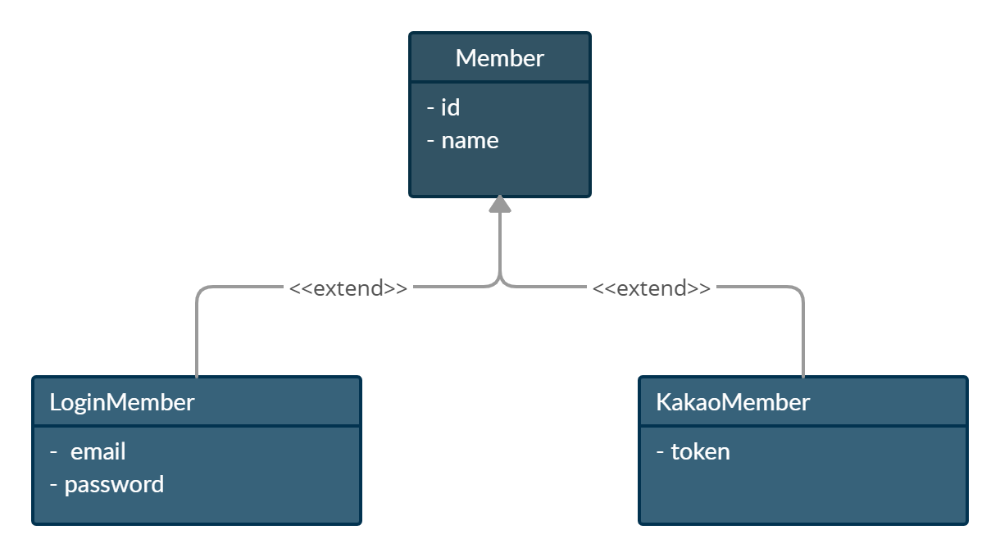
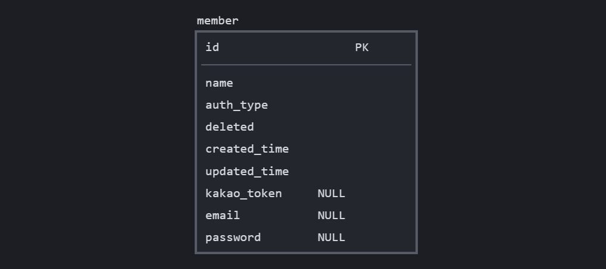
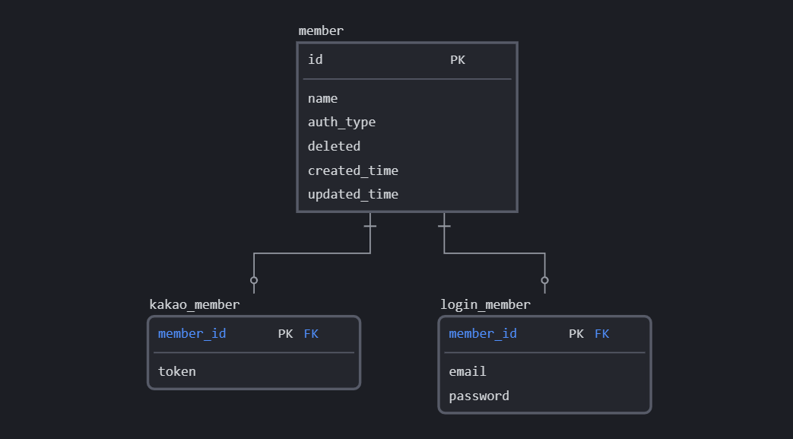
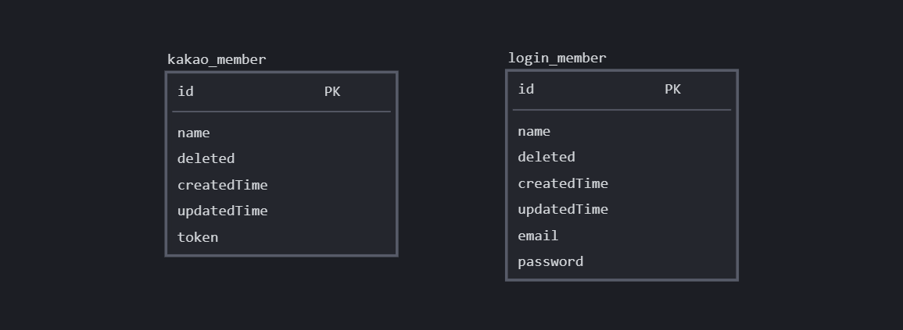
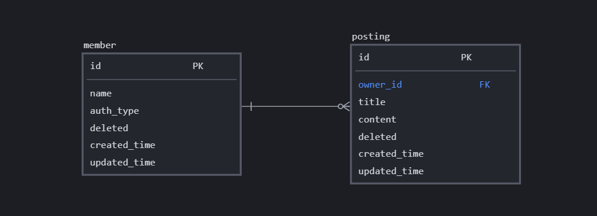
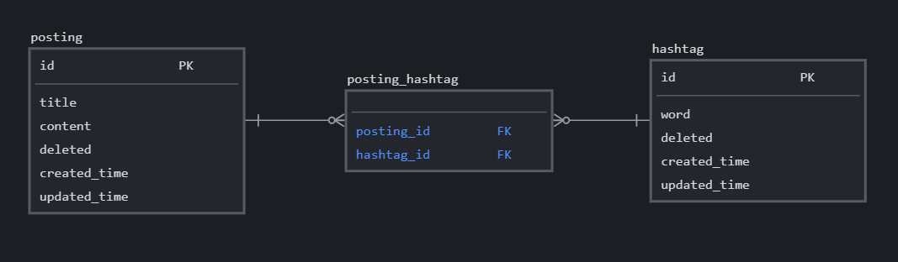
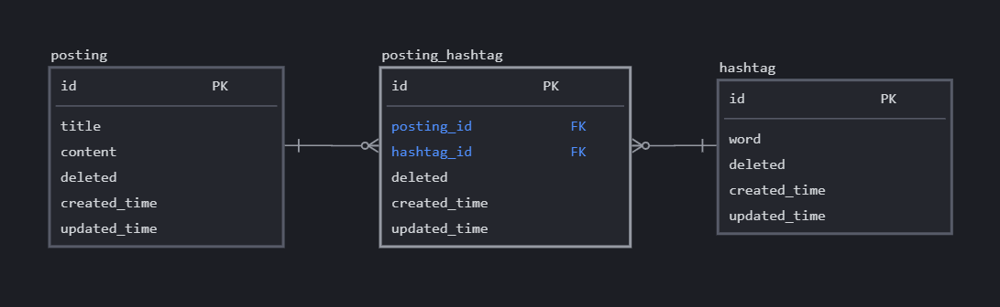
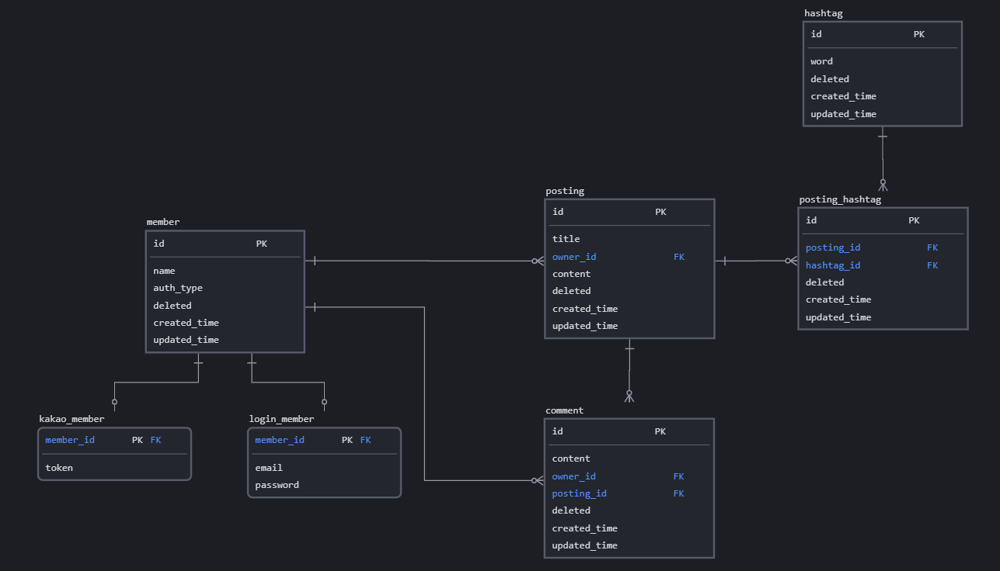

## \[ 개요 \]

JPA에서는 Java Class만 작성하면 자동으로 Database의 Schema를 만들어주는 DDL을 제공해 준다. 이번 포스팅에서는 작은 프로젝트에서 JPA를 활용하여 DB를 설계하고 구현해 볼 예정이다. JPA 기본 문법에 대해서 자세히 적는 대신 설계 방향과 여러 가지 옵션을 활용하는 방법을 중심으로 알아볼 예정이다.

---

### 요구 사항

우리가 Spring JPA를 이용해서 어떤 게시글 서비스를 만든다고 가정해 보자. 그러면 우리는 기본적으로 **사용자(Member), 게시글(Posting), 댓글(Comment)**에 대한 정보가 필요할 것이다. 게시글 검색을 더 활성화시키기 위해 **Hashtag(#)**도 추가해 볼 수 있다.

그리고 다음과 같은 추가적인 요구사항을 만족하는 서비스를 만들어 보자.

- 사용자에게 Email, password를 이용하는 로그인 인증과 카카오 로그인을 지원한다.

- 모든 DB 테이블에서 생성 시간, 수정 시간을 관리하고, 삭제할 때는 실제 Data를 삭제하는 대신 삭제 표시만 남겨둔다.

## \[ 공통 데이터 \]

그러면 이제 하나씩 JPA를 이용해서 구현해 보자

---

### MappedSuperclass

```java
@MappedSuperclass
public class BaseEntity {
    @CreationTimestamp
    private LocalDateTime createdTime;

    @UpdateTimestamp
    private LocalDateTime updatedTime;

    @ColumnDefault("true")
    private Boolean deleted;
}
```

- 요구사항에서 삭제 여부, 생성 시간, 수정 시간을 모든 테이블에서 동일하게 관리하기로 하였다.
- 이런 필드들을 모든 Entity에 직접 작성하는 대신 `@MappedSuperclass`를 지정한 클래스에 모아두고 이 클래스를 상속받기만 하면 자동으로 해당 컬럼들이 테이블에 반영된다.

## \[ 상속관계 \]



Member의 인증 방식에는 Email, Password를 이용한 로그인과, 카카오 인증을 활용하는 방법을 지원하기로 했다. 그래서 Java에서는 Member를 상속받는 LoginMember, KakaoMember 클래스를 만들었다. Java에서는 이 모델을 클래스를 상속함으로써 구현하였지만, Database 상에서는 이런 상속 개념이 없다.

```java
@Entity
@Inheritance(strategy = InheritanceType.JOINED)
@DiscriminatorColumn(name = "auth_type")
public class Member extends BaseEntity {
    @Id
    @GeneratedValue(strategy = GenerationType.IDENTITY)
    private Long id;

    @Column(unique = true)
    private String name;
}
```

대신 `@Inheritance`를 사용하여 상속받는 클래스가 Database 스키마에서 어떻게 구성될지 결정할 수 있다.

<!-- `@DiscriminatorColumn` 옵션을 지정해주면 테이블에 지정한 이름으로 컬럼이 생기며, 상속 관계를 위해 어느 테이블과 Join 해야할 지 알 수 있다. -->

```java
@Entity
public class LoginMember extends Member {
    @NotNull
    @Column(unique = true)
    private String email;
    private String password;
}
```

@Inheritance 옵션에는 다음과 같이 3가지가 있는데 하나씩 알아보자.

- `SINGLE_TABLE`
- `JOINED`
- `TABLE_PER_CLASS`

---

### Single Table



Single table 전략은 Member를 상속받는 모든 자식 Entity의 필드를 Member 테이블 하나에 넣어두고 필요한 것만 사용하는 전략이다. (나머지는 Null)

- 장점
  - Join 없이 데이터를 가져올 수 있기 때문에 성능이 빠르다.
- 단점
  - 해당되지 않는 Entity에 대한 컬럼도 한 테이블에 있기 때문에, 자식 Entity에 해당하는 컬럼은 항상 Nullabe로 설정된다.
  - 자식 Entity에 많은 데이터가 있을 경우 저장 공간 낭비가 심하고, 조회 성능도 느려질 수 있다.

자식 Entity들의 데이터가 적을 때 사용하면 좋을 것 같다.

---

### Joined



Joined 전략은 Member를 상속받는 Entity가 별도의 테이블을 구성하고, Member 테이블과 조인하여 사용하는 전략이다.

- 장점
  - 불필요한 Null 데이터를 저장하지 않으므로, 저장 공간 면에서 효율적이다.
- 단점
  - Join으로 인해 성능이 저하된다.

Joined 전략이 상속 관계와 가장 유사한 구조를 가지고 있어, 이해하기도 관리하기도 쉽다.
그리고 하위 테이블의 데이터를 잘 사용하지 않는 경우 나중에 다룰 `Lazy Load`로 보완할 수 있기 때문에
Joined 옵션을 사용하기로 했다.

---

### Table Per Class



Table per class 전략도 Member를 상속받는 Entity가 별도의 테이블을 생성하지만,
공통되는 Member의 필드들을 각 테이블에 따로 넣는 전략이다.

- 장점
  - 데이터를 완전히 분리하여 단순하고 관리하기 쉽다.
  - 단순 조회 성능이 빠르다.
- 단점
  - 부모 Entity를 중심으로 데이터를 가져올 때 굉장히 비효율적이다.

이 전략은 자식 Entity로 명확하게 조회할 때는 괜찮지만, 부모 Entity인 Member 객체로 조회할 때는 login\_\_member, kakao\_\_member 테이블을 모두 union 연산하여 탐색하기 때문에 굉장히 비효율적이다.

## \[ 연관관계 \]

- @OneToOne
- @ManyToOne
- @OneToMany
- @ManyToMany

JPA에서는 위와 같이 연관관계를 위한 4가지 @Annotaion을 제공한다.

---

### @ManyToOne



```java
@Entity
public class Posting extends BaseEntity {
    @Id
    @GeneratedValue(strategy = GenerationType.IDENTITY)
    private Long id;
    private String title;
    private String content;

    @ManyToOne
    @JoinColumn(name = "owner_id", nullable = false)
    private Member owner;
}
```

Posting 과 Member의 관계는 N:1이다.  
이럴 때 @ManyToOne을 사용한다. DB 상에서는 당연히 Many 쪽에서 Foreign Key를 가지기 때문에 @ManyToOne을 지정한 곳에 @JoinColumn으로 Foreign Key 이름을 지정해 준다.

---

### @OneToMany

```java
@Entity
@Inheritance(strategy = InheritanceType.JOINED)
@DiscriminatorColumn(name = "auth_type")
public class Member extends BaseEntity {
    @Id
    @GeneratedValue(strategy = GenerationType.IDENTITY)
    private Long id;

    @Column(unique = true)
    private String name;

    @OneToMany(mappedBy = "owner")
    private List<Posting> postingList;
}
```

반대로 Member - Posting은 1:N이다.  
DB 상의 Member 테이블에서는 Foreign key를 가지고 있지 않지만, 객체에서는 PostingList 정보가 필요할 수 있기 때문에 @OneToMany를 사용하여 필드로 불러올 수 있다. 이런 경우를 양방향 연관관계라고 한다. 여기서 `mappedBy` 옵션에는 상대방 Entity에서 자신을 지칭하는 필드명으로 지정해야 한다.

---

### @ManyToMany

```java
@Entity
public class Hashtag extends BaseEntity {
    @Id
    @GeneratedValue(strategy = GenerationType.IDENTITY)
    private Long id;

    @Column(unique = true)
    @NotNull
    private String word;
}
```

```java
@Entity
public class Posting extends BaseEntity {
    @Id
    @GeneratedValue(strategy = GenerationType.IDENTITY)
    private Long id;
    private String title;
    private String content;

    @ManyToOne
    @JoinColumn(name = "owner_id", nullable = false)
    private Member owner;

    @ManyToMany
    @JoinTable(name = "posting_hashtag")
    private List<Hashtag> hashtagList;
}
```



N:M 관계에서는 편리하게 @ManyToMany 옵션을 사용하면 자동으로 위와 같은 관계 테이블이 생성된다. 하지만 이런 경우 연관 관계를 표시하는 데이터에는 추가적인 정보를 저장할 수 없다. 따라서 실무에서는 대부분 두 테이블의 연결을 관리하는 별도의 Entity를 정의하여 사용한다.

---

### N:M 직접 정의하기

```java
@Entity
public class PostingHashtag extends BaseEntity {
    @Id
    @GeneratedValue(strategy = GenerationType.IDENTITY)
    private Long id;

    @ManyToOne
    @JoinColumn(name = "posting_id")
    private Posting posting;
    @ManyToOne
    @JoinColumn(name = "hashtag_id")
    private Hashtag hashtag;
}
```

Posting과 Hashtag를 연결하는 PostingHastag Entity를 만들고, 각 Entity의 id를 Foreign key로 가지도록 @ManyToOne으로 연결해 주었다. 이렇게 N:M 관계를 위한 연결 Entity를 만들면 연결 정보에 추가적인 정보를 담을 수 있다.

```java
@Entity
public class Posting extends BaseEntity {
    ...
    @OneToMany(mappedBy = "posting")
    private List<PostingHashtag> taggingList;
}

```

Posting에서는 연결된 Hashtag 정보를 조회하기 위해서 @OneToMany 로 연결하였다.



## \[ Schema \]

앞에서 다룬 내용을 기반으로 Comment까지 마저 추가하면 다음과 같은 DB Schema를 구성할 수 있다.


